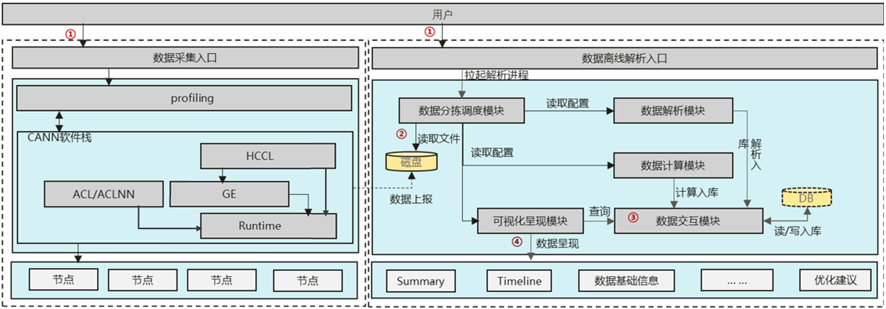
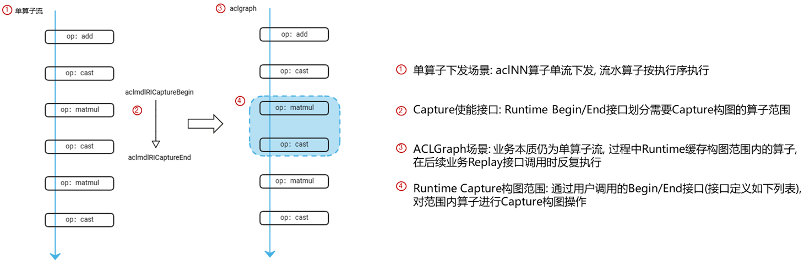

# MindStudio Profiler Performance Optimization Feature Analysis and Design Specifications

|                                           |                   |
| ----------------------------------------- | ----------------- |
| SIG group:                                | mstt-sig          |
| Incorporated into the following versions: | MindStudio 26.0.0 |
| Designer:                                 | chenhao           |
| Date:                                     | 2026.01.21        |

\*\*Copyright © 2022 openGauss Community\*\*

Your reproduction, use, modification and distribution of this document is subject to the Creative Commons Attribution-ShareAlike 4.0 International Public License ("CC BY-SA 4.0"). For ease of understanding, you can visit thehttps://creativecommons.org/licenses/by-sa/4.0/Understand the overview (but not the replacement) of CC BY-SA 4.0. You can obtain the complete agreement of CC BY-SA 4.0 from the following website:https://creativecommons.org/licenses/by-sa/4.0/legalcode.

**Revision records**

| Date        | Revised version | Revision Description                                                        | Authors | Audited |
| ----------- | --------------- | --------------------------------------------------------------------------- | ------- | ------- |
| 2026.01. 21 | 1.0             | Completed the draft.                                                        | chenhao | chenhao |
| 2026.01. 28 | 1.1             | Added the section about performance optimization in the ACL Graph scenario. | chenhao | chenhao |

# 1. Feature Overview

*Briefly describe the background information about the product or feature, and briefly describe the benefits and objectives of the solution to customers. In addition, describe the main content and application scope of this document.*

## 1.1 Scope

*Briefly describe the main functions of the feature.*

## 1.2 Feature Requirement List

Table X: List of feature requirements

| Requirement No. | Requirement name                                  | Feature Description                                                   | Remarks                                                                               |
| --------------- | ------------------------------------------------- | --------------------------------------------------------------------- | ------------------------------------------------------------------------------------- |
| 1               | Performance optimization in the ACLGraph scenario | Collects attributes such as shape, format, and dtype of the operator. | Data can be collected in both the Capture and Replay phases in the ACLGraph scenario. |

# 2. Requirement Scenario Analysis

## 2.1 Feature Requirement Source and Value Overview

In the delivery process of built-in frameworks (such as PyTorch) in the ACL Graph scenario, operator performance needs to be analyzed for model performance optimization. Performance analysis and display in the ACL Graph scenario need to be supported.

## 2.2 Feature Scenario Analysis

This capability is required in the model performance optimization scenario in the PyTorch framework to support model performance analysis.

## 2.3 Feature Impact Analysis

NA

### 2.3.1 Hardware Limitations

| Product Type                                | Support |
| ------------------------------------------- | ------- |
| Atlas A3 Series Training/Inference Products | support |
| Atlas A2 Series Training/Inference Products | support |

### 2.3.2 Technical Limitations

Operating system: Linux

Programming language: C/Python

### 2.3.3 Impact on the License

NA

### 2.3.4 Analysis of Impact on System Performance Specifications

The size of the memory required for parsing performance data must be at least 10 times the size of the collected performance data.

### 2.3.5 Analysis of Impact on System Reliability Specifications

NA

### 2.3.6 Impact on System Compatibility

The new data format processing is a new feature and has no version compatibility issues.

### 2.3.7 Impact Analysis on Interaction and Conflicts with Other Key Features

NA

## 2.4 Analysis of implementation solutions for similar community/commercial software

NA

# 3. Feature/Function implementation principles (multiple use cases can be broken down)

## 3.1 Objectives

Parses and displays performance data of model operators and supports model performance optimization, analysis, and optimization.

## 3.2 Overall Solution

The performance optimization tool consists of three parts: performance data collection and parsing, performance data analysis, and visualized performance data display. Performance data collection involves operator development, inference (online and offline inference), and training scenarios. (The collection mode varies with the training framework, such as MindSpore, PyTorch, and TensorFlow.) Performance data can be parsed online or offline. Performance data can be displayed in CSV tables, Chrome trace or perfetto in JSON, Tensorboard, or MindStudio Insight.

In the offline inference scenario, trained models are quantized and compressed, and converted by ATC. Then, the Mindx SDK or ACL API is used to directly develop applications. Developed applications are started by msprof to obtain corresponding performance data.

In the PyTorch/MindSpore training scenario, you can enable the Ascend profiler function through the profiler interface provided by the framework to collect, parse, and display performance data. The collected performance data includes performance data related to the Ascend software stack, Ascend hardware, and framework. The three types of performance data are parsed in a unified manner and displayed on the MindInsight GUI.

In the TensorFlow training scenario, you can enable the Ascend profiler function by using environment variables or modifying configuration parameters to collect, parse, and display performance data. The collected performance data includes only the Ascend software stack and Ascend hardware performance data. Currently, the performance data of the TensorFlow training framework cannot be collected. Performance data is parsed in a unified manner. The output performance data can be in CSV format and can be analyzed in table format and in JSON format, which can be displayed in Chrome Trace or Perfetto.

For the Ascend profiler enablement method for large model training, see the enablement method for MindSpore, PyTorch, TensorFlow, and PaddlePaddle. The main difference is that large models have large-scale clusters. In the cluster scenario, performance analysis of multiple cards and multiple nodes is more complex than that of a single card. Therefore, the system needs to provide statistical analysis of the core performance data of each card in the cluster, so that performance optimization personnel can quickly identify the performance bottleneck of the card. Another important point is that the communication performance analysis in the cluster scenario needs to be performed based on the communication domain. For example, in the PP division scenario, the communication performance data between stages needs to be analyzed based on the stage division to check whether the bubble is proper.

Process of collecting and parsing performance data:

    

Figure 1 Process for collecting and parsing MSProf performance data

① Users can enter command parameters to invoke the binary program msprof to collect or parse performance data. The parse and export command parameters are involved.

② The offline parsing module automatically starts the process to classify, sort, and schedule performance data. The collects data and saves it to disks.

③ The offline parsing module starts the process through the data sorting and scheduling module to translate and interpret binary data and associate and depend on performance data. The data interaction module reads and writes the processed data to the database and saves the data to the database.

④ The offline parsing module queries and imports the calculated performance data into the database, and converts the required data into the results for users to display in a visualized manner. Currently, data summary tables and timeline trace files are mainly included.

This section does not describe the performance data visualization.

# 4. Performance data can be analyzed and displayed in the aclGraph scenario

## 4.1 Design Idea

In the aclGraph scenario, profiling can be enabled in both the capture and replay phases to support data parsing and display and operator performance analysis.

## 4.2 Constraints

26.0.0 and later versions (Torch, CANN, and HDK packages) are required.

## 4.3 Detailed implementation (module-level or process-level message sequence diagram from user entry)

    

Figure 2: Service process of the aclgraph software stack

The service process is still delivered by a single operator. The operator does not know whether the capture phase is in aclgraph mode. The Runtime, however, uses the Capture interface to enable the corresponding operator task to compose the image. Then, the operator captured by the Capture is replayed, as shown in Figure 2. The matmul and cast operators are contained in the interface range. After being captured, the operators are executed repeatedly in the replay phase.

## 4.4 Interfaces Between Subsystems (Mainly Covering the Definition of Module Interfaces)

| Interface Information  | Interface Description                                                                                                                                                           |
| ---------------------- | ------------------------------------------------------------------------------------------------------------------------------------------------------------------------------- |
| Interface prototype    | Interface definition function rtError_t aclrtsStreamSetAttribute(rtStream_t stm, rtStreamAttr stmAttrId, rtStreamAttrValue_t \*attrValue) for setting the buffer switch control |
| Interface parameter    | rtStream_t: stream object stmAttrId: ID of the attribute bound to the stream, key value rtStreamAttrValue_t, value of the bound stream                                          |
| Interface Return Value | Error code                                                                                                                                                                      |

| Interface Information  | Interface Description                                                                                                                                                      |
| ---------------------- | -------------------------------------------------------------------------------------------------------------------------------------------------------------------------- |
| Interface prototype    | Interface Definition Function for Obtaining the Cache Status (rtError_t aclrtsStreamGetAttribute(rtStream_t stm, rtStreamAttr stmAttrId, rtStreamAttrValue_t \*attrValue)) |
| Interface parameter    | rtStream_t: stream object stmAttrId: ID of the attribute bound to the stream, key value rtStreamAttrValue_t, value of the bound stream                                     |
| Interface Return Value | Error Code                                                                                                                                                                 |

| Interface Information  | Interface Description                                                                                                                                                          |
| ---------------------- | ------------------------------------------------------------------------------------------------------------------------------------------------------------------------------ |
| Interface prototype    | Apply for memory, copy info information to the last delivered task by size, and cache the information. rtError_t aclrtsCacheLastTaskOPInfo(void \* infoPtr, uint32_t infoSize) |
| Interface parameter    | infoPtr: task information to be cached.infoSize: size of the task information to be cached.                                                                                    |
| Interface Return Value | Error Code                                                                                                                                                                     |

## 4.5 Subsystem LLD

1. The PyTorch framework invokes aclrtsStreamSetAttribute to enable the stream cache function when aclmdlRICaptureBegin is invoked.

2. After the kernel launch, the operator obtains the stream cache status through aclrtsStreamGetAttribute. If the cache is enabled, the operator sends the assembly information to the runtime cache through aclrtsCacheLastTaskOPInfo. If the switch is disabled, the buffer is not delivered.

3. Runtime uses thread variables. Based on the stream ID and task ID of the last task delivered by the thread, runtime copies the delivered information based on the size of the memory applied for and caches the information.

4. Before calling aclmdlRICaptureEnd, the PyTorch framework invokes aclrtsStreamSetAttribute to close the cache.

5. When disabling the cache, the Runtime needs to disable the status of implicitly stacked streams and proactively added streams. If the status is not disabled at the end, only the implicitly stacked streams and proactively added streams need to be disabled. The status of the enabled streams remains unchanged.

6. During subsequent replay, if the profiling function is enabled, the Runtime reports the original cached data to the profiling function.

7. The cache information is destroyed when the model is destroyed.

## 4.6 DFX Attribute Design

### 4.6.1 Performance Design

The msprof data parsing module processes only data formats and displays the data format. The impact on performance is controllable.

### 4.6.2 Upgrade and Capacity Expansion Design

NA

### 4.6.3 Exception Handling Design

NA

### 4.6.4 Resource Management Design

The current feature requires extra memory space. The memory size required for performance data parsing must be at least 10 times the size of collected performance data. The disk usage depends on the data volume.

### 4.6.5 Miniaturized Design

NA

### 4.6.6 Testability Design

NA

### 4.6.7 Security Design

#### 4.6.7.1 Safety Design Qualification

*Check the security design by referring to the security design checklist.*

| Security attributes                | Check Item                                                                                                                                                | Check Item Description                                                                                                                                                                                                                                                                                                                                                                                                                                                                                                                                                                                                                                                                                                                                                                                                                                                                                                                                                                                                                                                             | Involved or Not | Satisfied or not |
| ---------------------------------- | --------------------------------------------------------------------------------------------------------------------------------------------------------- | ---------------------------------------------------------------------------------------------------------------------------------------------------------------------------------------------------------------------------------------------------------------------------------------------------------------------------------------------------------------------------------------------------------------------------------------------------------------------------------------------------------------------------------------------------------------------------------------------------------------------------------------------------------------------------------------------------------------------------------------------------------------------------------------------------------------------------------------------------------------------------------------------------------------------------------------------------------------------------------------------------------------------------------------------------------------------------------- | --------------- | ---------------- |
| Access channel control             | Whether to add a listening port                                                                                                                           | The communication matrix needs to be updated for new listening ports.                                                                                                                                                                                                                                                                                                                                                                                                                                                                                                                                                                                                                                                                                                                                                                                                                                                                                                                                                                                                              | No.             |                  |
| Access channel control             | Whether to add new processes or communication between components                                                                                          | Added the communication matrix between new processes or components.                                                                                                                                                                                                                                                                                                                                                                                                                                                                                                                                                                                                                                                                                                                                                                                                                                                                                                                                                                                                                | No.             |                  |
| Access channel control             | Whether to add an authentication mode                                                                                                                     | The communication matrix and product documentation must be updated for the new authentication mode.                                                                                                                                                                                                                                                                                                                                                                                                                                                                                                                                                                                                                                                                                                                                                                                                                                                                                                                                                                                | No.             |                  |
| Permission control                 | Whether files or directories need to be created                                                                                                           | When creating a file or directory, you must explicitly specify the access permission for the file or directory.                                                                                                                                                                                                                                                                                                                                                                                                                                                                                                                                                                                                                                                                                                                                                                                                                                                                                                                                                                    | No.             |                  |
| Permission control                 | Check whether the account permission meets the permission minimization principle.                                                                         | All accounts in the system must be assigned with the least permission.                                                                                                                                                                                                                                                                                                                                                                                                                                                                                                                                                                                                                                                                                                                                                                                                                                                                                                                                                                                                             | No.             |                  |
| Permission control                 | Check whether user privilege escalation exists.                                                                                                           | Illegal user privilege escalation is prohibited.                                                                                                                                                                                                                                                                                                                                                                                                                                                                                                                                                                                                                                                                                                                                                                                                                                                                                                                                                                                                                                   | No.             |                  |
| Undisclosed Interface              | Whether to add GUC parameters                                                                                                                             | The product documentation needs to be updated when GUC parameters are added.                                                                                                                                                                                                                                                                                                                                                                                                                                                                                                                                                                                                                                                                                                                                                                                                                                                                                                                                                                                                       | No.             |                  |
| Undisclosed Interface              | Add or modify functions, views, and system tables.                                                                                                        | When adding or modifying functions, views, and system tables, the product documentation must be updated and permission control must be considered.                                                                                                                                                                                                                                                                                                                                                                                                                                                                                                                                                                                                                                                                                                                                                                                                                                                                                                                                 | No.             |                  |
| Undisclosed Interface              | Add SQL Syntax                                                                                                                                            | The new SQL syntax needs to be updated in the product documentation to support audit log recording.                                                                                                                                                                                                                                                                                                                                                                                                                                                                                                                                                                                                                                                                                                                                                                                                                                                                                                                                                                                | No.             |                  |
| Undisclosed Interface              | Whether to add internal tools                                                                                                                             | The product documentation needs to be updated for new internal tools.                                                                                                                                                                                                                                                                                                                                                                                                                                                                                                                                                                                                                                                                                                                                                                                                                                                                                                                                                                                                              | No.             |                  |
| Undisclosed Interface              | Check whether the script contains comment code.                                                                                                           | Do not comment out code in explanatory languages such as Shell and Python. The comment out code must be deleted.                                                                                                                                                                                                                                                                                                                                                                                                                                                                                                                                                                                                                                                                                                                                                                                                                                                                                                                                                                   | No.             |                  |
| Undisclosed Interface              | Check whether there are access modes such as hidden commands, parameters, and ports.                                                                      | Access modes, such as commands, parameters, and ports, that are not used during maintenance on the live network (including but not limited to product production, commissioning, and maintenance purposes), must be deleted (e.g. by compiling macros)                                                                                                                                                                                                                                                                                                                                                                                                                                                                                                                                                                                                                                                                                                                                                                                                                             | No.             |                  |
| Undisclosed Interface              | Check whether the system has hidden backdoors.                                                                                                            | Do not reserve any undisclosed accounts in the system. All accounts must be managed by the system and must be described in the documentation.                                                                                                                                                                                                                                                                                                                                                                                                                                                                                                                                                                                                                                                                                                                                                                                                                                                                                                                                      | No.             |                  |
| Undisclosed Interface              | It is prohibited to provide crack and network sniffing tools in the software (including software packages and patch packages) released to external users. | 1. It is prohibited to provide the software (including software packages and patch packages) released to external users that can change any user password or have the "password cracking capability". (Brute force cracking of passwords and malicious cracking of passwords by exploiting system/algorithm vulnerabilities) 2. A function or tool used to decrypt files that contain sensitive data (such as configuration files and databases that contain keys). 2. Do not retain third-party network sniffing tools, such as tcpdump, gdb, strace, readelf, and process debugging tools, in the system. CPP, GCC, dexdump, mirror, JDK development/compilation tools, and self-developed debugging tools/scripts used only in the commissioning phase (for example, encryption and decryption scripts, commissioning functions, and commands that can be used only in the commissioning phase), which must be retained due to service requirements, and strict access control is required. In addition, describe the reason, application scenario, and risk for the retention. | No.             |                  |
| Sensitive data protection          | Authentication credentials cannot be stored in the system in plaintext and must be encrypted.                                                             | Authentication credentials (such as passwords and private keys) must be encrypted and cannot be stored in the system in plaintext.                                                                                                                                                                                                                                                                                                                                                                                                                                                                                                                                                                                                                                                                                                                                                                                                                                                                                                                                                 | No.             |                  |
| Sensitive data protection          | The key used for encrypting sensitive data transmission cannot be hard-coded.                                                                             | Hard coding of passwords and keys is prohibited.                                                                                                                                                                                                                                                                                                                                                                                                                                                                                                                                                                                                                                                                                                                                                                                                                                                                                                                                                                                                                                   | No.             |                  |
| Sensitive data protection          | Check whether sensitive information, such as passwords and keys, is printed in plaintext.                                                                 | Do not print sensitive information (passwords, private keys, and pre-shared keys) in plaintext in logs, debugging information, error messages, and ps commands stored in the system.                                                                                                                                                                                                                                                                                                                                                                                                                                                                                                                                                                                                                                                                                                                                                                                                                                                                                               | No.             |                  |
| Sensitive data protection          | Specifies whether to display the password in plaintext.                                                                                                   | Do not display passwords in plaintext.                                                                                                                                                                                                                                                                                                                                                                                                                                                                                                                                                                                                                                                                                                                                                                                                                                                                                                                                                                                                                                             | No.             |                  |
| Sensitive data protection          | Whether the default passwords of third-party and open-source software are used                                                                            | Do not use the default passwords of third-party and open-source software. For details, see section 1.5 in the Security Design Guide.                                                                                                                                                                                                                                                                                                                                                                                                                                                                                                                                                                                                                                                                                                                                                                                                                                                                                                                                               | No.             |                  |
| Sensitive data protection          | Indicates whether to store passwords in plaintext in configuration files.                                                                                 | Plaintext passwords cannot be written into configuration files. (except the scenario where the password must be configured during the installation, deployment, and use of the command-line tool.)                                                                                                                                                                                                                                                                                                                                                                                                                                                                                                                                                                                                                                                                                                                                                                                                                                                                                 | No.             |                  |
| Sensitive data protection          | Whether to use insecure encryption algorithms                                                                                                             | Do not use proprietary or insecure encryption algorithms. Recommended Encryption Algorithm Security Design Guide.                                                                                                                                                                                                                                                                                                                                                                                                                                                                                                                                                                                                                                                                                                                                                                                                                                                                                                                                                                  | No.             |                  |
| Sensitive data protection          | Check whether sensitive information, such as passwords, is transmitted over secure channels.                                                              | Sensitive information must be transmitted between untrusted networks through secure transmission channels or encrypted transmission. For details, see chapter 10 of the Security Design Guide.                                                                                                                                                                                                                                                                                                                                                                                                                                                                                                                                                                                                                                                                                                                                                                                                                                                                                     | No.             |                  |
| Sensitive data protection          | Check whether sensitive information such as passwords and keys in the memory is destroyed after being used.                                               | The passwords or keys in the memory are cleared immediately after being used.                                                                                                                                                                                                                                                                                                                                                                                                                                                                                                                                                                                                                                                                                                                                                                                                                                                                                                                                                                                                      | No.             |                  |
| Sensitive data protection          | The random number used in the cryptographic algorithm must be the cryptographic secure random number.                                                     | The random number used in the cryptographic algorithm must be the cryptographically defined secure random number. For details, see section 6.3 in the Security Design Guide.                                                                                                                                                                                                                                                                                                                                                                                                                                                                                                                                                                                                                                                                                                                                                                                                                                                                                                       | No.             |                  |
| Sensitive data protection          | Check whether there are insecure examples in the documentation.                                                                                           | The examples in the documentation must be secure and provide correct guidance for users. Potential risks in the examples must be described in the documentation.                                                                                                                                                                                                                                                                                                                                                                                                                                                                                                                                                                                                                                                                                                                                                                                                                                                                                                                   | No.             |                  |
| Certification                      | Whether the authentication mechanism is provided                                                                                                          | The new system needs to provide the authentication mechanism and the authentication mechanism is enabled by default.                                                                                                                                                                                                                                                                                                                                                                                                                                                                                                                                                                                                                                                                                                                                                                                                                                                                                                                                                               | No.             |                  |
| Certification                      | Whether authentication is performed on the server                                                                                                         | The authentication process needs to be performed on the server.                                                                                                                                                                                                                                                                                                                                                                                                                                                                                                                                                                                                                                                                                                                                                                                                                                                                                                                                                                                                                    | No.             |                  |
| Certification                      | Indicates whether the server returns valid information after the authentication fails.                                                                    | After the authentication fails, the information returned by the server does not provide detailed information that can be used to locate the error cause.                                                                                                                                                                                                                                                                                                                                                                                                                                                                                                                                                                                                                                                                                                                                                                                                                                                                                                                           | No.             |                  |
| External parameter verification    | Indicates whether to verify the validity of external input.                                                                                               | 1. If external input data is used as the loop termination condition, array subscript, and memory allocation parameter, infinite loop, buffer overflow, memory overwriting, and DoS may occur. 2. The validity of external input, such as file paths, must be verified to prevent injection risks.                                                                                                                                                                                                                                                                                                                                                                                                                                                                                                                                                                                                                                                                                                                                                                                  | Yes             | Yes              |
| Third-party component introduction | Third-party components are introduced.                                                                                                                    | 1. New third-party components must be scanned by using secure compilation options, viruses, vulnerabilities, open source fragment reference, license compliance, and open source components. For details, see the version release cyber security quality requirements. 2. The source of the new third-party components must be trusted.                                                                                                                                                                                                                                                                                                                                                                                                                                                                                                                                                                                                                                                                                                                                            | No.             |                  |

#### 4.6.7.2 Sensitive Data Analysis

##### 1. Sensitive data list

*The specific scope of sensitive data depends on the specific application scenario of the system. Designers need to analyze and determine the sensitive data based on risks. Typical sensitive data includes authentication credentials (such as passwords) and keys.*

| **Data field**                 | **Remarks/Descriptions**                           | **Data Field Sensitivity** | **Association processing module** | **Forced operation**                                         | **Forbidden operations** |
| ------------------------------ | -------------------------------------------------- | -------------------------- | --------------------------------- | ------------------------------------------------------------ | ------------------------ |
| Administrator Account/Password | User name and password of the system administrator | High                       | Login/Authentication              | Encrypted transmission, encrypted storage, and anonymization | Output and logs          |
| ...                            | ...                                                | ...                        | ...                               | ...                                                          | ...                      |
|                                |                                                    |                            |                                   |                                                              |                          |

##### 2. Check sensitive operations

*(1) Lifecycle dimension: For sensitive data identified, we need to identify the lifecycle of the data and identify the process of generation, use, transmission, persistence, and destruction to avoid unintentional omissions in the subsequent risk identification process. 2) High-risk handling process Identify whether sensitive data is handled with high risks. Typical high-risk processing includes printing, echoing, storage, hard coding, and insecure algorithms. From the perspective of information processing, these high-risk processes are prone to security vulnerabilities when sensitive data is processed. Therefore, the sensitive data needs to be checked in detail. The sensitive data check matrix is as follows:*

For example, in a typical web system, the following table lists the check results of sensitive data (administrator accounts and passwords) in the lifecycle.

 * Generated: The administrator sets the password when logging in to the system for the first time.
 * Usage: The administrator uses the password for authentication when logging in to the system.
 * Transmission: After the administrator enters the login password on the client, the password is transmitted to the server over the network.
 * Persistence: After the administrator sets a password for the first time, the server persists the password in the backend database.
 * Destroy: After a specified period, the administrator is forced to change the password and delete the old password.

|                    |                                                               Produced                                                               |                         Use the                          |                                                        Transmission                                                        |                Persistence                 |                                       Destroy                                        |
|:------------------:|:------------------------------------------------------------------------------------------------------------------------------------:|:--------------------------------------------------------:|:--------------------------------------------------------------------------------------------------------------------------:|:------------------------------------------:|:------------------------------------------------------------------------------------:|
|       Print        |                                                            Not involved.                                                             | The password will not be printed in any form during use. | No encryption is required in the secure transmission channel. Encrypted transmission over non-secure transmission channels |               Not involved.                | The password is not printed during the destruction, but operation logs are recorded. |
|       Output       |                 The ciphertext password is displayed on the client, and the password is displayed as \*\*\*\*\*\*\*.                 |                      Not involved.                       |                                                       Not involved.                                                        |               Not involved.                |                                    Not involved.                                     |
|       Stored       | After a user enters a password, the password is encrypted and saved to the backend database using the security encryption algorithm. |                         congener                         |                                                       Not involved.                                                        | Encrypted storage of the back-end database |          Delete the corresponding password from the backend database table.          |
|     Hard-coded     |                                                            Not involved.                                                             |                      Not involved.                       |                                                       Not involved.                                                        |               Not involved.                |                                    Not involved.                                     |
| Insecure algorithm |                                            Encryption using the AES256 security algorithm                                            |              In-memory decryption when used              |                             Non-secure transmission channels use secure encryption algorithms.                             |                  congener                  |                                    Not involved.                                     |

#### 4.6.7.3 Design Implementation

Does not involve security aspects such as session management, identity authentication, password and key, DoS, information leakage, and hardware.

File permission: The minimum permission on flushed files is 640, and the minimum permission on directories is 750.

Common common file verification: Soft link, file permission and owner group, and file read/write verification of file size and quantity

Injection attack: No command injection or log injection risk. Security character strings have been intercepted during command execution and log printing. CSV injection verifies attack characters before file writing.

Sensitive information: Profiling data does not involve sensitive information. Sensitive words are scanned by tools for protection.

DoS attack: local tool for profiling data collection, which does not involve service communication and interaction, and has no attack risk.

Use a tool to scan undisclosed interfaces and check whether undisclosed interfaces and public IP addresses are involved.

Use the scanning tool to identify the compilation options and meet the requirements.

## 4.7 External Interfaces of the System

The interaction interfaces of the data parsing module are file interfaces and do not involve the invoking of external interfaces of the component.

## 4.8 Self-Test Case Design

Test cases are designed based on the performance data collection and parsing in the Capture and Replay phases, including:

1. Profiling enabled in the Capture and Replay phases
2. Completeness of fields in the performance data deliverables displayed during data parsing

# 5. Reliability and availability design

## 5.1 Redundancy Design

The data parsing module mainly uses CPU and memory resources and does not involve policies such as mirror backup and parameter backup.

## 5.2 Fault Management

The data parsing module is an offline tool in the development state. It only involves fault locating and records error information in logs.

## 5.3 Overload control design

The offline data parsing module does not involve the online overload control design.

## 5.4 Upgrade Without Service Interruption

NA

## 5.5 Human Error Design

Offline data parsing module, which does not involve online operation records, status records, and division of personnel operation rights.

## 5.6 Fault Prediction and Prevention Design

The data parsing module supports the following prevention policies:

1. Check the remaining disk space. When the disk capacity is less than 90% of the total disk space, the system displays an alarm indicating that the disk space is insufficient.
2. If the maximum number of data records to be inserted to the database exceeds the upper limit, an error message is displayed, indicating that the data fails to be inserted and the data cannot be inserted.

# 6. Design for features and non-functional quality attributes

## 6.1 Testability

Test cases are designed based on the performance data collection and parsing in the Capture and Replay phases, including:

 * Profiling enabled in the Capture and Replay phases
 * Completeness of fields in the performance data deliverables displayed during data parsing

## 6.2 Serviceability

NA

## 6.3 Evolvability

NA

## 6.4 Openness

*Focus on the openness of external interfaces, including the standardization of the interfaces, for example, compliance with the SQL:2011 standard.*

## 6.5 Compatibility

Function version compatibility is identified based on the version number between components. The version number before and after the version number change is processed separately.

## 6.6 Scalability/Scalability

NA

## 6.7 Maintainability

Performance data parsing logs (log files), expected data production deliverables, and content are correct.

## 6.8 Information

*Refer to the following table to evaluate the modification points of various documents involved in the feature and describe the specific modification points.*

| Category | Manual Name | Involved or Not (Y/N) | Description of the modified or added content |
| -------- | ----------- | --------------------- | -------------------------------------------- |
| White Paper | Technical white paper | N | Added the XX technology in section XX. |
| Product Documentation | Product Description | Y | Updated the technical specifications to XX. |
| Feature Description | Y | Added the XX feature. | |
| Compilation Guide | Y | XXX | |
| Installation guide | Y | Updated the XX scenario in section "Installing a Cluster." | |
| Administrator's Guide | N | XXX | |
| Developer guide (including the development tutorial, SQL reference, system tables and system views, GUC parameter description, error code description, and API reference) | Y | Added the XXX function in section XX. | |
| Tool Reference | Y | Added the XX tool. | |
| Glossary of terms | Y | New term XX | |
| Getting Started                                                                                                                                                           | Easy tutorial         | N                                                          | XXX                                          |

# 7. (Optional) Data Structure Design

NA
