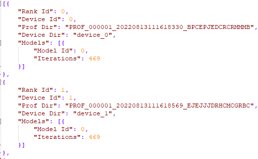
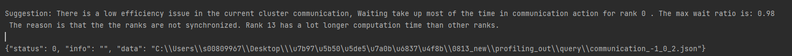
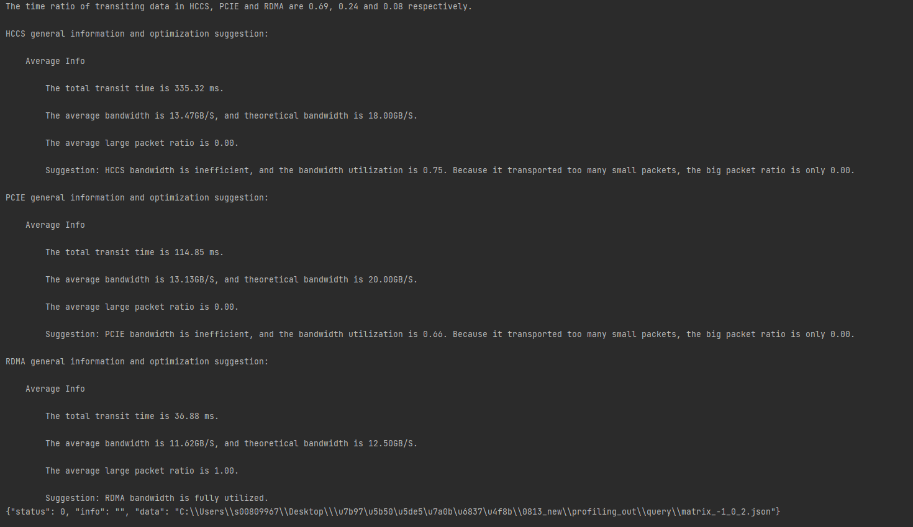

# 附录

## 获取设备信息

**产品支持情况<a name="zh-cn_topic_0000001276273570_section1281125681015"></a>**

|产品|是否支持|
|--|:-:|
|Atlas A3 训练系列产品/Atlas A3 推理系列产品|√|
|Atlas A2 训练系列产品/Atlas A2 推理系列产品|√|
|Atlas 200I/500 A2 推理产品|√|
|Atlas 推理系列产品|√|
|Atlas 训练系列产品|√|


**功能说明<a name="zh-cn_topic_0000001276273570_section4362143220451"></a>**

性能数据采集完成后可以通过“get\_msprof\_info.py”脚本工具在PROF\_XXX目录下的device_\{__id__\} 或host目录文件获取设备信息。“get\_msprof\_info.py”功能及安装路径如下：

**表 1**  脚本介绍

|脚本名|功能| 路径                                                                                                                                                             |
|--|--|----------------------------------------------------------------------------------------------------------------------------------------------------------------|
|get_msprof_info.py|获取设备信息。| `${INSTALL_DIR}/tools/profiler/profiler_tool/analysis/interface`，${INSTAL\_DIR}请替换为CANN软件安装后文件存储路径。若安装的Toolkit软件包，以root安装举例，则安装后文件存储路径为：/usr/local/Ascend/cann。 |

**命令格式<a name="zh-cn_topic_0000001276273570_section25968322563"></a>**

```
python3 get_msprof_info.py -dir <dir> [-help]
```

**参数说明<a name="zh-cn_topic_0000001276273570_section051118235917"></a>**

**表 2**  参数说明

|参数|可选/必选|说明|
|--|--|--|
|-dir或--collection-dir|必选|收集到的Profiling数据目录。非集群场景须指定为PROF_XXX目录下的host或device*_{id}*目录；集群场景须指定为PROF*_*XXX目录的父目录。|
|-h或--help|可选|显示帮助信息，仅在获取使用方式时使用。|

**使用示例<a name="zh-cn_topic_0000001276273570_section20415205113454"></a>**

1.  以运行用户登录工具所在环境。
2.  切换至“get\_msprof\_info.py”脚本所在目录。
3.  执行“get\_msprof\_info.py”脚本，命令示例如下。

    -   非集群场景

        ```
        python3 get_msprof_info.py -dir /home/1/PROF_000001_20220129014731273_KEDKPORHMAGPGD/device_0
        ```

    -   集群场景

        ```
        python3 get_msprof_info.py -dir /home/1/
        ```

    **表 3**  参数说明

|参数|**可选/必选**| 说明                                                                                  |
|--|--|-------------------------------------------------------------------------------------|
|-dir或--collection-dir|必选| 收集到的Profiling数据目录。非集群场景须指定为PROF_XXX目录下的host或device_{id}目录；集群场景须指定为PROF*_*XXX目录的父目录。 |
|-h或--help|可选| 显示帮助信息，仅在获取使用方式时使用。                                                                 |

**输出说明<a name="zh-cn_topic_0000001276273570_section1320820550911"></a>**

非集群场景会打印输出结果，如[图1](#zh-cn_topic_0000001276273570_fig1935196101)所示，各字段含义如[表4](#zh-cn_topic_0000001276273570_table293151916103)所示；集群场景在-dir参数指定目录下生成/query/cluster\_info.json文件保存集群场景各节点信息，如[图2](#zh-cn_topic_0000001276273570_fig095121901016)所示，各字段含义如[表5](#zh-cn_topic_0000001276273570_table1095119171010)所示。

**图 1**  设备信息（非集群场景）<a name="zh-cn_topic_0000001276273570_fig1935196101"></a>  


**表 4**  字段说明（非集群场景）<a name="zh-cn_topic_0000001276273570_table293151916103"></a>

|字段|**说明**|
|--|--|
|collection_info|信息收集。|
|Collection end time|信息收集结束时间。|
|Collection start time|信息收集开始时间。|
|Result Size|信息数据大小，单位MB。|
|device_info|设备信息。|
|AI Core Number|AI Core数量。|
|AI CPU Number|AI CPU数量。|
|Control CPU Number|Control CPU数量。|
|Control CPU Type|Control CPU类型。|
|Device Id|设备ID。|
|TS CPU Number|TS CPU数量。|
|host_info|Host信息。|
|cpu_info|Host CPU信息。|
|CPU ID|Host CPU ID。|
|Name|Host CPU名称。|
|Type|Host CPU类型。|
|Frequency|Host CPU频率。|
|Logical_CPU_Count|Host逻辑CPU数量。|
|cpu_num|Host CPU数量。|
|Host Computer Name|Host设备名。|
|Host Operating System|Host操作系统。|
|model_info|模型信息。|
|Device Id|设备ID。|
|iterations|迭代统计。|
|Iteration Number|迭代次数。|
|Model Id|模型ID，根据模型数量显示。|
|version_info|版本信息。|
|analysis_version|解析版本信息。|
|collection_version|采集版本信息。|
|drv_version|驱动版本信息。|


**图 2**  设备信息（集群场景）<a name="zh-cn_topic_0000001276273570_fig095121901016"></a>  


**表 5**  字段说明（集群场景）<a name="zh-cn_topic_0000001276273570_table1095119171010"></a>

|字段|说明|
|--|--|
|Rank Id|集群场景的节点标识ID，集群场景下设备的唯一标识。|
|Device Id|设备ID，集群场景下不作为设备唯一标识。|
|Prof Dir|集群场景下当前Rank Id对应设备上的PROF_XXX目录。|
|Device Dir|集群场景PROF_XXX目录下的device_{id}目录。|
|Models|模型信息，包含当前Rank Id对应设备的所有模型ID（Model ID）及该模型下的迭代次数（Iterations）。|


## 性能数据文件分片

**产品支持情况<a name="zh-cn_topic_0000001265229666_section1281125681015"></a>**

|产品|是否支持|
|--|:-:|
|Atlas A3 训练系列产品/Atlas A3 推理系列产品|√|
|Atlas A2 训练系列产品/Atlas A2 推理系列产品|√|
|Atlas 200I/500 A2 推理产品|√|
|Atlas 推理系列产品|√|
|Atlas 训练系列产品|√|


**功能说明<a name="zh-cn_topic_0000001265229666_section1598625522114"></a>**

性能数据文件分片是对于解析完成的timeline数据文件（.json），系统会识别.json文件在Chrome浏览器（“chrome://tracing”）上打开时间的长短，适当将.json文件切分成合适的数量，以方便用户快速打开。分片操作是在执行性能数据导出时启动。

**文件格式<a name="zh-cn_topic_0000001265229666_section18515142717224"></a>**

数据文件分片通过msprof\_slice.json配置文件配置分片属性，msprof\_slice.json配置文件格式如下。

```
{
  "slice_switch": "off",
  "slice_file_size(MB)": 0,
  "strategy": 0
}
```

msprof\_slice.json配置文件保存目录为：

`${INSTALL_DIR}/tools/profiler/profiler_tool/analysis/msconfig`，$\{INSTALL\_DIR\}请替换为CANN软件安装后文件存储路径。若安装的Toolkit软件包，以root安装举例，则安装后文件存储路径为：/usr/local/Ascend/cann。

**参数说明<a name="zh-cn_topic_0000001265229666_section112651016202315"></a>**

**表 1**  参数说明

|参数|可选/必选|说明|
|--|--|--|
|slice_switch|可选|分片开关。取值为：<br>&#8226; on：开启分片。<br/>&#8226; off：关闭分片。<br/>默认值为off。<br/>当前分片限制文件最大为20G，如果开启分片功能且文件大小超过20G时文件导出失败，此外，如果开启了分片开关，但是实际文件大小小于200M时，也不会触发分片。<br/>默认情况下关闭数据分片，开启数据分片须编辑msprof_slice.json文件并配置该参数为on，配置为其他值均表示取默认值。<br/>默认情况下，数据分片根据timeline数据文件在Chrome浏览器上打开时间的长短判断分片，打开时间超出上限时，执行分片操作，分片文件大小由slice_file_size参数控制，分片文件数量由strategy参数控制。<br/>分片后的文件名格式为：模块名\_{slice_n}\_{timestamp}.json，其中slice_n表示分片的序号。|
|slice_file_size(MB)|可选|分片文件的容量上限。单位为MB，取值范围为大于等于200的正整数，默认情况下，不限制分片文件的大小。<br/>参数配置大于等于200的正整数时，每个分片文件大小不能超过该值；参数配置其他值时，不限制分片文件的大小，仅根据strategy参数限制分片文件数量。|
|strategy|可选|分片策略。取值为：<br/>&#8226; 0：按照切分次数最少且每个文件打开时间在可接受范围内的标准，对文件进行拆分。<br/>&#8226; 1：按照每个文件打开时间缩短为快速打开的标准（切分次数更多），对文件进行拆分。<br/>默认值为0。<br/>由于文件打开的时间长短与计算机性能有关，故无法给出准确的打开时间，一般情况下文件打开时间参考值如下：<br/>&#8226; 文件打开时间超出上限的参考时间为≥30s。<br/>&#8226; 文件打开时间在可接受范围内的参考时间为[10,30)，单位为s。<br/>&#8226; 文件打开时间为快速打开的参考时间为(0,10)，单位为s。<br/>具体打开时间请以设备实际情况为准。|


## 使用msprof.py脚本解析、查询与导出性能数据

### 概述

msprof解析工具是通过msprof.py脚本封装的，可直接使用[msprof解析工具](msprof_parsing_instruct.md)进行性能数据的解析和导出操作。

**工具使用流程**

msprof.py脚本需要执行如下步骤才能完成性能数据的最终导出：

1.  完成[解析性能数据](#解析性能数据)。
2.  （可选）[查询性能数据文件信息](#查询性能数据文件信息)。

    对于需要指定迭代（Iteration ID）和模型（Model ID）进行解析的情况可执行此步骤，否则可跳过。

3.  [导出性能数据](#导出性能数据)。

> **说明：** 
>-   以下产品不支持在设备上直接解析、查询和导出，需要将采集到的PROF\_XXX目录拷贝到安装了Toolkit包的环境下进行操作：
>    -   Atlas 200I/500 A2 推理产品的Ascend RC场景
>    -   msprof.py工具使用安装时创建的用户运行。


### 解析性能数据

**产品支持情况<a name="zh-cn_topic_0000001265229758_section17436144114294"></a>**

|AI处理器类型|是否支持|
|--|:-:|
|Atlas A3 训练系列产品/Atlas A3 推理系列产品|√|
|Atlas A2 训练系列产品/Atlas A2 推理系列产品|√|
|Atlas 200I/500 A2 推理产品|√|
|Atlas 推理系列产品|√|
|Atlas 训练系列产品|√|


**功能说明<a name="zh-cn_topic_0000001265229758_section14143165719292"></a>**

本功能用于解析性能数据。

**注意事项<a name="zh-cn_topic_0000001265229758_section3326152464212"></a>**

无

**命令格式<a name="zh-cn_topic_0000001265229758_section2822141353814"></a>**

```
python3 msprof.py import -dir <dir>
```

**参数说明<a name="zh-cn_topic_0000001265229758_section144107596381"></a>**

**表 1**  解析命令参数说明

|参数|**可选/必选**|说明|
|--|--|--|
|import|必选|通过import方式解析性能数据。使用import方式解析性能数据时，即使原始性能数据目录中已经生成.db文件，该方式会重新生成.db文件。|
|--cluster|集群场景时必选|解析集群场景的性能数据并进行汇总。仅配置import参数时支持。<br>**-dir**参数需指定PROF_XXX目录的父目录，指定后的解析结果在PROF_XXX目录同级目录下生成sqlite目录。|
|-dir或--collection-dir|必选|收集到的性能数据目录。须指定为PROF*_*XXX目录或PROF*_*XXX目录的父目录，例如：*/home/profiler_data/PROF_XXX*。|
|-h或--help|可选|显示帮助信息，仅在获取使用方式时使用。|


**使用示例<a name="zh-cn_topic_0000001265229758_section3337129114313"></a>**

1.  登录安装了Toolkit包的环境。
2.  切换至msprof.py脚本所在目录。

    `${INSTALL_DIR}/tools/profiler/profiler_tool/analysis/msprof`，$\{INSTALL\_DIR\}请替换为CANN软件安装后文件存储路径。若安装的Toolkit软件包，以root安装举例，则安装后文件存储路径为：/usr/local/Ascend/cann。

3.  解析性能数据。

    ```
    python3 msprof.py import -dir /home/profiler_data/PROF_XXX
    ```

**输出说明<a name="zh-cn_topic_0000001265229758_section435433185314"></a>**

执行完上述命令，解析完成后对应的PROF\_XXX的device_\{id\}和host目录下会生成sqlite目录，sqlite目录下会有db文件生成（该db文件为中间结果，无须关注）。

需要继续导出最终结果的timeline数据或db文件，可执行[导出性能数据](#导出性能数据)。


### 查询性能数据文件信息

**产品支持情况<a name="zh-cn_topic_0000001312709849_section17436144114294"></a>**

|AI处理器类型|是否支持|
|--|:-:|
|Atlas A3 训练系列产品/Atlas A3 推理系列产品|√|
|Atlas A2 训练系列产品/Atlas A2 推理系列产品|√|
|Atlas 200I/500 A2 推理产品|√|
|Atlas 推理系列产品|√|
|Atlas 训练系列产品|√|


**功能说明<a name="zh-cn_topic_0000001312709849_section2149245124116"></a>**

本功能用于查询性能数据文件信息，性能数据文件信息中包含迭代（Iteration ID）/模型（Model ID）。

**注意事项<a name="zh-cn_topic_0000001312709849_section1977174874311"></a>**

执行查询操作前需要调用**import**命令解析Profiling数据，否则查询结果无意义。

**命令格式<a name="zh-cn_topic_0000001312709849_section1078215339441"></a>**

```
python3 msprof.py query -dir <dir> 
```

**参数说明<a name="zh-cn_topic_0000001312709849_section1358435054413"></a>**

**表 1**  查询性能数据信息命令参数说明

|参数|**可选/必选**|说明|
|--|--|--|
|-dir或--collection-dir|必选|收集到的性能数据目录。须指定为PROF_XXX目录或PROF*_*XXX目录的父目录，例如：/home/profiler_data/PROF_XXX|
|--data-type|可选|数据类型。用于MindStudio对接，用户无需配置。取值为：<br/>&#8226; 0：集群场景，可查询当前数据是否为集群场景采集的数据。<br/>&#8226; 1：迭代轨迹数据，每轮迭代的详细数据，包括FP/BP计算时间、迭代更新拖尾和迭代间隙。<br/>&#8226; 2：计算量，AI Core上的浮点运算数。<br/>&#8226; 3：数据准备，训练数据发送至Device以及Device侧读取训练数据。<br/>&#8226; 4：并行度调优建议。<br/>&#8226; 5：并行度数据，主要展示纯通信耗时和计算耗时。<br/>&#8226; 6：通信慢卡慢链路数据及优化建议。<br/>&#8226; 7：通信矩阵数据及优化建议。<br/>&#8226; 8：Host侧系统及进程的CPU、内存的性能指标。<br/>&#8226; 9：通信耗时使能关键路径分析。<br/>&#8226; 10：通信矩阵使能关键路径分析。|
|--id|可选|集群场景时指定集群节点的Rank ID，非集群场景指定设备ID。用于MindStudio对接，用户无需配置。|
|--model-id|可选|模型ID。<br/>用于MindStudio对接，用户无需配置。|
|--iteration-id|可选|指定以Graph为粒度统计的迭代ID（每个Graph执行一次，Iteration ID加1，当一个脚本被编译为多个Graph时，该ID与脚本层面的Step ID不一致）。默认值为1。<br/>用于MindStudio对接，用户无需配置。|
|-h或--help|可选|显示帮助信息，仅在获取使用方式时使用。|


**使用示例<a name="zh-cn_topic_0000001312709849_section13391201510441"></a>**

1.  登录安装了Toolkit包的环境。
2.  切换至msprof.py脚本所在目录。

    `${INSTALL_DIR}/tools/profiler/profiler_tool/analysis/msprof`，$\{INSTALL\_DIR\}请替换为CANN软件安装后文件存储路径。若安装的Toolkit软件包，以root安装举例，则安装后文件存储路径为：/usr/local/Ascend/cann。

3.  查询性能数据信息，命令行格式如下。

    ```
    python3 msprof.py query -dir /home/profiler_data/PROF_XXX
    ```

**输出说明<a name="zh-cn_topic_0000001312709849_section32716634617"></a>**

执行查询性能数据信息命令后会打印显示结果。

msprof工具的查询功能获取到的信息如[表2](#zh-cn_topic_0000001312709849_table6267151610469)所示。

**表 2**  性能数据文件信息<a name="zh-cn_topic_0000001312709849_table6267151610469"></a>

|字段|说明|
|--|--|
|Job Info|任务名。|
|Device ID|设备ID。|
|Dir Name|文件夹名称。|
|Collection Time|数据采集时间。|
|Model ID|模型ID。|
|Iteration Number|总迭代数。|
|Top Time Iteration|耗时最长的5个迭代。|
|Rank ID|集群场景的节点标识ID。|


### 导出性能数据

**产品支持情况<a name="zh-cn_topic_0000001265069834_section17436144114294"></a>**

|AI处理器类型|是否支持|
|--|:-:|
|Atlas A3 训练系列产品/Atlas A3 推理系列产品|√|
|Atlas A2 训练系列产品/Atlas A2 推理系列产品|√|
|Atlas 200I/500 A2 推理产品|√|
|Atlas 推理系列产品|√|
|Atlas 训练系列产品|√|


**功能说明<a name="zh-cn_topic_0000001265069834_section4946111125919"></a>**

本功能用于导出性能数据。

**注意事项<a name="zh-cn_topic_0000001265069834_section1316727135913"></a>**

在导出性能数据前，需要先完成[解析性能数据](#解析性能数据)。

**命令格式<a name="zh-cn_topic_0000001265069834_section151421417593"></a>**

-   导出timeline数据和db文件

    ```
    python3 msprof.py export timeline -dir <dir> [-reports <reports_sample_config.json>] [--iteration-id <iteration_id>] [--model-id <model-id>] [--iteration-count <iteration_count>] [--clear]
    ```

-   导出summary数据和db文件

    ```
    python3 msprof.py export summary -dir <dir> [--iteration-id <iteration_id>] [--model-id <model-id>] [--iteration-count <iteration_count>] [--format <export_format>] [--clear]
    ```

-   导出db文件

    ```
    python3 msprof.py export db -dir <dir>
    ```

**参数说明<a name="zh-cn_topic_0000001265069834_section039513131005"></a>**

**表 1**  导出性能数据命令参数说明

|参数|**可选/必选**|说明|
|--|--|--|
|-dir或--collection-dir|必选|收集到的性能数据目录。须指定为PROF_XXX目录或PROF*_*XXX目录的父目录，例如：/home/HwHiAiUser/profiler_data/PROF_XXX。|
|-reports|可选|传入用户自定义的reports_sample_config.json配置文件，会根据配置文件中指定的范围导出相应的性能数据文件。参数实现与msprof --reports一致，详细介绍请参见[使用示例（--reports参数）](msprof_parsing_instruct.md#zh-cn_topic_0000001265229686_section1128153151819)。|
|--iteration-id|可选|迭代ID。需配置为正整数。默认值为1。与--model-id必须同时配置。<br>&#8226; 对于Atlas A2 训练系列产品/Atlas A2 推理系列产品，支持--model-id 4294967295，表示指定以Step为粒度统计的迭代ID（每执行完成一个Step，Iteration ID加1）。仅支持解析MindSpore（版本号大于等于2.3）框架的性能数据。<br/>&#8226; 对于Atlas A3 训练系列产品/Atlas A3 推理系列产品，支持--model-id 4294967295，表示指定以Step为粒度统计的迭代ID（每执行完成一个Step，Iteration ID加1）。仅支持解析MindSpore（版本号大于等于2.3）框架的性能数据。<br/>&#8226; --model-id配置为其他值时，指定以Graph为粒度统计的迭代ID（每个Graph执行一次，Iteration ID加1，当一个脚本被编译为多个Graph时，该ID与脚本层面的Step ID不一致）。|
|--model-id|可选|模型ID。需配置为正整数。与--iteration-id必须同时配置，--iteration-id未配置且不配置--model-id时，默认导出所有模型ID对应的数据。<br/>&#8226; 对于Atlas A2 训练系列产品/Atlas A2 推理系列产品，支持--model-id 4294967295，为Step模式，即--iteration-id配置的值以Step为粒度解析。仅支持解析MindSpore（版本号大于等于2.3）框架的性能数据。<br/>&#8226; 对于Atlas A3 训练系列产品/Atlas A3 推理系列产品，支持--model-id 4294967295，为Step模式，即--iteration-id配置的值以Step为粒度解析。仅支持解析MindSpore（版本号大于等于2.3）框架的性能数据。<br/>&#8226; --model-id配置为其他值时，为Graph模式，即--iteration-id配置的值以Graph为粒度解析。|
|--iteration-count|可选|导出连续迭代的个数，取值范围为1~5的整数，根据--iteration-id配置的值为起始Step，导出连续数量的Step，比如配置--iteration-count为3，--iteration-id为1，则导出Step为1、2、3。|
|--format|可选|summary数据文件的导出格式，支持csv和json两种格式，默认值为csv。仅配置summary参数时支持。<br/>本文中summary文件介绍均以csv文件为例。|
|--clear|可选|数据精简模式，开启后将在导出性能数据后删除PROF_XXX/device_{id}下的sqlite目录，以节省存储空间。配置该参数时表示开启数据精简模式，未配置表示关闭，默认关闭。|
|-h或--help|可选|显示帮助信息，仅在获取使用方式时使用。|


**使用示例<a name="zh-cn_topic_0000001265069834_section202865387012"></a>**

1.  登录安装了Toolkit包的环境。
2.  切换至msprof.py脚本所在目录。

    `${INSTALL_DIR}/tools/profiler/profiler_tool/analysis/msprof`，$\{INSTALL\_DIR\}请替换为CANN软件安装后文件存储路径。若安装的Toolkit软件包，以root安装举例，则安装后文件存储路径为：/usr/local/Ascend/cann。

3.  导出性能数据。可以导出timeline、summary和db三类文件，命令行格式如下：

    -   导出timeline数据和db文件

        ```
        python3 msprof.py export timeline -dir /home/HwHiAiUser/profiler_data/PROF_XXX
        ```

    -   导出summary数据和db文件

        ```
        python3 msprof.py export summary -dir /home/HwHiAiUser/profiler_data/PROF_XXX
        ```

    -   导出db文件，生成汇总所有性能数据的.db格式文件（msprof\_时间戳.db）。

        ```
        python3 msprof.py export db -dir /home/HwHiAiUser/profiler_data/PROF_XXX
        ```

    > **说明：** 
    >-   默认情况下，导出所有性能数据。
    >-   单算子场景和仅执行采集昇腾AI处理器系统数据的场景（即**msprof**采集命令未配置用户应用程序参数**--application**的情况），不支持--iteration-id和--model-id参数。

**输出说明<a name="zh-cn_topic_0000001265069834_section54271276213"></a>**

执行完上述命令后，会在collection-dir目录下的PROF\_XXX目录下生成mindstudio\_profiler\_output目录和msprof\_\*.db文件。

生成的**Profiling数据**目录结构如下所示。

-   单采集进程

    ```
    └── PROF_XXX
          ├── device_0
          │    └── data
          ├── device_1
          │    └── data
          ├── host
          │    └── data
          ├── msprof_*.db
          └── mindstudio_profiler_output
                ├── msprof_{timestamp}.json
                ├── step_trace_{timestamp}.json
                ├── xx_*.csv
                 ...
                └── README.txt
    ```

-   多采集进程

    ```
    └── PROF_XXX1
          ├── device_0
          │    └── data
          ├── host
          │    └── data
          ├── msprof_*.db
          └── mindstudio_profiler_output
                ├── msprof_{timestamp}.json
                ├── step_trace_{timestamp}.json
                ├── xx_*.csv
                 ...
                └── README.txt
    └── PROF_XXX2
          ├── device_1
          │    └── data
          ├── host
          │    └── data
          ├── msprof_*.db
          └── mindstudio_profiler_output
                ├── msprof_{timestamp}.json
                ├── step_trace_{timestamp}.json
                ├── xx_*.csv
                 ...
                └── README.txt
    ```

> **说明：** 
>-   多Device场景下，若启动单采集进程，则仅生成一个PROF\_XXX目录，若启动多采集进程则生成多个PROF\_XXX目录，其中device目录在PROF\_XXX目录下生成，每个PROF\_XXX目录下生成多少个device目录与用户实际操作有关，不影响性能数据分析。
>-   性能数据详细介绍请参见[性能数据文件参考](profile_data_file_references.md)。
>-   mindstudio\_profiler\_output目录中的文件是根据采集的实际性能数据进行生成，如果实际的性能数据没有相关的数据文件，就不会导出对应的timeline和summary数据。
>-   使用export命令能直接从已解析的性能数据中导出数据文件。当性能数据未解析时，单独执行export命令也能进行解析性能数据并导出数据文件。
>-   对于被强制中断的msprof采集进程，工具会保存已采集的原始性能数据，也可以使用**export**解析并导出。


## 性能调优建议

> **说明：** 
>该功能为msprof工具解析后输出调优建议的功能，已不再演进，分析性能数据并输出调优建议更多的功能请参见《[msprof-analyze](https://gitcode.com/Ascend/mstt/tree/master/profiler/msprof_analyze/)》。

**产品支持情况<a name="zh-cn_topic_0000002441319698_section5889102116569"></a>**

> **说明：** 
>昇腾产品的具体型号，请参见《[昇腾产品形态说明](https://www.hiascend.com/document/detail/zh/AscendFAQ/ProduTech/productform/hardwaredesc_0001.html)》

|AI处理器类型|是否支持|
|--|:-:|
|Atlas A3 训练系列产品/Atlas A3 推理系列产品|√|
|Atlas A2 训练系列产品/Atlas A2 推理系列产品|√|
|Atlas 200I/500 A2 推理产品|√|
|Atlas 推理系列产品|√|
|Atlas 训练系列产品|√|


集群或多卡通信场景下，在执行完性能数据export导出命令后，会在屏幕打印相关性能调优建议，具体如下：

1.  基于通信耗时分析得到优化建议。

    由于集合通信算子是同步执行的，若集群中存在慢节点，则会由于木桶效应，拖累整个集群的性能。

    优化建议原则：

    1.  查看一个迭代内是否存在通信算子等待时长比例（Wait Time Ratio）大于阈值（0.2）的卡：
        1.  若存在，此迭代存在通信瓶颈，可通过[1.2](#zh-cn_topic_0000002441319698_li137377801319)进一步查看。
        2.  若不存在，初步断定此迭代不存在通信瓶颈，可进一步查看总体带宽使用率情况。

    2.  <a name="zh-cn_topic_0000002441319698_li137377801319"></a>找到通信算子等待时长比例（Wait Time Ratio）最大的卡，查看其传输前同步时长比例（Synchronization Time Ratio Before Transit）是否大于阈值（0.2）：
        1.  如果大于，则存在慢卡（等待时长比例最小的卡），需查看慢卡的前向反向计算时间；若该慢卡的前向反向计算时间远大于其他卡，则需要检查负载是否均衡和处理器是否故障；若该卡的前向反向计算时间基本和其他卡相同，则需检查数据预处理时间；
        2.  否则，存在链路异常的情况，需查看是否有链路故障或者通信量过小的情况。

    > **说明：** 
    >-   等待时长比例（Wait Time Ratio） = 等待时长（Wait Time）/ \(等待时长（Wait Time） + 通信时长（Transit Time）\)，等待时长比例越大代表卡的等待时长占总通信耗时越长，通信效率越低。
    >-   传输前同步时长比例（Synchronization Time Ratio Before Transit） = 传输开始前同步时长（Synchronization Time） / \(传输开始前同步时长（Synchronization Time） + 通信时长（Transit Time）\)，同步时长（Synchronization Time）指第一次传输数据前的同步时长，传输前同步时长比例越大说明通信效率越低，可能存在慢卡的情况。

    **图 1**  基于通信耗时分析<a name="zh-cn_topic_0000002441319698_fig37451988134"></a>  
    

2.  基于通信矩阵分析得到优化建议。

    集群场景中的慢链路一般有以下两种情况：

    -   个别的慢链路导致少数卡之间的通信时间增长，其他卡需等待其通信完成，从而拖累整个集群的性能。
    -   存在带宽或通信算子异常的情况，导致全网链路无法达到正常的带宽速率，所有卡的通信时间增长，这种情况下没有典型的慢卡和慢链路。

    通过通信矩阵对HCCS、PCIE和RDMA进行分析，针对每种链路类型的平均情况，给出瓶颈分析及调优建议；针对存在慢链路的情况，给出慢链路的全部信息及调优建议。

    分析建议如下：

    1.  三种链路类型的耗时占比信息。
    2.  每种链路类型的具体情况：
        1.  链路平均信息：包含传输总耗时，平均带宽及平均大包传输率，根据信息给出调优建议。
        2.  最慢链路信息：链路带宽小于平均带宽20%时输出最慢链路相关信息，包含传输时长、传输大小、传输带宽、带宽利用率以及大包比例，根据信息给出调优建议。

    优化建议原则：

    1.  若带宽使用率大于0.8，说明带宽使用正常，全网链路无瓶颈，可参考[2.2](#zh-cn_topic_0000002441319698_li78702451587)进一步查看；
    2.  <a name="zh-cn_topic_0000002441319698_li78702451587"></a>若通信包比例大于0.8，说明通信包尺寸无异常，则链路配置有问题或存在链路劣化问题，可参考[2.3](#zh-cn_topic_0000002441319698_li13870154517585)进一步查看；
    3.  <a name="zh-cn_topic_0000002441319698_li13870154517585"></a>若通信包尺寸过小，说明每次通信传输的包太小，导致带宽使用率不高，存在带宽的瓶颈。

    **图 2**  基于通信矩阵分析<a name="zh-cn_topic_0000002441319698_fig1087154512584"></a>  
    

