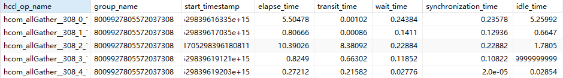
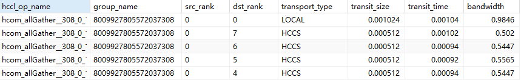
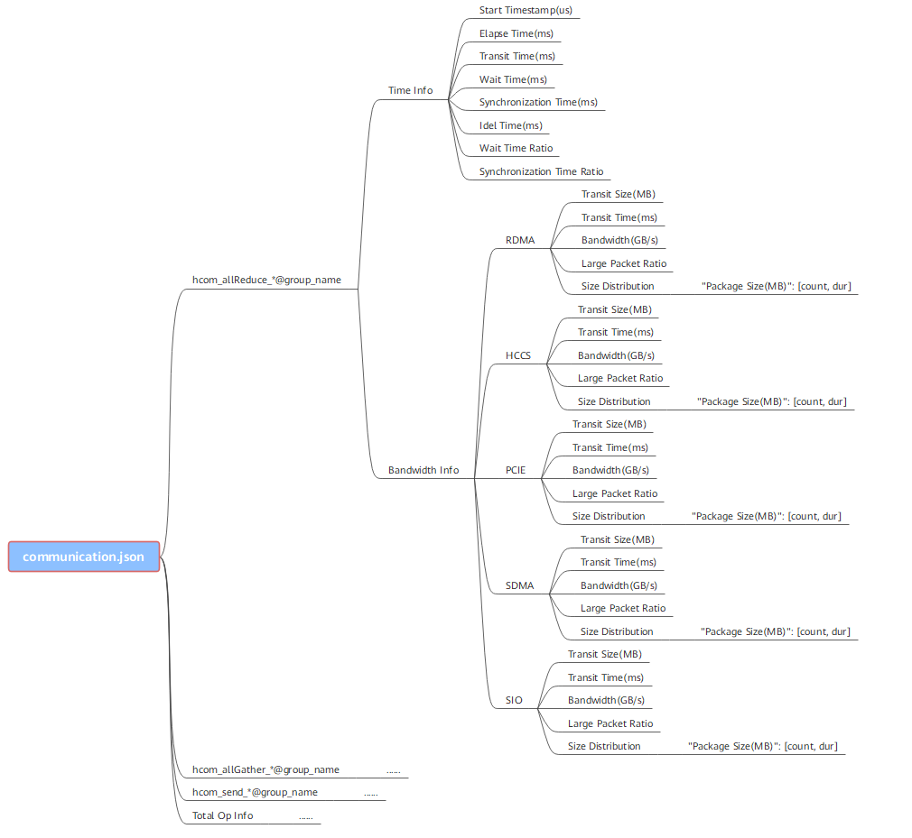
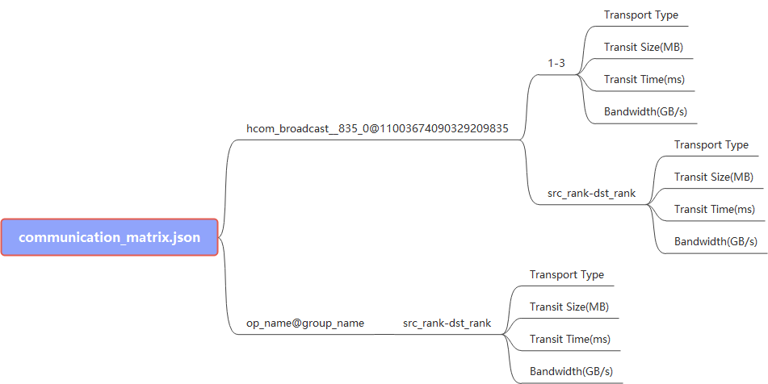

# msprof解析工具

## 简介

msprof命令行工具是通过msprof.py封装的，支持性能数据的通用解析。

**工具使用流程**

-   自动解析：一般情况下，在执行msprof命令行采集性能数据时，默认即解析并导出性能数据文件。
-   离线解析：
    -   对于不支持自动解析或需要重新解析的情况，可使用[解析并导出性能数据](#解析并导出性能数据)进行解析。
    -   （可选）对于性能数据文件解析失败的情况，可尝试使用[解析性能数据](#解析性能数据)进行重新解析后再次执行[解析并导出性能数据](#解析并导出性能数据)。
    -   （可选）对于需要指定迭代（Iteration ID）和模型（Model ID）进行解析的情况，可先使用[查询性能数据文件信息](#查询性能数据文件信息)或[解析性能数据](#解析性能数据)查询总迭代数和Model ID，再选择需要的迭代（Iteration ID）和模型（Model ID）进行[解析并导出性能数据](#解析并导出性能数据)。
    -   对于通信场景的性能数据需要在完成[解析并导出性能数据](#解析并导出性能数据)后，对已导出的数据进行[通信性能数据解析](#通信性能数据解析)。

## 使用前准备

**环境准备**

1.  安装配套版本的CANN Toolkit开发套件包和ops算子包并配置CANN环境变量，具体请参见《CANN 软件安装指南》。

    Ascend EP场景下msprof工具路径为：`${INSTALL_DIR}/tools/profiler/bin`，$\{INSTALL\_DIR\}请替换为CANN软件安装后文件存储路径。若安装的Toolkit软件包，以root安装举例，则安装后文件存储路径为：/usr/local/Ascend/cann。

    Ascend RC场景下msprof工具路径为：/var

2.  设置Python相关环境变量。

    存在多个Python3版本时，以指定python3.7.5为例，请根据实际修改。

    ```
    export PATH=/usr/local/python3.7.5/bin:$PATH
    #设置python3.7.5库文件路径
    export LD_LIBRARY_PATH=/usr/local/python3.7.5/lib:$LD_LIBRARY_PATH
    ```

> **说明：** 
>上述环境变量只在当前窗口生效，用户可以将上述命令写入\~/.bashrc文件，使其永久生效，操作如下：
>1.  以安装用户在任意目录下执行**vi \~/.bashrc**，在该文件最后添加上述内容。
>2.  执行**:wq!**命令保存文件并退出。
>3.  执行**source \~/.bashrc**使环境变量生效。

**约束**

使用该工具前，请了解相关使用约束：

-   权限约束
    -   用户须自行保证使用最小权限原则（如禁止other用户拥有写权限，常见如禁止666、777）。
    -   使用性能分析工具前请确保执行用户的umask值大于等于0027，否则会导致获取的性能数据所在目录和文件权限过大。
    -   出于安全性及权限最小化角度考虑，本工具不应使用root等高权限账户，建议使用普通用户权限执行。
    -   本工具为开发调测工具，不建议在生产环境使用。
    -   请确保性能数据保存在不含软链接的当前用户目录下，否则可能引起安全问题。

-   数据落盘约束
    
    -   解析性能数据过程中如果配置的落盘路径磁盘或用户目录空间已满，会出现解析失败或文件无法落盘的情况，须自行清理磁盘或用户目录空间。
    
-   兼容性和场景约束
    
    -   工具要求Python 3.7.5及以上版本。
    
-   其他约束

    -   本工具中需要指定路径的参数，要求路径中不能包含如下特殊字符。

        ```
        "\n", "\\n", "\f", "\\f", "\r", "\\r", "\b", "\\b", "\t", "\\t", "\v", "\\v", "\u007F", "\\u007F", "\"", "\\\"", "'", "\'", "\\", "\\\\", "%", "\\%", ">", "\\>", "<", "\\<", "|", "\\|", "&", "\\&", "$", "\\$", ";", "\\;", "`", "\\`"
        ```

## 解析并导出性能数据

**产品支持情况**

|AI处理器类型|是否支持|
|--|:-:|
|Atlas A3 训练系列产品/Atlas A3 推理系列产品|√|
|Atlas A2 训练系列产品/Atlas A2 推理系列产品|√|
|Atlas 200I/500 A2 推理产品|√|
|Atlas 推理系列产品|√|
|Atlas 训练系列产品|√|

**功能说明**

本功能用于解析并导出性能数据。

**注意事项**

-   请先完成[使用前准备](#使用前准备)。
-   请先完成性能数据采集。
-   以下产品不支持在设备上直接解析，需要将采集到的PROF\_XXX目录拷贝到安装了Toolkit软件包的环境下进行解析：
    -   Atlas 200I/500 A2 推理产品的Ascend RC场景

**命令格式**

```
msprof --export=on --output=<dir> [--type=<type>] [--reports=<reports_sample_config.json>] [--iteration-id=<number>] [--model-id=<number>] [--summary-format=<csv/json>] [--clear=on]
```

**参数说明**

**表 1**  参数说明

|参数|**可选/必选**| 说明                                                                                                                                                                                                                                                                                                                                                                                                                      |
|--|--|-------------------------------------------------------------------------------------------------------------------------------------------------------------------------------------------------------------------------------------------------------------------------------------------------------------------------------------------------------------------------------------------------------------------------|
|--export|必选| 解析并导出性能数据。可选on或off，默认值为off。<br>&#8226; on：表示开启<br/>&#8226; off：表示关闭<br/>若需导出个别模型（Model ID）/迭代（Iteration ID）的数据，可在msprof采集命令执行完成后重新执行msprof --export命令配置--model-id、--iteration-id参数。<br/>对于未解析的PROF_XXX文件，自动解析后再导出。<br/>示例：msprof --export=on --output=/home/HwHiAiUser                                                                                                                                                |
|--output|必选| 性能数据文件目录。须指定为PROF\_XXX目录或PROF_XXX目录的父目录，例如：/home/profiler_data/PROF\_XXX。                                                                                                                                                                                                                                                                                                                                      |
|--type|可选| 设置性能数据导出结果文件格式，即可以选择msprof命令行执行采集后自动解析的结果文件格式，取值为：<br/>&#8226; text：表示解析为json和csv格式的timeline和summary文件和db格式文件（msprof\_时间戳.db），详见[性能数据文件参考](profile_data_file_references.md)。支持CANN 7.0.0及以上版本的性能数据解析。<br/>&#8226; db：仅解析为一个汇总所有性能数据的db格式文件（msprof_时间戳.db），使用MindStudio Insight工具展示。当前该格式数据与text参数解析的数据信息量存在差异，建议使用text方式采集。配置db时，仅支持**msprof** **--export**命令的 **--output**参数，不支持**msprof --export**命令的其他参数。<br/>默认为text。 |
|--reports|可选| 传入用户自定义的reports_sample_config.json配置文件，会根据配置文件中指定的范围导出相应的性能数据。详见[使用示例（--reports参数）](#zh-cn_topic_0000001265229686_section1128153151819)。                                                                                                                                                                                                                                                                                |
|--iteration-id|可选| 迭代ID。需配置为正整数。默认值为1。与--model-id必须同时配置。<br/>&#8226; 对于Atlas A2 训练系列产品/Atlas A2 推理系列产品和Atlas A3 训练系列产品/Atlas A3 推理系列产品，支持--model-id=4294967295，表示指定以Step为粒度统计的迭代ID（每执行完成一个Step，Iteration ID加1）。仅支持解析MindSpore（版本号大于等于2.3）框架的性能数据。<br/>&#8226; --model-id配置为其他值时，指定以Graph为粒度统计的迭代ID（每个Graph执行一次，Iteration ID加1，当一个脚本被编译为多个Graph时，该ID与脚本层面的Step ID不一致）。                                                                                                              |
|--model-id|可选| 模型ID。需配置为正整数。与--iteration-id必须同时配置。<br/>&#8226; 对于Atlas A2 训练系列产品/Atlas A2 推理系列产品和Atlas A3 训练系列产品/Atlas A3 推理系列产品，支持--model-id=4294967295，为Step模式，即--iteration-id配置的值以Step为粒度解析。仅支持解析MindSpore（版本号大于等于2.3）框架的性能数据。<br/>&#8226; --model-id配置为其他值时，为Graph模式，即--iteration-id配置的值以Graph为粒度解析。                                                                                                                                                                       |
|--summary-format|可选| summary数据文件的导出格式，取值为：<br/>&#8226; json：导出的summary数据文件为json格式。<br/>&#8226; csv：导出的summary数据文件为csv，默认值。<br/>仅--type=text时支持。                                                                                                                                                                                                                                                                                               |
|--python-path|可选| 指定解析使用的Python解释器路径，要求Python 3.7.5及以上版本。                                                                                                                                                                                                                                                                                                                                                                                 |
|--clear|可选| 数据精简模式，开启后将在导出性能数据后删除PROF_XXX/device_{id}下的sqlite目录，以节省存储空间。可选on或off，默认值为off。                                                                                                                                                                                                                                                                                                                                           |


> **说明：** 
>-   默认情况下，导出所有性能数据。
>-   单算子场景和仅执行采集昇腾AI处理器系统数据的场景（即**msprof**采集命令未配置用户应用程序参数**--application**的情况），不支持--iteration-id和--model-id参数。

**使用示例**

指定性能数据文件目录的为/home/profiler\_data/PROF\_XXX目录，执行导出命令。

```
msprof --export=on --output=/home/profiler_data/PROF_XXX
```

**使用示例（--reports参数）<a name="zh-cn_topic_0000001265229686_section1128153151819"></a>**

指定的性能数据文件目录为/home/profiler\_data/PROF\_XXX目录，传入用户自定义的reports\_sample\_config.json配置文件，执行导出命令。

```
msprof --export=on --output=/home/profiler_data/PROF_XXX --reports=${INSTALL_DIR}/tools/profiler/profiler_tool/analysis/msconfig/reports_sample_config.json
```

$\{INSTALL\_DIR\}请替换为CANN软件安装后文件存储路径。若安装的Toolkit软件包，以root安装举例，则安装后文件存储路径为：/usr/local/Ascend/cann。

> **说明：** 
>-   --reports参数指定的是reports\_sample\_config.json文件。需要与--export同时配置，仅支持--type=text，且仅支持对json文件的timeline数据进行控制，csv文件的summary数据依然为全量导出。
>-   不支持软链接，文件大小最大阈值为64M，文件路径加上文件名长度最大阈值为1024字符。

reports\_sample\_config.json文件默认保存在`${INSTALL_DIR}/tools/profiler/profiler_tool/analysis/msconfig/`目录下，内容如下：

支持在任意有读写权限的目录下自行创建reports\_sample\_config.json文件。

```
{
	"json_process": {
		"ascend": true,
		"acc_pmu": true,
		"cann": true,
		"ddr": true,
		"stars_chip_trans": true,
		"hbm": true,
		"communication": true,
		"hccs": true,
		"os_runtime_api": true,
		"network_usage": true,
		"disk_usage": true,
		"memory_usage": true,
		"cpu_usage": true,
		"msproftx": true,
		"npu_mem": true,
		"overlap_analyse": true,
		"pcie": true,
		"sio": true,
		"stars_soc": true,
		"step_trace": true,
		"freq": true,
		"llc": true,
		"nic": true,
		"roce": true,
		"qos": true,
		"device_tx": true
	}
}
```

以上为控制相应性能数据的开关，可配置开启（true）或关闭（false或删除字段）。控制的性能数据包括msprof\_\*.json文件的timeline数据层级（包括CANN，Ascend Hardware、AI Core Freq、片上内存、Communication、Overlap Analysis、NPU\_MEM层级等）。

> **说明：** 
>-   导出以上数据的前提是原始性能数据中已存在相应数据，即相应数据已采集。
>-   需确保reports\_sample\_config.json文件格式正确，否则可能导致如下情况：
>       -   文件内容错误，如拼写错误，--reports参数不生效，导出全量性能数据。
>       -   文件读取失败，如权限问题、文件不存在等，导致--reports无法读取配置文件，则会中断导出进程并报错。

**输出说明**

执行完**msprof --export**命令后，会在PROF\_XXX目录下生成mindstudio\_profiler\_output目录。

生成的性能数据目录结构如下所示。

-   单采集进程

    ```
    └── PROF_XXX
          ├── device_0
          │    └── data
          ├── device_1
          │    └── data
          ├── host
          │    └── data
          ├── msprof_*.db
          └── mindstudio_profiler_output
                ├── msprof_*.json
                ├── step_trace_*.json
                ├── xx_*.csv
                 ...
                └── README.txt
    ```

-   多采集进程

    ```
    └── PROF_XXX1
          ├── device_0
          │    └── data
          ├── host
          │    └── data
          ├── msprof_*.db
          └── mindstudio_profiler_output
                ├── msprof_*.json
                ├── step_trace_*.json
                ├── xx_*.csv
                 ...
                └── README.txt
    └── PROF_XXX2
          ├── device_1
          │    └── data
          ├── host
          │    └── data
          ├── msprof_*.db
          └── mindstudio_profiler_output
                ├── msprof_*.json
                ├── step_trace_*.json
                ├── xx_*.csv
                 ...
                └── README.txt
    ```

> **说明：** 
>-   msprof\_\*.db为汇总所有性能数据的db格式文件。mindstudio\_profiler\_output目录下的json文件为timeline信息文件，主要收集算子、任务等运行耗时，以色块形式展示；csv文件为summary信息文件，主要以表格形式汇总运行耗时。性能数据详细介绍请参见[性能数据文件参考](profile_data_file_references.md)。
>-   多Device场景下，若启动单采集进程，则仅生成一个PROF\_XXX目录，若启动多采集进程则生成多个PROF\_XXX目录，其中device目录在PROF\_XXX目录下生成，每个PROF\_XXX目录下生成多少个device目录与用户实际操作有关，不影响性能数据分析。
>-   mindstudio\_profiler\_output目录中的文件是根据采集的实际性能数据进行生成，如果实际的性能数据没有相关的数据文件，就不会导出对应的timeline和summary数据。
>-   对于被强制中断的msprof采集进程，工具会保存已采集的原始性能数据，**msprof** **--parse**功能重新解析后，再次执行**msprof --export**。

## 查询性能数据文件信息

**产品支持情况<a name="zh-cn_topic_0000001265069802_section026513436147"></a>**

|AI处理器类型|是否支持|
|--|:-:|
|Atlas A3 训练系列产品/Atlas A3 推理系列产品|√|
|Atlas A2 训练系列产品/Atlas A2 推理系列产品|√|
|Atlas 200I/500 A2 推理产品|√|
|Atlas 推理系列产品|√|
|Atlas 训练系列产品|√|


**功能说明<a name="zh-cn_topic_0000001265069802_section145530158016"></a>**

本功能用于查询性能数据文件信息，确认导出时指定迭代（Iteration ID）/模型（Model ID）。

性能数据解析时自动打印展示性能数据文件信息，故本功能在数据解析中为可选操作，主要用于已解析的历史PROF\_XXX目录重新查询性能数据文件信息。

**注意事项<a name="zh-cn_topic_0000001265069802_section1862912104913"></a>**

-   请先完成[使用前准备](#使用前准备)。
-   请先完成性能数据采集。
-   以下产品不支持在设备上直接解析，需要将采集到的PROF\_XXX目录拷贝到安装了Toolkit软件包的环境下进行解析：
    -   Atlas 200I/500 A2 推理产品的Ascend RC场景

**命令格式<a name="zh-cn_topic_0000001265069802_section427441453914"></a>**

```
msprof --query=on --output=<dir>
```

**参数说明<a name="zh-cn_topic_0000001265069802_section560313153920"></a>**

**表 1**  参数说明

|参数|**可选/必选**|说明|
|--|--|--|
|--query|必选|查询性能数据文件信息。可选on或off，默认值为off。<br>&#8226; on：表示开启<br>&#8226; off：表示关闭<br/>当完成解析后，可以通过本参数查询性能数据文件信息。|
|--output|必选|解析后的性能数据文件目录。须指定为PROF_XXX目录或PROF_XXX目录的父目录，例如：/home/profiler_data/PROF_XXX。|

**使用示例<a name="zh-cn_topic_0000001265069802_section1418112291310"></a>**

指定解析后的性能数据文件目录为/home/profiler\_data/PROF\_XXX，开启查询性能数据文件信息功能。

```
msprof --query=on --output=/home/profiler_data/PROF_XXX
```

**输出说明<a name="zh-cn_topic_0000001265069802_section168811719132211"></a>**

msprof工具的查询功能获取到的信息如下表所示。

**表 2**  Profiling数据文件信息

|字段|含义|
|--|--|
|Job Info|任务名。|
|Device ID|设备ID。|
|Dir Name|文件夹名称。|
|Collection Time|数据采集时间。|
|Model ID|模型ID。|
|Iteration Number|总迭代数。|
|Top Time Iteration|耗时最长的5个迭代。|
|Rank ID|集群场景的节点识别ID。|


## 解析性能数据

**产品支持情况<a name="zh-cn_topic_0000001265229730_zh-cn_topic_0000002111094444_section5889102116569"></a>**

|AI处理器类型|是否支持|
|--|:-:|
|Atlas A3 训练系列产品/Atlas A3 推理系列产品|√|
|Atlas A2 训练系列产品/Atlas A2 推理系列产品|√|
|Atlas 200I/500 A2 推理产品|√|
|Atlas 推理系列产品|√|
|Atlas 训练系列产品|√|


**功能说明<a name="zh-cn_topic_0000001265229730_section180511375811"></a>**

该功能只会进行性能数据解析，不会导出性能数据文件，导出性能数据文件功能请参见[解析并导出性能数据](#解析并导出性能数据)。

一般情况下，解析性能数据功能不需要单独使用，主要有如下两种使用场景：

-   对于性能数据文件解析失败的场景（例如：当存在首次解析由于某些原因导致解析失败，残留文件时），可以使用**msprof** **--parse**功能重新解析后，再次执行**msprof --export**。
-   对于需要指定 **--model-id**和 **--iteration-id**参数进行**msprof --export**导出时，可以先执行**msprof** **--parse**解析并打印迭代（Iteration ID）/模型（Model ID）后，选择需要的Iteration ID和Model ID进行导出。

**注意事项<a name="zh-cn_topic_0000001265229730_section1862912104913"></a>**

-   请先完成[使用前准备](#使用前准备)。
-   请先完成性能数据采集。
-   以下产品不支持在设备上直接解析，需要将采集到的PROF\_XXX目录拷贝到安装了Toolkit软件包的环境下进行解析：
    -   Atlas 200I/500 A2 推理产品的Ascend RC场景

**命令格式<a name="zh-cn_topic_0000001265229730_section242218915115"></a>**

```
msprof --parse=on --output=<dir>
```

**参数说明<a name="zh-cn_topic_0000001265229730_section2451143111512"></a>**

**表 1**  参数说明

|参数|**可选/必选**|说明|
|--|--|--|
|--parse|必选|解析原始性能数据文件。可选on或off，默认值为off。<br>&#8226; on：表示开启<br/>&#8226; off：表示关闭|
|--output|必选|原始性能数据文件目录。须指定为PROF\_XXX目录或PROF\_XXX目录的父目录，例如：/home/profiler_data/PROF_XXX。|
|--python-path|可选|指定解析使用的Python解释器路径，要求Python 3.7.5及以上版本。|

**使用示例<a name="zh-cn_topic_0000001265229730_section16676746151716"></a>**

解释原始性能数据文件，指定/home/profiler\_data/PROF\_XXX为原始性能数据文件目录。

```
msprof --parse=on --output=/home/profiler_data/PROF_XXX
```

**输出说明<a name="section1110932215311"></a>**

执行完上述命令，会打印展示性能数据文件信息并在PROF\_XXX的device_\{id\}和host目录下生成sqlite目录，sqlite目录下会有db文件生成。

需要继续导出最终结果的timeline数据或db文件，可执行[解析并导出性能数据](#解析并导出性能数据)。

## 通信性能数据解析

**产品支持情况<a name="zh-cn_topic_0000001631250206_zh-cn_topic_0000002111094444_section5889102116569"></a>**

|AI处理器类型|是否支持|
|--|:-:|
|Atlas A3 训练系列产品/Atlas A3 推理系列产品|√|
|Atlas A2 训练系列产品/Atlas A2 推理系列产品|√|
|Atlas 200I/500 A2 推理产品|x|
|Atlas 推理系列产品|√|
|Atlas 训练系列产品|√|


**功能说明<a name="zh-cn_topic_0000001631250206_section38498221045"></a>**

msprof通信性能数据解析功能主要用于统计通信类的分段耗时、拷贝、带宽等信息，以便进行通信类数据分析。通信类数据只有在多卡、多节点或集群场景下存在。

**注意事项<a name="zh-cn_topic_0000001631250206_section1862912104913"></a>**

-   请先完成[使用前准备](#使用前准备)。
-   请先对PROF\_XXX目录执行**msprof**的解析导出操作，同时关闭数据精简模式，命令示例如下：

    ```
    msprof --export=on --output=/home/xxx/profiler_data/PROF_XXX --clear=off
    ```

-   以下产品不支持在设备上直接解析，需要将采集到的PROF\_XXX目录拷贝到安装了Toolkit软件包的环境下进行解析：
    
    -   Atlas 200I/500 A2 推理产品的Ascend RC场景

**命令格式<a name="zh-cn_topic_0000001631250206_section916018568431"></a>**

msprof命令行方式：

```
msprof --analyze=on [--type=<type>] [--rule=communication] --output=<dir> [--clear=on]
```

msprof.py脚本方式：

```
python3 msprof.py analyze [--type <type>] --rule communication -dir <dir> [--clear]
```

**参数说明<a name="zh-cn_topic_0000001631250206_section22131743164518"></a>**

**表 1**  参数说明（msprof命令行方式）

|参数|**可选/必选**| 说明                                                                                                                                                                                                                                                                                                                                                                                                                                                                                                                                                                                                                                                                                                                                                                                                                                     |
|--|--|----------------------------------------------------------------------------------------------------------------------------------------------------------------------------------------------------------------------------------------------------------------------------------------------------------------------------------------------------------------------------------------------------------------------------------------------------------------------------------------------------------------------------------------------------------------------------------------------------------------------------------------------------------------------------------------------------------------------------------------------------------------------------------------------------------------------------------------|
|--analyze|必选| 分析性能数据文件，可选on或off，默认值为off。<br>&#8226; on：表示开启<br/>&#8226; off：表示关闭                                                                                                                                                                                                                                                                                                                                                                                                                                                                                                                                                                                                                                                                                                                                                                     |
|--type|可选| 设置性能数据解析结果文件格式，即可以选择msprof命令行执行后自动解析的结果文件格式，取值为：<br/>text：表示解析为json格式文件和communication_analyzer.db文件。<br/>db：表示解析为communication_analyzer.db文件。<br/>默认为text。                                                                                                                                                                                                                                                                                                                                                                                                                                                                                                                                                                                                                                                                             |
|--rule|可选| 分析规则，取值为：<br/>&#8226; communication：分析通信类数据。<br/>&#8227; --type=text时，在PROF_XXX/analyze目录下生成communication.json文件，展示单卡所有通信算子通信耗时、带宽等详细信息，如[图4](#zh-cn_topic_0000001631250206_fig176088819116)所示；以及生成communication_analyzer.db文件。<br/>&#8227; --type=db时，在PROF_XXX/analyze目录下仅生成communication_analyzer.db文件，保存CommAnalyzerTime（通信耗时）和CommAnalyzerBandwidth（通信带宽）信息表。<br/>&#8226; communication_matrix：分析通信矩阵数据。<br/>&#8227; --type=text时，在PROF_XXX/analyze目录下生成communication_matrix.json文件，展示通信小算子基本的信息，包含通信size、通信带宽、通信rank等信息，用于分析通信细节，如[图5](#zh-cn_topic_0000001631250206_fig182611711341)所示；以及生成communication_analyzer.db文件。<br/>&#8227; --type=db时，在PROF_XXX/analyze目录下仅生成communication_analyzer.db文件，保存CommAnalyzerMatrix（通信矩阵）信息表。<br/>以上两个参数值可以同时配置，使用逗号分隔，例如 **：--rule**=communication,communication_matrix。<br/>默认同时设置以上两个参数值。 |
|--output|必选| 性能数据文件目录。须指定为PROF\_XXX目录，例如：/home/HwHiAiUser/profiler_data/PROF_XXX。                                                                                                                                                                                                                                                                                                                                                                                                                                                                                                                                                                                                                                                                                                                                                                 |
|--clear|可选| 数据精简模式，开启后将在导出性能数据后删除PROF_XXX目录下的sqlite目录，以节省存储空间。可选on或off，默认值为off。                                                                                                                                                                                                                                                                                                                                                                                                                                                                                                                                                                                                                                                                                                                                                                    |


**表 2**  参数说明（msprof.py脚本方式）

|参数|**可选/必选**|说明|
|--|--|--|
|analyze|必选|分析性能数据文件。|
|--type|可选|设置性能数据解析结果文件格式，即可以选择msprof.py脚本执行后自动解析的结果文件格式，取值为：<br/>&#8226; text：表示解析为json格式文件和communication_analyzer.db文件。<br/>&#8226; db：表示解析为communication_analyzer.db文件。默认为text。|
|-r或--rule|必选|分析规则，取值为：<br/>&#8226; communication：分析通信类数据。<br/>&#8227; --type text时，在PROF_XXX/analyze目录下生成communication.json文件，展示单卡所有通信算子通信耗时、带宽等详细信息，如[图4](#zh-cn_topic_0000001631250206_fig176088819116)所示；以及生成communication_analyzer.db文件。<br/>&#8227; --type db时，在PROF_XXX/analyze目录下仅生成communication_analyzer.db文件，保存CommAnalyzerTime（通信耗时）和CommAnalyzerBandwidth（通信带宽）信息表。<br/>&#8226; communication_matrix：分析通信矩阵数据。<br/>&#8227; --type text时，在PROF_XXX/analyze目录下生成communication_matrix.json文件，展示通信小算子基本的信息，包含通信size、通信带宽、通信rank等信息，用于分析通信细节，如[图5](#zh-cn_topic_0000001631250206_fig182611711341)所示；以及生成communication_analyzer.db文件。<br/>&#8227; --type db时，在PROF_XXX/analyze目录下仅生成communication_analyzer.db文件，保存CommAnalyzerMatrix（通信矩阵）信息表。<br/>以上两个参数值可以二选一也可以同时配置，同时配置时使用逗号分隔，例如：--rule communication,communication_matrix。|
|-dir或--collection-dir|必选|性能数据文件目录。须指定为PROF\_XXX目录，例如：/home/profiler_data/PROF_XXX。|
|--clear|可选|数据精简模式，开启后将在导出性能数据后删除PROF_XXX目录下的sqlite目录，以节省存储空间。配置该参数时表示开启数据精简模式，默认未配置该参数，表示关闭。|


**使用示例（msprof命令行方式）<a name="zh-cn_topic_0000001631250206_section627382494419"></a>**

指定/home/profiler\_data/PROF\_XXX目录为性能数据文件目录，开启解析性通信能数据文件功能。

```
msprof --analyze=on --output=/home/profiler_data/PROF_XXX
```

**使用示例（msprof.py脚本方式）<a name="zh-cn_topic_0000001631250206_section1080212562237"></a>**

1.  以Toolkit软件包的运行用户登录开发环境。
2.  切换至msprof.py脚本所在目录。

    `${INSTALL_DIR}/tools/profiler/profiler_tool/analysis/msprof`，$\{INSTALL\_DIR\}请替换为CANN软件安装后文件存储路径。若安装的Toolkit软件包，以root安装举例，则安装后文件存储路径为：/usr/local/Ascend/cann。

3.  设置解析通信类数据，指定/home/profiler\_data/PROF\_XXX目录为性能数据文件目录，执行解析命令。

    ```
    python3 msprof.py analyze --rule communication -dir /home/profiler_data/PROF_XXX
    ```

**输出结果文件说明<a name="zh-cn_topic_0000001631250206_section023216238448"></a>**

-   --type=text或--type=db以及--rule=communication

**图 1**  CommAnalyzerTime<a name="zh-cn_topic_0000001631250206_fig1437311348497"></a>  


**表 3**  CommAnalyzerTime

|字段|说明|
|--|--|
|hccl_op_name|通信算子名称。|
|group_name|通信算子的分组。|
|start_timestamp|通信开始时间戳。|
|elapse_time|算子的通信总耗时，单位ms。|
|transit_time|通信时长，单位ms。表示通信算子的通信耗时，如果通信耗时过长，可能是某条链路存在问题。|
|wait_time|等待时长，单位ms。节点之间通信前首先需要进行同步，确保通信的两个节点同步完成，再进行通信。|
|synchronization_time|同步时长，单位ms。节点之间进行同步需要的时长。|
|idle_time|空闲时间，单位ms。空闲时间（idle_time） = 算子的通信总耗时（elapse_time） - 通信时长（transit_time） - 等待时长（wait_time）。|

**图 2**  CommAnalyzerBandwidth<a name="zh-cn_topic_0000001631250206_fig1670544917497"></a>  


**表 4**  CommAnalyzerBandwidth

|字段|说明|
|--|--|
|hccl_op_name|通信算子名称。|
|group_name|通信算子的分组。|
|transport_type|通信传输类型，包含：LOCAL、SDMA、RDMA、PCIE、HCCS、SIO。|
|transit_size|通信数据量，单位MB。|
|transit_time|通信时长，单位ms。表示通信算子的通信耗时，如果通信耗时过长，可能是某条链路存在问题。|
|bandwidth|通信带宽大小，单位GB/s。|
|large_packet_ratio|通信数据大包占比。|
|package_size|一次传输的通信数据包大小，单位MB。|
|count|通信传输次数。|
|total_duration|数据传输总耗时，单位ms。|


-   --type=text或--type=db以及--rule=communication\_matrix

    **图 3**  CommAnalyzerMatrix<a name="zh-cn_topic_0000001631250206_fig746925911497"></a>  
    

    **表 5**  CommAnalyzerMatrix

|字段|说明|
|--|--|
|hccl_op_name|通信算子名称。|
|group_name|通信算子的分组。|
|src_rank|通信源Rank。|
|dst_rank|通信目的Rank。|
|transport_type|通信传输类型，包含：LOCAL、SDMA、RDMA、PCIE、HCCS、SIO。|
|transit_size|通信数据量，单位MB。|
|transit_time|通信时长，单位ms。表示通信算子的通信耗时，如果通信耗时过长，可能是某条链路存在问题。|
|bandwidth|通信带宽大小，单位GB/s。|


-   --type=text、--rule=communication

    **图 4**  communication.json<a name="zh-cn_topic_0000001631250206_fig176088819116"></a>  
    

-   --type=text、--rule=communication\_matrix

    **图 5**  communication\_matrix.json<a name="zh-cn_topic_0000001631250206_fig182611711341"></a>  
    
