# 性能数据文件参考<a name="ZH-CN_TOPIC_0000002477463220"></a>

## 总体说明<a name="ZH-CN_TOPIC_0000002509383183"></a>

采集性能原始数据，并解析导出成可视化的性能数据文件后，文件目录结构及主要文件如下。

**目录结构及文件说明<a name="zh-cn_topic_0000001798537961_section469834321910"></a>**

性能数据目录结构示例如下（仅展示性能数据）：

```
├── msprof_*.db
├── mindstudio_profiler_output
│    ├── msprof_*.json
│    ├── step_trace_*.json
│    ├── xx_*.csv
...
│    └── README.txt 
├── device_{id}
...
│    └── data
├── host
...
     └── data
```

\*表示\{timestamp\}时间戳。

-   mindstudio\_profiler\_output目录保存Host和各个Device的性能数据汇总（性能数据分析推荐查看该目录下文件），目录下的结果文件命名格式为：“模块名\_\{timestamp\}.\{json/csv\}”。
-   device_{id}目录主要保存各个Device运行昇腾AI应用的性能原始数据和昇腾AI处理器系统原始数据。
-   host目录主要保存上层应用接口（msproftx）的昇腾AI应用运行性能原始数据和Host系统原始数据。

> **说明：** 
>该目录下的各个文件数据量较大，可能出现数据文件分片，若不需要切分文件，可参见[性能数据文件分片](appendixes.md#性能数据文件分片)修改分片容量上限。

默认采集的性能数据文件如[表1](#zh-cn_topic_0000001798537961_table775514312190)所示。

**表 1**  msprof默认配置采集的性能数据文件<a name="zh-cn_topic_0000001798537961_table775514312190"></a>

|文件名|说明|
|--|--|
|msprof_*.db|汇总所有性能数据的db格式文件。|
|msprof_*.json|timeline数据总表。|
|step_trace_*.json|迭代轨迹数据，每轮迭代的耗时。单算子场景（如PyTorch场景）下无此性能数据文件。|
|op_summary_*.csv|AI Core和AI CPU算子数据。|
|op_statistic_*.csv|AI Core和AI CPU算子调用次数及耗时统计。|
|step_trace_*.csv|迭代轨迹数据。单算子场景（如PyTorch场景）下无此性能数据文件。|
|task_time_*.csv|Task Scheduler任务调度信息。|
|fusion_op_*.csv|模型中算子融合前后信息。单算子场景（如PyTorch场景）下无此性能数据文件。|
|api_statistic_*.csv|用于统计CANN层的API执行耗时信息。|


> **说明：** 
>上表中的json文件为timeline信息文件，主要收集算子、任务等运行耗时，以色块形式展示；csv文件为summary信息文件，主要以表格形式汇总运行耗时。

**查看整体性能数据<a name="zh-cn_topic_0000001798537961_section268312488227"></a>**

msprof\_\*.db为汇总整体性能数据的文件，mindstudio\_profiler\_output目录下的timeline和summary文件则是将各类性能数据拆分成多个文件，以上两类文件均可以使用MindStudio Insight工具导入后进行整体数据的可视化展示，详细操作请参见《MindStudio Insight工具用户指南》。

**查看timeline文件<a name="zh-cn_topic_0000001798537961_section2083110814512"></a>**

使用Perfetto UI打开：在Chrome浏览器中输入https://ui.perfetto.dev/地址，将.json文件拖到空白处打开，通过键盘上的快捷键（w：放大，s：缩小，a：左移，d：右移）进行查看。

使用tracing打开：在Chrome浏览器中输入chrome://tracing地址，将.json文件拖到空白处打开，通过键盘上的快捷键（w：放大，s：缩小，a：左移，d：右移）进行查看。

> **说明：** 
>超大文件推荐使用Perfetto UI打开。

**summary文件说明<a name="zh-cn_topic_0000001798537961_section19411141014571"></a>**

-   生成的summary数据文件使用Excel打开时，可能会出现字段值为科学计数的情况，例如“1.00159E+12”。此时可选中该单元格，然后“右键\>设置单元格格式”，在弹出的对话框中“数字”标签下选择“数值”，单击“确定”就能正常显示。
-   生成的summary数据文件中某些字段值为“N/A”时，表示此时该值不存在。


## msprof导出db格式数据说明<a name="ZH-CN_TOPIC_0000002509503205"></a>

msprof命令执行完成后，会生成一个汇总所有性能数据的msprof\_\{时间戳\}.db表结构文件，该文件推荐使用MindStudio Insight工具查看，也可以使用Navicat Premium等数据库开发工具直接打开。当前db文件汇总的性能数据如下：

> **说明：** 
>db文件均以表格形式展示性能数据，且所有数据均以数字映射（例如opName字段下的算子名显示为194），数字与名称的映射表为[STRING\_IDS](#zh-cn_topic_0000002076410600_section116561584178)。

**单位相关<a name="zh-cn_topic_0000002076410600_section1053014715533"></a>**

1.  时间相关，统一使用纳秒（ns），且为本地Unix时间。
2.  内存相关，统一使用字节（Byte）。
3.  带宽相关，统一使用Byte/s。
4.  频率相关，统一使用MHz。

**ENUM\_API\_TYPE<a name="zh-cn_topic_0000002076410600_section8466235152619"></a>**

枚举表。

无对应开关，导出msprof\_\{时间戳\}.db文件时默认生成。

**表 1**  格式

|字段名|类型|含义|
|--|--|--|
|id|INTEGER|索引，ID|
|name|TEXT|API类型|


**表 2**  内容

|id|name|
|--|--|
|20000|acl|
|15000|model|
|10000|node|
|5500|communication|
|5000|runtime|
|50001|op|
|50002|queue|
|50003|trace|
|50004|mstx|


**ENUM\_MODULE<a name="zh-cn_topic_0000002076410600_section15914131919911"></a>**

枚举表。

无对应开关，导出msprof\_\{时间戳\}.db文件时默认生成。

**表 3**  格式

|字段名|类型|含义|
|--|--|--|
|id|INTEGER|索引，ID|
|name|TEXT|组件名|


**表 4**  内容

|id|name|
|--|--|
|0|SLOG|
|1|IDEDD|
|2|SCC|
|3|HCCL|
|4|FMK|
|5|CCU|
|6|DVPP|
|7|RUNTIME|
|8|CCE|
|9|HDC|
|10|DRV|
|11|NET|
|22|DEVMM|
|23|KERNEL|
|24|LIBMEDIA|
|25|CCECPU|
|27|ROS|
|28|HCCP|
|29|ROCE|
|30|TEFUSION|
|31|PROFILING|
|32|DP|
|33|APP|
|34|TS|
|35|TSDUMP|
|36|AICPU|
|37|LP|
|38|TDT|
|39|FE|
|40|MD|
|41|MB|
|42|ME|
|43|IMU|
|44|IMP|
|45|GE|
|47|CAMERA|
|48|ASCENDCL|
|49|TEEOS|
|50|ISP|
|51|SIS|
|52|HSM|
|53|DSS|
|54|PROCMGR|
|55|BBOX|
|56|AIVECTOR|
|57|TBE|
|58|FV|
|59|MDCMAP|
|60|TUNE|
|61|HSS|
|62|FFTS|
|63|OP|
|64|UDF|
|65|HICAID|
|66|TSYNC|
|67|AUDIO|
|68|TPRT|
|69|ASCENDCKERNEL|
|70|ASYS|
|71|ATRACE|
|72|RTC|
|73|SYSMONITOR|
|74|AMP|
|75|ADETECT|
|76|MBUFF|
|77|CUSTOM|


**ENUM\_HCCL\_DATA\_TYPE<a name="zh-cn_topic_0000002076410600_section899062216107"></a>**

枚举表。

无对应开关，导出msprof\_\{时间戳\}.db文件时默认生成。

**表 5**  格式

|字段名|类型|含义|
|--|--|--|
|id|INTEGER|索引，ID|
|name|TEXT|通信数据类型|


**表 6**  内容

|id|name|
|--|--|
|0|INT8|
|1|INT16|
|2|INT32|
|3|FP16|
|4|FP32|
|5|INT64|
|6|UINT64|
|7|UINT8|
|8|UINT16|
|9|UINT32|
|10|FP64|
|11|BFP16|
|12|INT128|
|255|RESERVED|
|65534|N/A|
|65535|INVALID_TYPE|


**ENUM\_HCCL\_LINK\_TYPE<a name="zh-cn_topic_0000002076410600_section1843687151113"></a>**

枚举表。

无对应开关，导出msprof\_\{时间戳\}.db文件时默认生成。

**表 7**  格式

|字段名|类型|含义|
|--|--|--|
|id|INTEGER|索引，ID|
|name|TEXT|通信链路类型|


**表 8**  内容

|id|name|
|--|--|
|0|ON_CHIP|
|1|HCCS|
|2|PCIE|
|3|ROCE|
|4|SIO|
|5|HCCS_SW|
|6|STANDARD_ROCE|
|255|RESERVED|
|65534|N/A|
|65535|INVALID_TYPE|


**ENUM\_HCCL\_TRANSPORT\_TYPE<a name="zh-cn_topic_0000002076410600_section64765193176"></a>**

枚举表。

无对应开关，导出msprof\_\{时间戳\}.db文件时默认生成。

**表 9**  格式

|字段名|类型|含义|
|--|--|--|
|id|INTEGER|索引，ID|
|name|TEXT|通信传输类型|


**表 10**  内容

|id|name|
|--|--|
|0|SDMA|
|1|RDMA|
|2|LOCAL|
|255|RESERVED|
|65534|N/A|
|65535|INVALID_TYPE|


**ENUM\_HCCL\_RDMA\_TYPE<a name="zh-cn_topic_0000002076410600_section2375181481718"></a>**

枚举表。

无对应开关，导出msprof\_\{时间戳\}.db文件时默认生成。

**表 11**  格式

|字段名|类型|含义|
|--|--|--|
|id|INTEGER|索引，ID|
|name|TEXT|通信RDMA类型|


**表 12**  内容

|id|name|
|--|--|
|0|RDMA_SEND_NOTIFY|
|1|RDMA_SEND_PAYLOAD|
|255|RESERVED|
|65534|N/A|
|65535|INVALID_TYPE|


**ENUM\_MSTX\_EVENT\_TYPE<a name="zh-cn_topic_0000002076410600_section1752102012146"></a>**

枚举表。

无对应开关，导出msprof\_\{时间戳\}.db文件时默认生成。

**表 13**  格式

|字段名| 类型     |含义|
|--|--------|--|
|id| INTEGER |索引，Host侧tx打点数据event类型对应的ID|
|name| TEXT   |Host侧tx打点数据event类型|


**表 14**  内容

|id|name|
|--|--|
|0|marker|
|1|push/pop|
|2|start/end|
|3|marker_ex|


**ENUM\_MEMCPY\_OPERATION<a name="zh-cn_topic_0000002076410600_section1663131744913"></a>**

枚举表。

无对应开关，导出msprof\_\{时间戳\}.db文件时默认生成。

**表 15**  格式

|字段名|类型|含义|
|--|--|--|
|id|INTEGER|主键，ID|
|name|TEXT|拷贝类型|


**表 16**  内容

|id|name|
|--|--|
|0|host to host|
|1|host to device|
|2|device to host|
|3|device to device|
|4|managed memory|
|5|addr device to device|
|6|host to device ex|
|7|device to host ex|
|65535|other|


**STRING\_IDS<a name="zh-cn_topic_0000002076410600_section116561584178"></a>**

映射表，用于存储ID和字符串映射关系。

无对应开关。

**表 17**  格式

|字段名|类型|含义|
|--|--|--|
|id|INTEGER|索引，string ID|
|value|TEXT|string value|


**SESSION\_TIME\_INFO<a name="zh-cn_topic_0000002076410600_section153758441710"></a>**

时间表，用于存储性能数据中的开始结束时间。在采集未正常退出时，无结束时间。

无对应开关。

**表 18**  格式

|字段名|类型|含义|
|--|--|--|
|startTimeNs|INTEGER|任务开启时的Unix时间，单位ns|
|endTimeNs|INTEGER|任务结束时的Unix时间，单位ns|


**NPU\_INFO<a name="zh-cn_topic_0000002076410600_section966211019179"></a>**

对应deviceId的芯片型号。

无对应开关。

**表 19**  格式

|字段名|类型|含义|
|--|--|--|
|id|INTEGER|设备ID，显示为-1时表示未采集到deviceId|
|name|TEXT|设备对应的芯片型号|


**HOST\_INFO<a name="zh-cn_topic_0000002076410600_section57348569166"></a>**

hostUid及名称。

无对应开关。

**表 20**  格式

|字段名|类型|含义|
|--|--|--|
|hostUid|TEXT|标识Host的唯一ID|
|hostName|TEXT|Host主机名称，如localhost|


**TASK<a name="zh-cn_topic_0000002076410600_section16993252171612"></a>**

task数据，呈现所有硬件执行的算子信息。

由--task-time开关控制。

**表 21**  格式

|字段名|类型|含义|
|--|--|--|
|startNs|INTEGER|与globalTaskId联合索引，索引名称TaskIndex，算子任务开始时间，单位ns|
|endNs|INTEGER|算子任务结束时间，单位ns|
|deviceId|INTEGER|算子任务对应的设备ID|
|connectionId|INTEGER|生成host-device连线|
|globalTaskId|INTEGER|与startNs联合索引，索引名称TaskIndex，用于唯一标识全局算子任务|
|globalPid|INTEGER|算子任务执行时的PID|
|taskType|INTEGER|设备执行该算子的加速器类型|
|contextId|INTEGER|用于区分子图小算子，常见于MIX算子和FFTS+任务|
|streamId|INTEGER|算子任务对应的streamId|
|taskId|INTEGER|算子任务对应的taskId|
|modelId|INTEGER|算子任务对应的modelId|


**COMPUTE\_TASK\_INFO<a name="zh-cn_topic_0000002076410600_section1724311477163"></a>**

计算算子描述信息。

由--task-time开关控制。

**表 22**  格式

|字段名|类型|含义|
|--|--|--|
|name|INTEGER|算子名，STRING_IDS(name)|
|globalTaskId|INTEGER|索引，全局算子任务ID，用于关联TASK表|
|blockDim|INTEGER|算子运行切分数量，对应算子运行时核数|
|mixBlockDim|INTEGER|mix算子从加速器的BlockDim值|
|taskType|INTEGER|Host执行该算子的加速器类型，STRING_IDS(taskType)|
|opType|INTEGER|算子类型，STRING_IDS(opType)|
|inputFormats|INTEGER|算子输入数据格式，STRING_IDS(inputFormats)|
|inputDataTypes|INTEGER|算子输入数据类型，STRING_IDS(inputDataTypes)|
|inputShapes|INTEGER|算子的输入维度，STRING_IDS(inputShapes)|
|outputFormats|INTEGER|算子输出数据格式，STRING_IDS(outputFormats)|
|outputDataTypes|INTEGER|算子输出数据类型，STRING_IDS(outputDataTypes)|
|outputShapes|INTEGER|算子输出维度，STRING_IDS(outputShapes)|
|attrInfo|INTEGER|算子的attr信息，用来映射算子shape，算子自定义的参数等，STRING_IDS(attrInfo)|
|opState|INTEGER|算子的动静态信息，dynamic表示动态算子，static表示静态算子，N/A表示该场景或该算子不识别，STRING_IDS(opState)|
|hf32Eligible|INTEGER|标识是否使用HF32精度标记，YES表示使用，NO表示未使用，N/A表示该场景或该算子不识别，STRING_IDS(hf32Eligible)|


**COMMUNICATION\_TASK\_INFO<a name="zh-cn_topic_0000002076410600_section1656344215167"></a>**

描述通信小算子信息。

由--task-time、--hccl、--ascendcl开关控制对应数据的采集。配置--task-time为非l0时数据有效。有通信数据的场景下默认生成该表。

**表 23**  格式

|字段名|类型|含义|
|--|--|--|
|name|INTEGER|算子名，STRING_IDS(name)|
|globalTaskId|INTEGER|索引，索引名称CommunicationTaskIndex，全局算子任务ID，用于关联TASK表|
|taskType|INTEGER|算子类型，STRING_IDS(taskType)|
|planeId|INTEGER|网络平面ID|
|groupName|INTEGER|通信域，STRING_IDS(groupName)|
|notifyId|INTEGER|notify唯一ID|
|rdmaType|INTEGER|RDMA类型，包含：RDMASendNotify、RDMASendPayload，ENUM_HCCL_RDMA_TYPE(rdmaType)|
|srcRank|INTEGER|源Rank|
|dstRank|INTEGER|目的Rank|
|transportType|INTEGER|传输类型，包含：LOCAL、SDMA、RDMA，ENUM_HCCL_TRANSPORT_TYPE(transportType)|
|size|INTEGER|数据量，单位Byte|
|dataType|INTEGER|数据格式，ENUM_HCCL_DATA_TYPE(dataType)|
|linkType|INTEGER|链路类型，包含：HCCS、PCIe、RoCE，ENUM_HCCL_LINK_TYPE(linkType)|
|opId|INTEGER|对应的大算子Id，用于关联COMMUNICATION_OP表|
|isMaster|INTEGER|标记主从流通信算子，分析时以主流算子为准，取值为：0：从流1：主流|
|bandwidth|NUMERIC|该通信小算子的带宽数据，单位Byte / s|


**COMMUNICATION\_OP<a name="zh-cn_topic_0000002076410600_section1238183491611"></a>**

描述通信大算子信息。

由--task-time、--hccl开关控制对应数据的采集。有通信数据的场景下默认生成该表。

**表 24**  格式

|字段名|类型|含义|
|--|--|--|
|opName|INTEGER|算子名，STRING_IDS(opName)，例：hcom_allReduce__428_0_1|
|startNs|INTEGER|通信大算子的开始时间，单位ns|
|endNs|INTEGER|通信大算子的结束时间，单位ns|
|connectionId|INTEGER|生成host-device连线|
|groupName|INTEGER|通信域，STRING_IDS(groupName)，例：10.170.22.98%enp67s0f5_60000_0_1708156014257149|
|opId|INTEGER|索引，通信大算子Id，用于关联COMMUNICATION_TASK_INFO表|
|relay|INTEGER|借轨通信标识|
|retry|INTEGER|重传标识|
|dataType|INTEGER|大算子传输的数据类型，如（INT8，FP32），ENUM_HCCL_DATA_TYPE(dataType)|
|algType|INTEGER|通信算子使用的算法，可分为多个阶段，STRING_IDS(algType)，如（HD-MESH）|
|count|NUMERIC|算子传输的dataType类型的数据量|
|opType|INTEGER|算子类型，STRING_IDS(opType)，例：hcom_broadcast_|
|deviceld|INTEGER|设备ID|


**CANN\_API<a name="zh-cn_topic_0000002076410600_section2740528151615"></a>**

CANN API数据。

由--ascendcl开关控制。

**表 25**  格式

|字段名|类型|含义|
|--|--|--|
|startNs|INTEGER|API的开始时间，单位ns|
|endNs|INTEGER|API的结束时间，单位ns|
|type|INTEGER|API类型，ENUM_API_TYPE(type)|
|globalTid|INTEGER|API所属的全局TID。高32位：PID，低32位：TID|
|connectionId|INTEGER|索引，用于关联TASK表和COMMUNICATION_OP表|
|name|INTEGER|API的名称，STRING_IDS(name)|


**QOS<a name="zh-cn_topic_0000002076410600_section74321720145411"></a>**

保存QoS的数据。

由--sys-hardware-mem、--sys-hardware-mem-freq开关控制。

**表 26**  格式

|字段名|类型|含义|
|--|--|--|
|deviceId|INTEGER|设备ID|
|eventName|NUMERIC|QoS事件名称，STRING_IDS(eventName)|
|bandwidth|NUMERIC|QoS对应时间的带宽，单位Byte / s|
|timestampNs|NUMERIC|本地时间，单位ns|


**AICORE\_FREQ<a name="zh-cn_topic_0000002076410600_section12814131518375"></a>**

AI Core频率信息。

无对应开关，导出msprof\_\{时间戳\}.db文件时默认生成。

**表 27**  格式

|字段名|类型|含义|
|--|--|--|
|deviceld|INTEGER|设备ID|
|timestampNs|NUMERIC|频率变化时的本地时间，单位ns|
|freq|INTEGER|AI Core频率值，单位MHz|


**ACC\_PMU<a name="zh-cn_topic_0000002076410600_section68271524191613"></a>**

ACC\_PMU数据。

由--sys-hardware-mem、--sys-hardware-mem-freq开关控制。

**表 28**  格式

|字段名|类型|含义|
|--|--|--|
|accId|INTEGER|加速器ID|
|readBwLevel|INTEGER|DVPP和DSA加速器读带宽的等级|
|writeBwLevel|INTEGER|DVPP和DSA加速器写带宽的等级|
|readOstLevel|INTEGER|DVPP和DSA加速器读并发的等级|
|writeOstLevel|INTEGER|DVPP和DSA加速器写并发的等级|
|timestampNs|NUMERIC|本地时间，单位ns|
|deviceId|INTEGER|设备ID|


**SOC\_BANDWIDTH\_LEVEL<a name="zh-cn_topic_0000002076410600_section14551151619160"></a>**

SoC带宽等级信息。

由--sys-hardware-mem、--sys-hardware-mem-freq开关控制。

**表 29**  格式

|字段名|类型|含义|
|--|--|--|
|l2BufferBwLevel|INTEGER|L2 Buffer带宽等级|
|mataBwLevel|INTEGER|Mata带宽等级|
|timestampNs|NUMERIC|本地时间，单位ns|
|deviceId|INTEGER|设备ID|


**NIC<a name="zh-cn_topic_0000002076410600_section65681562168"></a>**

每个时间节点网络信息数据。

控制开关：

-   msprof命令的--sys-io-profiling、--sys-io-sampling-freq
-   Ascend PyTorch Profiler的sys\_io

**表 30**  格式

|字段名|类型|含义|
|--|--|--|
|deviceId|INTEGER|设备ID|
|timestampNs|INTEGER|本地时间，单位ns|
|bandwidth|INTEGER|带宽，单位Byte/s|
|rxPacketRate|NUMERIC|收包速率，单位packet/s|
|rxByteRate|NUMERIC|接收字节速率，单位Byte/s|
|rxPackets|INTEGER|累计收包数量，单位packet|
|rxBytes|INTEGER|累计接收字节数量，单位Byte|
|rxErrors|INTEGER|累计接收错误包数量，单位packet|
|rxDropped|INTEGER|累计接收丢包数量，单位packet|
|txPacketRate|NUMERIC|发包速率，单位packet/s|
|txByteRate|NUMERIC|发送字节速率，单位Byte/s|
|txPackets|INTEGER|累计发包数量，单位packet|
|txBytes|INTEGER|累计发送字节数量，单位Byte|
|txErrors|INTEGER|累计发送错误包数量，单位packet|
|txDropped|INTEGER|累计发送丢包数量，单位packet|
|funcId|INTEGER|端口号|


**ROCE<a name="zh-cn_topic_0000002076410600_section1246285716152"></a>**

RoCE通信接口带宽数据。

控制开关：

-   msprof命令的--sys-io-profiling、--sys-io-sampling-freq
-   Ascend PyTorch Profiler的sys\_io

**表 31**  格式

|字段名|类型|含义|
|--|--|--|
|deviceId|INTEGER|设备ID|
|timestampNs|INTEGER|本地时间，单位ns|
|bandwidth|INTEGER|带宽，单位Byte/s|
|rxPacketRate|NUMERIC|收包速率，单位packet/s|
|rxByteRate|NUMERIC|接收字节速率，单位Byte/s|
|rxPackets|INTEGER|累计收包数量，单位packet|
|rxBytes|INTEGER|累计接收字节数量，单位Byte|
|rxErrors|INTEGER|累计接收错误包数量，单位packet|
|rxDropped|INTEGER|累计接收丢包数量，单位packet|
|txPacketRate|NUMERIC|发包速率，单位packet/s|
|txByteRate|NUMERIC|发送字节速率，单位Byte/s|
|txPackets|INTEGER|累计发包数量，单位packet|
|txBytes|INTEGER|累计发送字节数量，单位Byte|
|txErrors|INTEGER|累计发送错误包数量，单位packet|
|txDropped|INTEGER|累计发送丢包数量，单位packet|
|funcId|INTEGER|端口号|


**LLC<a name="zh-cn_topic_0000002076410600_section119051348181519"></a>**

三级缓存带宽数据。

由--sys-hardware-mem、--sys-hardware-mem-freq开关控制。

**表 32**  格式

|字段名|类型|含义|
|--|--|--|
|deviceId|INTEGER|设备ID|
|llcId|INTEGER|三级缓存ID|
|timestampNs|INTEGER|本地时间，单位ns|
|hitRate|NUMERIC|三级缓存命中率(100%)|
|throughput|NUMERIC|三级缓存吞吐量，单位Byte/s|
|mode|INTEGER|模式，用于区分是读或写，STRING_IDS(mode)|


**TASK\_PMU\_INFO<a name="zh-cn_topic_0000002076410600_section72694413158"></a>**

计算算子的PMU数据。

控制开关：

-   msprof命令的--ai-core、--aic-mode=task-based开关控制该表生成，--aic-metrics开关控制具体数据采集
-   Ascend PyTorch Profiler的aic\_metrics
-   MindSpore Profiler的aic\_metrics

仅Atlas 200I/500 A2 推理产品和Atlas A2 训练系列产品/Atlas A2 推理系列产品支持采集该数据。

**表 33**  格式

|字段名|类型|含义|
|--|--|--|
|globalTaskId|INTEGER|全局算子任务ID，用于关联TASK表|
|name|INTEGER|PMU metric指标名，STRING_IDS(name)|
|value|NUMERIC|对应指标名的数值|


**SAMPLE\_PMU\_TIMELINE<a name="zh-cn_topic_0000002076410600_section166020382157"></a>**

sample-based的PMU数据，用于timeline类的数据呈现。

控制开关：

-   msprof命令的--ai-core、--aic-mode=sample-based开关控制该表生成，--aic-metrics开关控制具体数据采集
-   Ascend PyTorch Profiler的aic\_metrics
-   MindSpore Profiler的aic\_metrics

**表 34**  格式

|字段名|类型|含义|
|--|--|--|
|deviceId|INTEGER|设备ID|
|timestampNs|INTEGER|本地时间，单位ns|
|totalCycle|INTEGER|对应core在时间片上的cycle数|
|usage|NUMERIC|对应core在时间片上的利用率（100%）|
|freq|NUMERIC|对应core在时间片上的频率，单位MHz|
|coreId|INTEGER|coreId|
|coreType|INTEGER|core类型(AIC或AIV)，STRING_IDS(coreType)|


**SAMPLE\_PMU\_SUMMARY<a name="zh-cn_topic_0000002076410600_section233113319159"></a>**

sample-based的PMU数据，用于summary类的数据呈现。

控制开关：

-   msprof命令的--ai-core、--aic-mode=sample-based开关控制该表生成，--aic-metrics开关控制具体数据采集
-   Ascend PyTorch Profiler的aic\_metrics
-   MindSpore Profiler的aic\_metrics

**表 35**  格式

|字段名|类型|含义|
|--|--|--|
|deviceId|INTEGER|设备ID|
|metric|INTEGER|PMU metric指标名，STRING_IDS(metric)|
|value|NUMERIC|对应指标名的数值|
|coreId|INTEGER|coreId|
|coreType|INTEGER|core类型(AIC或AIV)，STRING_IDS(coreType)|


**NPU\_MEM<a name="zh-cn_topic_0000002076410600_section29991927141518"></a>**

NPU内存占用数据。

由--sys-hardware-mem、--sys-hardware-mem-freq开关控制。

**表 36**  格式

|字段名|类型|含义|
|--|--|--|
|type|INTEGER|event类型，app或device，STRING_IDS(type)|
|ddr|NUMERIC|ddr占用大小，单位Byte|
|hbm|NUMERIC|hbm占用大小，单位Byte|
|timestampNs|INTEGER|本地时间，单位ns|
|deviceId|INTEGER|设备ID|


**NPU\_MODULE\_MEM<a name="zh-cn_topic_0000002076410600_section1612492317150"></a>**

NPU组件内存占用数据。

由--sys-hardware-mem、--sys-hardware-mem-freq开关控制。

**表 37**  格式

|字段名|类型|含义|
|--|--|--|
|moduleId|INTEGER|组件类型，ENUM_MODULE(moduleId)|
|timestampNs|INTEGER|本地时间，单位ns|
|totalReserved|NUMERIC|内存占用大小，单位Byte|
|deviceId|INTEGER|设备ID|


**NPU\_OP\_MEM<a name="zh-cn_topic_0000002076410600_section138661911511"></a>**

CANN算子内存占用数据，仅GE算子支持。

由--task-memory开关控制。

**表 38**  格式

|字段名|类型|含义|
|--|--|--|
|operatorName|INTEGER|算子名字，STRING_IDS(operatorName)|
|addr|INTEGER|内存申请释放首地址|
|type|INTEGER|用于区分申请或是释放，STRING_IDS(type)|
|size|INTEGER|申请的内存大小，单位Byte|
|timestampNs|INTEGER|本地时间，单位ns|
|globalTid|INTEGER|该条记录的全局TID。高32位：PID，低32位：TID|
|totalAllocate|NUMERIC|总体已分配的内存大小，单位Byte|
|totalReserve|NUMERIC|总体持有的内存大小，单位Byte|
|component|INTEGER|组件名，STRING_IDS(component)|
|deviceId|INTEGER|设备ID|


**HBM<a name="zh-cn_topic_0000002076410600_section1045421312151"></a>**

片上内存读写速率数据。

由--sys-hardware-mem、--sys-hardware-mem-freq开关控制。

**表 39**  格式

|字段名|类型|含义|
|--|--|--|
|deviceId|INTEGER|设备ID|
|timestampNs|INTEGER|本地时间，单位ns|
|bandwidth|NUMERIC|带宽，单位Byte/s|
|hbmId|INTEGER|内存访问单元ID|
|type|INTEGER|用于区分读或写，STRING_IDS(type)|


**DDR<a name="zh-cn_topic_0000002076410600_section56231221154"></a>**

片上内存读写速率数据。

由--sys-hardware-mem、--sys-hardware-mem-freq开关控制。

**表 40**  格式

|字段名|类型|含义|
|--|--|--|
|deviceId|INTEGER|设备ID|
|timestampNs|INTEGER|本地时间，单位ns|
|read|NUMERIC|内存读取带宽，单位Byte/s|
|write|NUMERIC|内存写入带宽，单位Byte/s|


**HCCS<a name="zh-cn_topic_0000002076410600_section81241447141420"></a>**

HCCS集合通信带宽数据。

控制开关：

-   msprof命令的--sys-interconnection-profiling、--sys-interconnection-freq
-   Ascend PyTorch Profiler的sys\_interconnection

**表 41**  格式

|字段名|类型|含义|
|--|--|--|
|deviceId|INTEGER|设备ID|
|timestampNs|INTEGER|本地时间，单位ns|
|txThroughput|NUMERIC|发送带宽，单位Byte/s|
|rxThroughput|NUMERIC|接收带宽，单位Byte/s|


**PCIE<a name="zh-cn_topic_0000002076410600_section760424014146"></a>**

PCIe带宽数据。

控制开关：

-   msprof命令的--sys-interconnection-profiling、--sys-interconnection-freq
-   Ascend PyTorch Profiler的sys\_interconnection

**表 42**  格式

|字段名|类型|含义|
|--|--|--|
|deviceId|INTEGER|设备ID|
|timestampNs|INTEGER|本地时间，单位ns|
|txPostMin|NUMERIC|发送端PCIe Post数据传输带宽最小值，单位Byte/s|
|txPostMax|NUMERIC|发送端PCIe Post数据传输带宽最大值，单位Byte/s|
|txPostAvg|NUMERIC|发送端PCIe Post数据传输带宽平均值，单位Byte/s|
|txNonpostMin|NUMERIC|发送端PCIe Non-Post数据传输带宽最小值，单位Byte/s|
|txNonpostMax|NUMERIC|发送端PCIe Non-Post数据传输带宽最大值，单位Byte/s|
|txNonpostAvg|NUMERIC|发送端PCIe Non-Post数据传输带宽平均值，单位Byte/s|
|txCplMin|NUMERIC|发送端接收写请求的完成数据包最小值，单位Byte/s|
|txCplMax|NUMERIC|发送端接收写请求的完成数据包最大值，单位Byte/s|
|txCplAvg|NUMERIC|发送端接收写请求的完成数据包平均值，单位Byte/s|
|txNonpostLatencyMin|NUMERIC|发送端PCIe Non-Post模式下的传输时延最小值，单位ns|
|txNonpostLatencyMax|NUMERIC|发送端PCIe Non-Post模式下的传输时延最大值，单位ns|
|txNonpostLatencyAvg|NUMERIC|发送端PCIe Non-Post模式下的传输时延平均值，单位ns|
|rxPostMin|NUMERIC|接收端PCIe Post数据传输带宽最小值，单位Byte/s|
|rxPostMax|NUMERIC|接收端PCIe Post数据传输带宽最大值，单位Byte/s|
|rxPostAvg|NUMERIC|接收端PCIe Post数据传输带宽平均值，单位Byte/s。|
|rxNonpostMin|NUMERIC|接收端PCIe Non-Post数据传输带宽最小值，单位Byte/s|
|rxNonpostMax|NUMERIC|接收端PCIe Non-Post数据传输带宽最大值，单位Byte/s|
|rxNonpostAvg|NUMERIC|接收端PCIe Non-Post数据传输带宽平均值，单位Byte/s|
|rxCplMin|NUMERIC|接收端收到写请求的完成数据包最小值，单位Byte/s|
|rxCplMax|NUMERIC|接收端收到写请求的完成数据包最大值，单位Byte/s|
|rxCplAvg|NUMERIC|接收端收到写请求的完成数据包平均值，单位Byte/s|


**META\_DATA<a name="zh-cn_topic_0000002076410600_section13792933201413"></a>**

基础数据，当前仅保存版本号信息。

无对应开关，导出msprof\_\{时间戳\}.db文件时默认生成。

**表 43**  格式

|字段名|类型|含义|
|--|--|--|
|name|TEXT|字段名|
|value|TEXT|数值|


**表 44**  内容

|name|含义|
|--|--|
|SCHEMA_VERSION|总版本号，如1.0.2|
|SCHEMA_VERSION_MAJOR|大版本号，如1，仅当数据库格式存在重写或重构时更改|
|SCHEMA_VERSION_MINOR|中版本号，如0，当更改列或类型时更改，存在兼容性问题|
|SCHEMA_VERSION_MICRO|小版本号，如2，当更新表时都会更改，不具有兼容性问题|


**MSTX\_EVENTS<a name="zh-cn_topic_0000002076410600_section13564192610142"></a>**

mstx接口采集的Host侧数据，Device侧数据在TASK表中整合。

由--msproftx开关控制表格输出，mstx接口控制数据的采集。

**表 45**  格式

|字段名|类型|含义|
|--|--|--|
|startNs|INTEGER|Host侧tx打点数据开始时间，单位ns|
|endNs|INTEGER|Host侧tx打点数据结束时间，单位ns|
|eventType|INTEGER|Host侧tx打点数据类型，ENUM_MSTX_EVENT_TYPE(eventType)|
|rangeId|INTEGER|Host侧range类型tx数据对应的range ID|
|category|INTEGER|Host侧tx数据所属的分类ID|
|message|INTEGER|Host侧tx打点数据携带信息，STRING_IDS(message)|
|globalTID|INTEGER|Host侧tx打点数据开始线程的全局TID|
|endGlobalTid|INTEGER|Host侧tx打点数据结束线程的全局TID|
|domainId|INTEGER|Host侧tx打点数据所属域的域ID|
|connectionId|INTEGER|Host侧tx打点数据的关联ID，TASK(connectionId)|


**COMMUNICATION\_SCHEDULE\_TASK\_INFO<a name="zh-cn_topic_0000002076410600_section16366112743116"></a>**

通信调度描述信息，当前仅针对AI CPU通信算子的描述。

无对应开关，导出msprof\_\{时间戳\}.db文件时默认生成。需要采集环境中包含AI CPU通信算子。

**表 46**  格式

|字段名|类型|含义|
|--|--|--|
|name|INTEGER|算子名，STRING_IDS(name)|
|globalTaskId|INTEGER|主键，全局算子任务ID，用于关联TASK表|
|taskType|INTEGER|Host执行该算子的加速器类型，STRING_IDS(taskType)|
|opType|INTEGER|算子类型，STRING_IDS(opType)|


**MEMCPY\_INFO<a name="zh-cn_topic_0000002076410600_section190813398529"></a>**

描述memcpy相关算子的拷贝数据量和拷贝方向。

由--runtime-api开关控制。

**表 47**  格式

|字段名|类型|含义|
|--|--|--|
|globalTaskId|NUMERIC|主键，全局算子任务ID，用于关联TASK|
|size|NUMERIC|拷贝的数据量|
|memcpyOperation|NUMERIC|拷贝类型，STRING_IDS(memcpyDirection)|


**CPU\_USAGE<a name="zh-cn_topic_0000002076410600_section730161613343"></a>**

Host侧CPU利用率数据。

由--host-sys=cpu开关控制。

**表 48**  格式

|字段名|类型|含义|
|--|--|--|
|timestampNs|NUMERIC|采样时的本地时间，单位ns|
|cpuId|NUMERIC|cpu编号|
|usage|NUMERIC|利用率(%)|


**HOST\_MEM\_USAGE<a name="zh-cn_topic_0000002076410600_section17298155016408"></a>**

Host侧内存利用率数据。

由--host-sys=mem开关控制。

**表 49**  格式

|字段名|类型|含义|
|--|--|--|
|timestampNs|NUMERIC|采样时的本地时间，单位ns|
|usage|NUMERIC|利用率(%)|


**HOST\_DISK\_USAGE<a name="zh-cn_topic_0000002076410600_section32136221402"></a>**

Host侧磁盘I/O利用率数据。

由--host-sys=disk开关控制。

**表 50**  格式

|字段名|类型|含义|
|--|--|--|
|timestampNs|NUMERIC|采样时的本地时间，单位ns|
|readRate|NUMERIC|磁盘读速率，单位B/s|
|writeRate|NUMERIC|磁盘写速率，单位B/s|
|usage|NUMERIC|利用率(%)|


**HOST\_NETWORK\_USAGE<a name="zh-cn_topic_0000002076410600_section223093643915"></a>**

Host侧系统级别的网络I/O利用率数据。

由--host-sys=network开关控制。

**表 51**  格式

|字段名|类型|含义|
|--|--|--|
|timestampNs|NUMERIC|采样时的本地时间，单位ns|
|usage|NUMERIC|利用率(%)|
|speed|NUMERIC|网络使用速率，单位B/s|


**OSRT\_API<a name="zh-cn_topic_0000002076410600_section7238121863614"></a>**

Host侧syscall和pthreadcall数据。

由--host-sys=osrt开关控制。

**表 52**  格式

|字段名|类型|含义|
|--|--|--|
|name|INTEGER|OS Runtime API接口名|
|globalTid|NUMERIC|该API所在线程的全局TID。高32位：PID，低32位：TID|
|startNs|INTEGER|API的开始时间，单位ns|
|endNs|INTEGER|API的结束时间，单位ns|


**NETDEV\_STATS<a name="zh-cn_topic_0000002076410600_section2080324381117"></a>**

通过硬件采样带宽能力，可以部分识别通信问题，作为总览项，初步排查通信问题，如出现通信耗时异常，即可优先排查是否为网络拥塞导致。

控制开关：

-   msprof命令的--sys-io-profiling、--sys-io-sampling-freq
-   Ascend PyTorch Profiler的sys\_io
-   MindSpore Profiler的sys\_io

**表 53**  格式

|字段名|类型|含义|
|--|--|--|
|deviceId|INTEGER|设备ID|
|timestampNs|INTEGER|采样时的本地时间，单位ns|
|macTxPfcPkt|INTEGER|MAC发送的PFC帧数|
|macRxPfcPkt|INTEGER|MAC接收的PFC帧数|
|macTxByte|INTEGER|MAC发送的字节数|
|macTxBandwidth|NUMERIC|MAC发送带宽，单位Byte / s|
|macRxByte|INTEGER|MAC接收的字节数|
|macRxBandwidth|NUMERIC|MAC接收带宽，单位Byte / s|
|macTxBadByte|INTEGER|MAC发送的坏包报文字节数|
|macRxBadByte|INTEGER|MAC接收的坏包报文字节数|
|roceTxPkt|INTEGER|RoCEE发送的报文数|
|roceRxPkt|INTEGER|RoCEE接收的报文数|
|roceTxErrPkt|INTEGER|RoCEE发送的坏包报文数|
|roceRxErrPkt|INTEGER|RoCEE接收的坏包报文数|
|roceTxCnpPkt|INTEGER|RoCEE发送的CNP类型报文数|
|roceRxCnpPkt|INTEGER|RoCEE接收的CNP类型报文数|
|roceNewPktRty|INTEGER|RoCEE发送的超时重传的数量|
|nicTxByte|INTEGER|NIC发送的字节数|
|nicTxBandwidth|NUMERIC|NIC发送带宽，单位Byte / s|
|nicRxByte|INTEGER|NIC接收的字节数|
|nicRxBandwidth|NUMERIC|NIC接收带宽，单位Byte / s|


**RANK\_DEVICE\_MAP<a name="zh-cn_topic_0000002076410600_section75444171535"></a>**

rankId和deviceId的映射关系数据。

无对应开关，导出ascend\_pytorch\_profiler\_\{Rank\_ID\}.db文件时默认生成。

**表 54**  格式

|字段名|类型|含义|
|--|--|--|
|rankId|INTEGER|取值固定为-1。|
|deviceId|INTEGER|节点上的设备ID，显示为-1时表示未采集到deviceId。|


## msprof（timeline数据总表）<a name="ZH-CN_TOPIC_0000002477303238"></a>

**产品支持情况<a name="zh-cn_topic_0000001751419248_section5889102116569"></a>**

> **说明：** 
>昇腾产品的具体型号，请参见《[昇腾产品形态说明](https://www.hiascend.com/document/detail/zh/AscendFAQ/ProduTech/productform/hardwaredesc_0001.html)》

|AI处理器类型|是否支持|
|--|:-:|
|Atlas A3 训练系列产品/Atlas A3 推理系列产品|√|
|Atlas A2 训练系列产品/Atlas A2 推理系列产品|√|
|Atlas 200I/500 A2 推理产品|√|
|Atlas 推理系列产品|√|
|Atlas 训练系列产品|√|


timeline数据总表文件为msprof\_\*.json。

msprof\_\*.json在“chrome://tracing”中展示如下。

**图 1**  timeline汇总展示<a name="zh-cn_topic_0000001751419248_fig10608132131617"></a>  
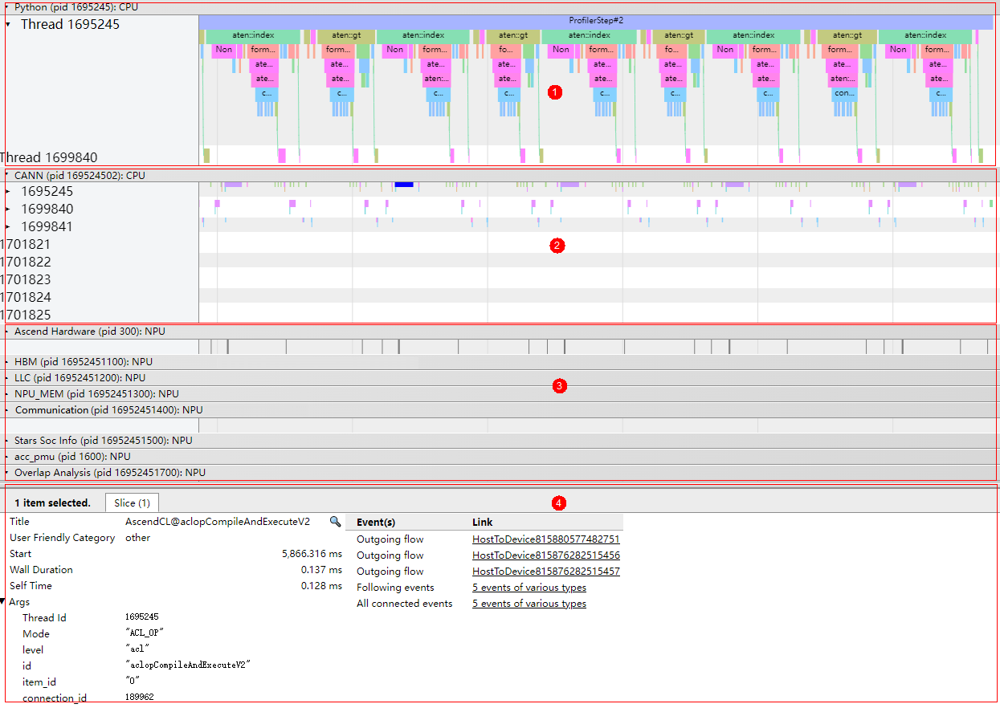

如[图1](#zh-cn_topic_0000001751419248_fig10608132131617)所示，timeline汇总数据主要展示如下区域：

-   区域1：应用层数据，包含上层应用运行的耗时信息，需要使用msproftx采集或其他框架场景采集。
-   区域2：CANN层数据，主要包含Runtime等组件以及Node（算子）的耗时数据。
-   区域3：底层NPU数据，主要包含Ascend Hardware下各个Stream任务流的耗时数据和迭代轨迹数据、Communication和Overlap Analysis通信数据以及其他昇腾AI处理器系统数据。
-   区域4：展示timeline中各算子、接口的详细信息（单击各个timeline时展示）。

> **说明：** 
>-   timeline数据总表的数据在[性能数据文件参考](profile_data_file_references.md)均有对应数据的详细介绍。
>-   上图中各区域的数据与采集场景有关，例如区域1仅在msproftx或其他框架场景采集时生成；Communication和Overlap Analysis通信数据仅在多卡、多节点或集群等存在通信的场景可采集到数据等。请以采集数据实际情况为准。
>-   msprof\_\*.json展示的数据是迭代内的数据，迭代外的数据不展示。

**查看算子下发方向<a name="zh-cn_topic_0000001751419248_section174114535213"></a>**

在tracing中查看.json文件时，开启“Flow events”下的选项后，应用层算子到NPU算子之间通过连线方式展示下发到执行的对应关系。如[图2](#zh-cn_topic_0000001751419248_fig490591821019)所示。

主要包括的对应关系有：

-   async\_npu：应用层算子 \> Ascend Hardware的NPU算子的下发执行关系。
-   MsTx：推理训练进程打点任务 \> Ascend Hardware的NPU打点算子的下发执行关系。调用aclprofMarkEx接口打点时生成。
-   async\_task\_queue：应用层Enqueue \> Dequeue的入队列到出队列对应关系。
-   HostToDevice：CANN层Node（算子） \> Ascend Hardware的NPU算子的下发执行关系（Host到Device）。
-   HostToDevice：CANN层Node（算子） \> Communication通信算子的下发执行关系（Host到Device）。
-   fwdbwd：前向API \> 反向API。

> **说明：** 
>-   由于软件测量的昇腾AI处理器频率与真实频率有误差，以及Host与Device的时间同步误差，可能会出现下层算子因错位而无法连线的问题。
>-   各层的对应关系是否呈现与对应采集场景是否采集该数据有关，请以实际情况为准。

**图 2**  算子映射关系<a name="zh-cn_topic_0000001751419248_fig490591821019"></a>  
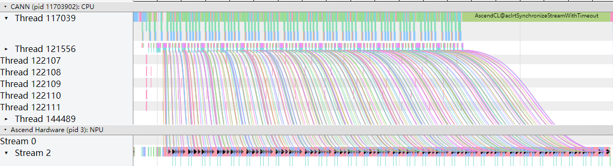

通过单击连线两端的算子或接口，即可查看算子下发的方向。如[图3](#zh-cn_topic_0000001751419248_fig11692135416129)所示。

**图 3**  算子信息<a name="zh-cn_topic_0000001751419248_fig11692135416129"></a>  
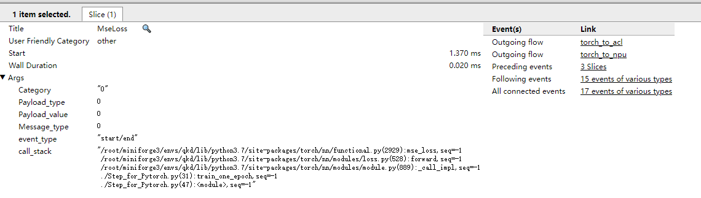

其中Event\(s\)列查看该算子或接口的出入方向，Link列查看映射关系两端的信息。

**查看AI Core频率<a name="zh-cn_topic_0000001751419248_section9194165318231"></a>**

支持的型号：

-   Atlas 200I/500 A2 推理产品
-   Atlas A2 训练系列产品/Atlas A2 推理系列产品
-   Atlas A3 训练系列产品/Atlas A3 推理系列产品

msprof\_\*.json下的“AI Core Freq”层级展示AI Core芯片在执行AI任务的过程中频率的变化情况，如[图4](#zh-cn_topic_0000001751419248_fig66071155154219)所示。

**图 4**  查看AI Core频率<a name="zh-cn_topic_0000001751419248_fig66071155154219"></a>  
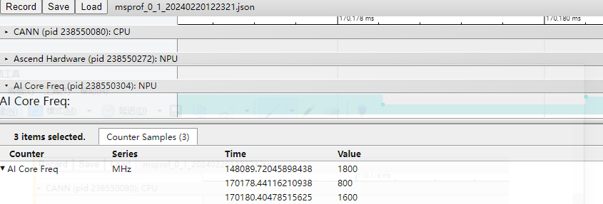

在148089.72045898438时刻下，AI Core处于高频状态，而在170178.44116210938时刻频率降低，那么在该时间段下AI任务的性能必然下降。AI Core芯片可能因温度升高，触发保护机制，降低频率；也可能因当前无AI任务运行，AI Core进入低功耗状态而降频。

在发生变频时，实际变频时间与软件监测到的时间存在0\~1ms的延时，该延时可能导致变频前后统计出的算子执行时间与实际不符。

**SIO数据分析<a name="zh-cn_topic_0000001751419248_section18441122912161"></a>**

支持的型号：

-   对于Atlas A2 训练系列产品/Atlas A2 推理系列产品，该数据均为0，不具有参考性。
-   Atlas A3 训练系列产品/Atlas A3 推理系列产品

msprof\_\*.json下的“SIO”层级展示通道间传输带宽的信息。

Atlas A3 训练系列产品/Atlas A3 推理系列产品中，SIO数据的每条流使用两条虚拟通道，die 0和die 1。

**图 5**  SIO（Atlas A3 训练系列产品/Atlas A3 推理系列产品）<a name="zh-cn_topic_0000001751419248_fig1090119416103"></a>  
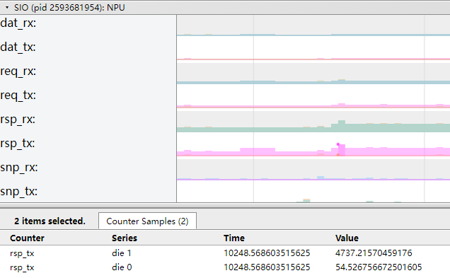

图中色块横坐标对应时间Time，单位ms，纵坐标对应带宽Value，单位MB/s。

**表 1**  字段说明

|字段名|字段含义|
|--|--|
|dat_rx|数据流通道的接收带宽。|
|dat_tx|数据流通道的发送带宽。|
|req_rx|请求流通道的接收带宽。|
|req_tx|请求流通道的发送带宽。|
|rsp_rx|回应流通道的接收带宽。|
|rsp_tx|回应流通道的发送带宽。|
|snp_rx|侦听流通道的接收带宽。|
|snp_tx|侦听流通道的发送带宽。|


**QoS数据分析<a name="zh-cn_topic_0000001751419248_section7237154131716"></a>**

msprof\_\*.json下的“QoS”层级展示设备QoS带宽信息。

支持的型号：

-   Atlas A2 训练系列产品/Atlas A2 推理系列产品
-   Atlas A3 训练系列产品/Atlas A3 推理系列产品

**图 6**  QoS OTHERS<a name="zh-cn_topic_0000001751419248_fig109246157107"></a>  
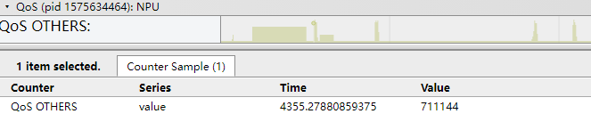

图中色块横坐标对应时间Time，单位ms，纵坐标对应带宽Value，单位MB/s。

**计算及通信算子融合MC²<a name="zh-cn_topic_0000001751419248_section10665117313"></a>**

支持的型号：

-   Atlas 推理系列产品
-   Atlas A2 训练系列产品/Atlas A2 推理系列产品

存在计算和通信算子融合的场景。

MC²：Matrix Computation & Communication，是CANN中一系列计算通信融合算子的统称，把原本串行的两个通信、计算算子融合到一起，内部通过Tiling切分成多轮通信计算，轮次间形成流水并行，从而掩盖通信耗时，提升整体执行性能。

具体算子一般以原计算通信算子名称按照依赖关系排列命名。比如AllgatherMatmul融合算子代表通信算子Allgather和计算算子Matmul融合，Matmul依赖Allgather输出。

通信轮次commTurn：即融合算子Tiling切分的份数。一般值为总数据量/单次通信量。

MC²实现中，内部分别在计算流、通信流上加载两个算子，两个算子内部实现协同完成流水并行执行：

-   计算流对应算子名称为融合算子名称，比如AllgatherMatmul。
-   通信流对应算子名称为融合算子名称+Aicpu，比如AllgatherMatmulAicpu。

通信算子根据融合算子Tiling切分执行多个通信轮次，每轮的基本流程是，根据计算算子下发的通信参数，执行集合通信算法，编排好具体任务，下发给硬件执行，并等待执行完成，通知计算侧执行结果。

> **说明：** 
>-   通信API场景暂不支持融合MC²，通信API场景包括：低bit通信MatmulAllReduce算子以及自定义的使用通信API的MC²算子。
>-   Timeline的Communication部分仅呈现Level0级别的数据。

MC²性能数据结果示例如下：

**图 7**  MC²<a name="zh-cn_topic_0000001751419248_fig16795116316"></a>  
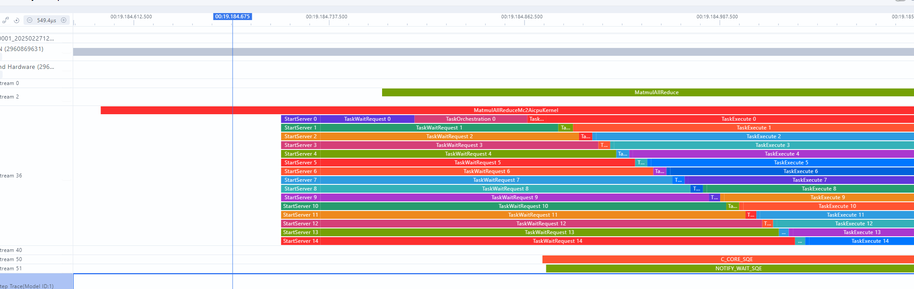

[图7](#zh-cn_topic_0000001751419248_fig16795116316)展示了MatmulAllReduceAddRmsNormAicpu融合算子，内部各阶段含义介绍如[表2](#zh-cn_topic_0000001751419248_table137165193119)所示。

**表 2**  字段说明

|字段名|字段含义|
|--|--|
|StartServer|KFC初始化时间。|
|TaskWaitRequest|等待计算算子下发通信参数。|
|TaskOrchestration|通信算子内部执行集合通信算法，编排执行任务耗时。|
|TaskLaunch|任务下发耗时。|
|TaskExecute|等待硬件任务执行完成耗时。|
|Finalize|KFC结束流程。|

**电压数据分析<a name="zh-cn_topic_0000001751419248_section5199345010"></a>**

msprof\*.json下的“Voltage Info”层级展示设备电压变压信息。

支持的型号：

-   Atlas A2 训练系列产品/Atlas A2 推理系列产品
-   Atlas A3 训练系列产品/Atlas A3 推理系列产品

变压特性曲线结果示例如下：

**图 8**  电压数据分析<a name="zh-cn_topic_0000001751419248_fig12628420171"></a>  
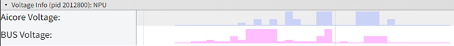

[图8](#zh-cn_topic_0000001751419248_fig12628420171)展示了变压特性曲线，图中色块横坐标对应时间，单位ms，纵坐标对应电压Value，单位mV。各字段含义介绍如[表3](#zh-cn_topic_0000001751419248_table21964325014)所示。

**表 3**  字段说明<a name="zh-cn_topic_0000001751419248_table21964325014"></a>

|字段名|字段含义|
|--|--|
|Aicore Voltage(mV)|AI Core电压，单位mV。|
|Bus Voltage(mV)|互联总线电压，单位mV。|


## msproftx数据说明<a name="ZH-CN_TOPIC_0000002509383185"></a>

**产品支持情况<a name="zh-cn_topic_0000001798418925_section5889102116569"></a>**

|产品|是否支持|
|--|:-:|
|Atlas A3 训练系列产品/Atlas A3 推理系列产品|√|
|Atlas A2 训练系列产品/Atlas A2 推理系列产品|√|
|Atlas 200I/500 A2 推理产品|√|
|Atlas 推理系列产品|√|
|Atlas 训练系列产品|√|


**总体说明<a name="zh-cn_topic_0000001798418925_section132087265710"></a>**

msproftx采集的是用户和上层框架程序输出性能数据，数据保存在mindstudio\_profiler\_output目录下。

相关数据如[表1](#zh-cn_topic_0000001798418925_zh-cn_topic_0290106133_table972265435020)所示。

**表 1**  数据文件介绍<a name="zh-cn_topic_0000001798418925_zh-cn_topic_0290106133_table972265435020"></a>

|文件名|说明|
|--|--|
|msprof_*.json|timeline汇总数据。详情请参见[msproftx timeline汇总数据](#zh-cn_topic_0000001798418925_section5704032072)。|
|msprof_tx_*.json|msproftx timeline数据。为msprof_*.json的子集。详情请参见[msproftx timeline数据。](#zh-cn_topic_0000001798418925_section12121185651210)|
|msprof_tx_*.csv|msproftx summary数据。对采集到的Host msproftx summary数据按线程进行拼接，并进行数据关联性展示。详情请[参见msprof_tx summary数据](#zh-cn_topic_0000001798418925_section15813213018)。|

**msproftx timeline汇总数据<a name="zh-cn_topic_0000001798418925_section5704032072"></a>**

msproftx的timeline汇总数据在msprof\_\*.json的上层应用层级展示，如[图1](#zh-cn_topic_0000001798418925_fig322453919307)所示。其他层级及含义请参见[msprof（timeline数据总表）](#ZH-CN_TOPIC_0000002477303238)。

**图 1**  timeline汇总数据<a name="zh-cn_topic_0000001798418925_fig322453919307"></a>  
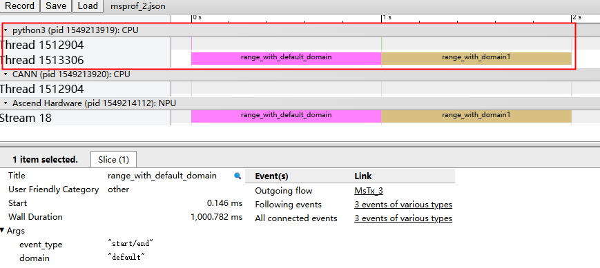

**msproftx timeline数据<a name="zh-cn_topic_0000001798418925_section12121185651210"></a>**

msproftx的timeline数据在msprof\_tx\_\*.json展示。如下所示。

**图 2**  msproftx timeline数据<a name="zh-cn_topic_0000001798418925_fig912175631213"></a>  
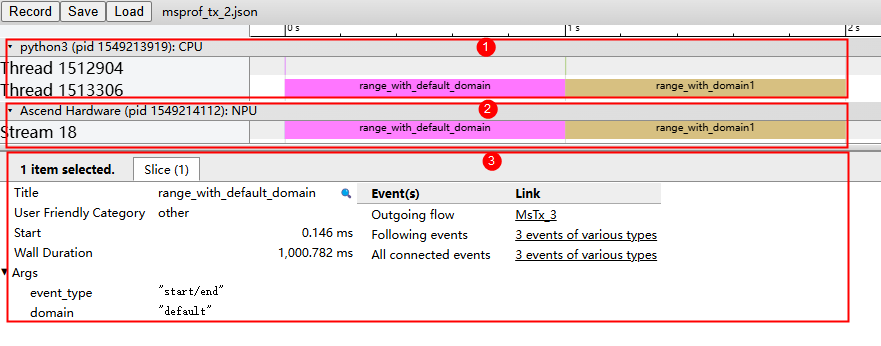

如[图2](#zh-cn_topic_0000001798418925_fig912175631213)所示，timeline汇总数据主要展示如下区域：

-   区域1：msproftx打点，记录上层应用数据，包含上层应用运行的耗时信息。
-   区域2：底层NPU数据，msproftx打点下发至Device侧的耗时记录。
-   区域3：展示timeline中各算子、接口的详细信息。单击各个timeline时展示。

**msprof\_tx summary数据<a name="zh-cn_topic_0000001798418925_section15813213018"></a>**

msprof\_tx summary数据文件为msprof\_tx\_\*.csv。

msprof\_tx\_\*.csv文件内容格式示例如下：

**图 3**  msprof\_tx summary数据<a name="zh-cn_topic_0000001798418925_fig52151315519"></a>  
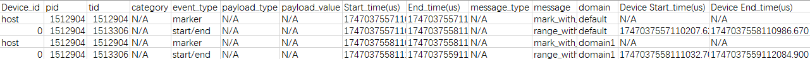

**表 2**  字段说明

|字段名|字段含义|
|--|--|
|Device_id|设备ID。|
|pid|进程ID。|
|tid|Thread ID，AscendCL API所在线程ID。|
|category|Profiling msproftx采集进程类别，用于标识msproftx采集进程的采集内容。（预留字段，暂未开放）|
|event_type|事件类型。|
|payload_type|Profiling msproftx采集进程中携带额外的信息Payload的数据类型。（预留字段，暂未开放）|
|payload_value|Profiling msproftx采集进程中携带额外的信息Payload的指针。（预留字段，暂未开放）|
|Start_time(us)|Profiling msproftx采集进程开始时间，单位us。|
|End_time(us)|Profiling msproftx采集进程结束时间，单位us。|
|message_type|Profiling msproftx采集进程中携带字符串类型。（预留字段，暂未开放）|
|message|Profiling msproftx采集进程中携带的字符串描述。|
|domain|打点所属的domain域。|
|Device Start_time(us)|Profiling msproftx采集进程在Device侧开始时间，单位us。|
|Device End_time(us)|Profiling msproftx采集进程在Device侧结束时间，单位us。|


## task\_time（任务调度信息）<a name="ZH-CN_TOPIC_0000002509503207"></a>

任务调度信息数据timeline信息在msprof\_\*.json文件的Ascend Hardware层级展示，summary信息在task\_time\_\*.csv文件汇总，用于识别AI任务运行时的调度耗时。

**产品支持情况<a name="zh-cn_topic_0000001679380154_section5889102116569"></a>**

|产品|是否支持|
|--|:-:|
|Atlas A3 训练系列产品/Atlas A3 推理系列产品|√|
|Atlas A2 训练系列产品/Atlas A2 推理系列产品|√|
|Atlas 200I/500 A2 推理产品|√|
|Atlas 推理系列产品|√|
|Atlas 训练系列产品|√|


**msprof\_\*.json文件中的任务调度信息数据说明<a name="zh-cn_topic_0000001679380154_section11622953115117"></a>**

msprof\_\*.json文件中的任务调度信息数据在Ascend Hardware中的各个Stream呈现，通过记录AI任务运行时，各个Task在不同加速器下的执行耗时，可以直观判断任务调度耗时长短。

msprof\_\*.json文件中的任务调度信息数据示例如下：

**图 1**  Ascend Hardware<a name="zh-cn_topic_0000001679380154_fig1264110521453"></a>  
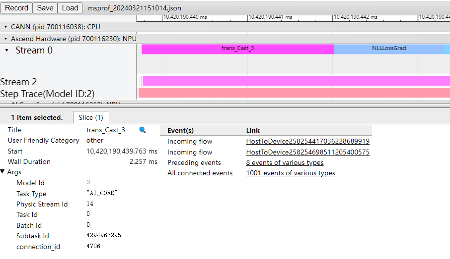

关键字段说明如下。

**表 1**  字段说明

|字段名|字段含义|
|--|--|
|Title|选择某个组件的接口名称。|
|Start|显示界面中时间轴上的时刻点，chrome trace自动对齐，单位ms。|
|Wall Duration|表示当前接口调用耗时，单位ms。|
|Task Time(us)|AI CPU算子的Task任务耗时，单位us。|
|Reduce Duration(us)|ALL REDUCE算子的集合通信时间，单位us。|
|Model Id|模型ID。|
|Task Type|执行该Task的加速器类型，包含AI_CORE、AI_VECTOR_CORE、AI_CPU等。|
|Stream Id|该Task所处的Stream ID。在Ascend Hardware下的Stream Id为该任务的完整逻辑流ID，而在右侧Timeline内的各个接口的Stream Id属性则为该接口的物理流ID（Physical Stream Id）。|
|Task Id|对应的Task ID。|
|Subtask Id|对应的Subtask ID。|
|Aicore Time(ms)|当所有的Block被同时调度，且每个Block的执行时长相等时，该Task在AI Core上的理论执行时间，单位ms。通常情况下，不同的Block开始调度时间略有差距，故该字段值略小于Task在AI Core上的实际执行时间。手动调频、功耗超出默认功耗值时动态调频以及Atlas 300V/Atlas 300I Pro情况下该数据不准确，不建议参考。|
|Total Cycle|该Task在AI Core上执行的cycle总数，由所有的Block的执行cycle数累加而成。|
|Receive Time|Device收到内存拷贝Task的信息接收时间，单位us。仅MemcopyAsync接口展示。|
|Start Time|内存拷贝Task开始拷贝的时间，单位us。仅MemcopyAsync接口展示。|
|End Time|内存拷贝Task结束拷贝的时间，单位us。仅MemcopyAsync接口展示。|
|size(B)|拷贝的数据量，单位B。仅MemcopyAsync接口展示。|
|bandwidth(GB/s)|拷贝的带宽，单位GB/s。仅MemcopyAsync接口展示。|
|operation|拷贝类型，host to device或device to host等。仅MemcopyAsync接口展示。|


**task\_time\_\*.csv文件说明（Atlas 推理系列产品）（Atlas 训练系列产品）（Atlas A2 训练系列产品/Atlas A2 推理系列产品）（Atlas A3 训练系列产品/Atlas A3 推理系列产品）（Atlas 200I/500 A2 推理产品）<a name="zh-cn_topic_0000001679380154_section586724384714"></a>**

task\_time\_\*.csv文件内容格式示例如下：

**图 2**  task\_time\_\*.csv<a name="zh-cn_topic_0000001679380154_fig77617419164"></a>  
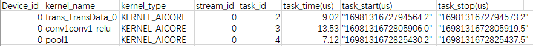

可以通过查看Task的Top耗时对应的算子，根据该算子的具体实现来判断算子是否存在问题。

**表 2**  字段说明

|字段名|字段含义|
|--|--|
|Device_id|设备ID。|
|kernel_name|Kernel的名称。显示为N/A表示为非计算类算子。|
|kernel_type|Kernel的类型，包含：KERNEL_AICORE、KERNEL_AICPU等。|
|stream_id|该Task所处的Stream ID。|
|task_id|Task任务的ID。|
|task_time(us)|Task耗时，包含调度到加速器的时间、加速器上的执行时间以及结束响应时间，单位us。|
|task_start(us)|Task开始时间，单位us。|
|task_stop(us)|Task结束时间，单位us。|


## api\_statistic（API耗时统计信息）<a name="ZH-CN_TOPIC_0000002477303240"></a>

API耗时信息统计数据timeline信息在msprof\_\*.json文件的CANN层级展示，summary信息在api\_statistic\_\*.csv文件汇总，用于统计CANN层的API执行耗时信息，主要包括AscendCL、Runtime、Node、Model、Communication层级的API。

-   AscendCL：AscendCL API，昇腾平台上开发深度神经网络应用的C语言API库。
-   Runtime：Runtime API，CANN运行时API。
-   Node：对应CANN层算子。
-   Model：模型，内部分析使用，无须关注。
-   Communication：集合通信算子。

**产品支持情况<a name="zh-cn_topic_0000001656264690_section5889102116569"></a>**

> **说明：** 
>昇腾产品的具体型号，请参见《[昇腾产品形态说明](https://www.hiascend.com/document/detail/zh/AscendFAQ/ProduTech/productform/hardwaredesc_0001.html)》

|AI处理器类型|是否支持|
|--|:-:|
|Atlas A3 训练系列产品/Atlas A3 推理系列产品|√|
|Atlas A2 训练系列产品/Atlas A2 推理系列产品|√|
|Atlas 200I/500 A2 推理产品|√|
|Atlas 推理系列产品|√|
|Atlas 训练系列产品|√|


**msprof\_\*.json文件的CANN层级数据说明<a name="zh-cn_topic_0000001656264690_section344219426541"></a>**

msprof\_\*.json文件CANN层数据部分主要展示当前Thread下运行的接口耗时，如下图所示。

**图 1**  CANN层数据<a name="zh-cn_topic_0000001656264690_fig191420493165"></a>  
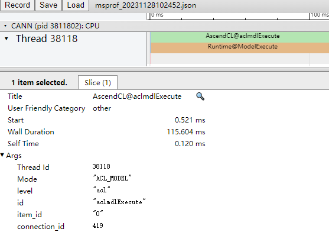

通过图中的timeline色块，可以直接观察到哪些接口耗时较长，并通过单击选中耗时较长的接口查看该接口的详细信息，如下表所示。

**表 1**  字段说明

|字段名|字段含义|
|--|--|
|Title|选择某个接口名称。|
|Start|显示界面中时间轴上的时刻点，chrome trace自动对齐，单位ms。|
|Wall Duration|表示当前接口调用耗时，单位ms。|
|Self Time|表示当前接口本身执行耗时，单位ms。|
|Mode|AscendCL API类型。包含：ACL_OP（单算子模型接口）、ACL_MODEL（模型接口）、ACL_RTS（Runtime接口）等。|
|level|层级，当前为AscendCL层。|


**api\_statistic\_\*.csv文件说明<a name="zh-cn_topic_0000001656264690_section11622953115117"></a>**

api\_statistic\_\*.csv文件内容格式示例如下：

**图 2**  api\_statistic\_\*.csv<a name="zh-cn_topic_0000001656264690_fig881322061712"></a>  
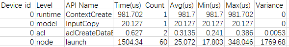

上图根据Time列进行降序排列，找出耗时最长的TopN算子；也可以根据最大、最小、平均耗时、方差等信息判断该算子运行是否稳定或者是否存在某次调用耗时较长的情况。例如方差数值越小，则代表算子运行越稳定；最大最小值越接近平均值且不存在个别数据差异较大的情况，则代表算子运行越稳定。

**表 2**  字段说明

|字段名|字段含义|
|--|--|
|Device_id|设备ID。采集到的数据来源于Host侧时，显示值为host。|
|Level|API所属层级。|
|API Name|API名称。|
|Time(us)|总耗时，单位us。|
|Count|调用次数。|
|Avg(us)|耗时平均值，单位us。|
|Min(us)|最小耗时，单位us。|
|Max(us)|最大耗时，单位us。|
|Variance|耗时方差。|


## step\_trace（迭代轨迹信息）<a name="ZH-CN_TOPIC_0000002477463224"></a>

迭代轨迹数据timeline信息在step\_trace\_\*.json文件展示，summary信息在step\_trace\_\*.csv文件汇总，用于判断并找出耗时较长的迭代。

单算子场景（如PyTorch场景）下无此性能数据文件。

**产品支持情况<a name="zh-cn_topic_0000001706482137_section5889102116569"></a>**

|产品|是否支持|
|--|:-:|
|Atlas A3 训练系列产品/Atlas A3 推理系列产品|√|
|Atlas A2 训练系列产品/Atlas A2 推理系列产品|√|
|Atlas 200I/500 A2 推理产品|√|
|Atlas 推理系列产品|√|
|Atlas 训练系列产品|√|


**step\_trace\_\*.json文件说明<a name="zh-cn_topic_0000001706482137_section8123844101012"></a>**

迭代轨迹数据step\_trace\_\*.json，根据Iteration的长短，判断哪个迭代耗时最长。

step\_trace\_\*.json文件内容格式示例如下：

**图 1**  step\_trace\_\*.json<a name="zh-cn_topic_0000001706482137_fig131371629121716"></a>  
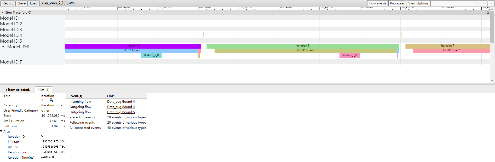

迭代轨迹数据即训练任务及AI软件栈的软件信息，实现对训练任务的性能分析。以默认的两段式梯度切分为例，通过打印出训练任务中关键节点fp\_start/bp\_end/Reduce Start/Reduce Duration\(us\)的时间，达到把一个迭代的执行情况描述清楚的目的。

离线推理场景下不采集FP（训练网络迭代轨迹正向算子的开始位置）和BP（训练网络迭代轨迹反向算子的结束位置），采集结果将显示FP Start、BP End为NA且不存在timeline。

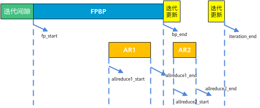

如上图，如果需要确定梯度切分策略，则需要计算图中bp\_end - allreduce1\_end的大小。根据已获取的迭代轨迹数据，我们需要使用**第一组**集合通信时间来计算，具体公式如：（BP End – Reduce End）/ freq。

**表 1**  字段说明

|字段名|字段含义|
|--|--|
|Title|选择某个组件的接口名称。|
|Start|显示界面中时间轴上的时刻点，chrome trace自动对齐，单位ms。|
|Wall Duration|表示当前接口调用耗时，单位ms。|
|Iteration ID|以Graph为粒度统计的迭代ID，每个Graph执行一次，Iteration ID加1，当一个脚本被编译为多个Graph时，该ID与脚本层面的Step ID不一致。|
|FP Start|FP开始时间，单位ns。|
|Iteration End|每轮迭代结束时间，单位ns。|
|Iteration Time(ns)|迭代时长，单位ns。|
|BP End|BP结束时间，单位ns。|
|FP_BP Time|FP/BP计算时间（BP End - FP Start），单位ns。|
|Iteration Refresh|迭代拖尾时间（Iteration End - BP End），单位ns。|
|Data_aug Bound|数据增强拖尾（本轮迭代FP Start - 上一个迭代Iteration End）。如果计算第一轮数据增强拖尾时没有上一轮迭代的Iteration End数据，那么第一轮迭代的数据增强拖尾数据值默认为N/A。|
|Reduce|集合通信时间，可能存在多组集合通信时间（ph：B表示某一组的开始时间，ph：E表示该组的结束时间）；如果非多P环境，则没有Reduce数据。|


**数据读取时间分析<a name="zh-cn_topic_0000001706482137_section18193612191110"></a>**

对于前一个迭代结束到后一个迭代开始之间的迭代间隙，若因数据读取耗时较长导致间隙过大，可以通过GetNext时间片，判断是否由于迭代的数据读取时间较长导致间隙过大。如[图2](#zh-cn_topic_0000001706482137_fig989215211178)所示。

仅TensorFlow框架支持。

**图 2**  GetNext<a name="zh-cn_topic_0000001706482137_fig989215211178"></a>  
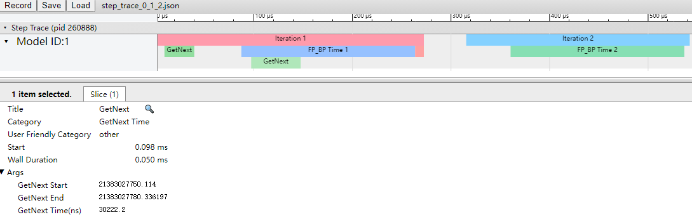

**表 2**  GetNext字段说明

|字段名|字段含义|
|--|--|
|GetNext Start|数据读取开始时间，单位ns。|
|GetNext End|数据读取结束时间，单位ns。|
|GetNext Time(ns)|数据读取耗时，单位ns。|


**step\_trace\_\*.csv文件说明<a name="zh-cn_topic_0000001706482137_section20701181816418"></a>**

step\_trace\_\*.csv文件内容格式示例如下：

**图 3**  step\_trace\_\*.csv<a name="zh-cn_topic_0000001706482137_fig1790711444171"></a>  
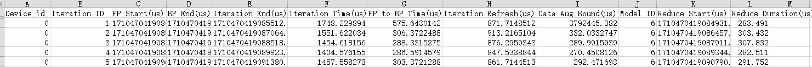

根据step\_trace\_\*.json文件的判断，可以对照step\_trace\_\*.csv文件的信息得到印证。

**表 3**  字段说明

|字段名|字段含义|
|--|--|
|Device_id|设备ID。|
|Iteration ID|以Graph为粒度统计的迭代ID，每个Graph执行一次，Iteration ID加1，当一个脚本被编译为多个Graph时，该ID与脚本层面的Step ID不一致。|
|FP Start(us)|FP开始时间，单位us。|
|BP End(us)|BP结束时间，单位us。|
|Iteration End(us)|每轮迭代结束的时间，单位us。|
|Iteration Time(us)|迭代时长，单位us。|
|FP to BP Time(us)|FP/BP计算时间（BP End - FP Start），单位us。|
|Iteration Refresh(us)|迭代拖尾时间（Iteration End - BP End），单位us。|
|Data Aug Bound(us)|数据增强拖尾（本轮迭代FP Start - 上一个迭代Iteration End），单位us。如果计算第一轮数据增强拖尾时没有上一轮迭代的Iteration End数据，那么第一轮迭代的数据增强拖尾数据值默认为N/A。|
|Model ID|某轮迭代的模型中的图ID。|
|Reduce Start(us)|集合通信开始时间，单位us。|
|Reduce Duration(us)|集合通信时间，可能存在多组集合通信时间，本示例按照系统默认切分策略是分为两段集合通信时间，Reduce Start表示开始时间，Reduce Duration表示由开始到结束时间，单位us。如果非多P环境，则没有Reduce数据。|


## dp（数据增强信息）<a name="ZH-CN_TOPIC_0000002509383187"></a>

数据增强信息仅在训练场景下生成且仅生成summary数据dp\_\*.csv。

在TensorFlow训练场景开启数据预处理下沉（即enable\_data\_pre\_proc开关配置为True）时可生成dp\_\*.csv文件。详情请参见《TensorFlow 1.15模型迁移指南》中的“训练迭代循环下沉”章节。

**产品支持情况<a name="zh-cn_topic_0000001752181593_section91616487538"></a>**

|产品|是否支持|
|--|:-:|
|Atlas A3 训练系列产品/Atlas A3 推理系列产品|x|
|Atlas A2 训练系列产品/Atlas A2 推理系列产品|x|
|Atlas 200I/500 A2 推理产品|x|
|Atlas 推理系列产品|x|
|Atlas 训练系列产品|√|


**dp\_\*.csv文件说明<a name="zh-cn_topic_0000001752181593_section5874203112014"></a>**

数据增强数据dp\_\*.csv文件内容格式示例如下：

**图 1**  dp\_\*.csv<a name="zh-cn_topic_0000001752181593_fig5210278292"></a>  
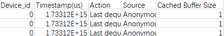

**表 1**  字段说明

|字段名|字段含义|
|--|--|
|Device_id|设备ID。|
|Timestamp(us)|事件的时间戳，单位us。|
|Action|事件的执行动作。|
|Source|事件的来源。|
|Cached Buffer Size|事件占用的Cached Buffer大小。|


## communication\_statistic（集合通信算子统计信息）<a name="ZH-CN_TOPIC_0000002509503209"></a>

集合通信算子和计算及通信流水掩盖数据timeline信息在msprof\_\*.json文件的Communication层级展示，summary信息在communication\_statistic\_\*.csv文件汇总，以及在msprof\_\*.json下展示“Overlap Analysis”计算及通信的流水掩盖分析数据。

集合通信算子数据只有在多卡、多机或集群等存在卡间通信的场景下才能被采集并解析出性能数据。

**产品支持情况<a name="zh-cn_topic_0000001658339478_section5889102116569"></a>**

|产品|是否支持|
|--|:-:|
|Atlas A3 训练系列产品/Atlas A3 推理系列产品|√|
|Atlas A2 训练系列产品/Atlas A2 推理系列产品|√|
|Atlas 200I/500 A2 推理产品|√|
|Atlas 推理系列产品|√|
|Atlas 训练系列产品|√|


**msprof\_\*.json文件的Communication层级数据说明<a name="zh-cn_topic_0000001658339478_section8123844101012"></a>**

msprof\_\*.json文件Communication层数据如下图所示。

**图 1**  通信大算子信息<a name="zh-cn_topic_0000001658339478_fig18715851115013"></a>  
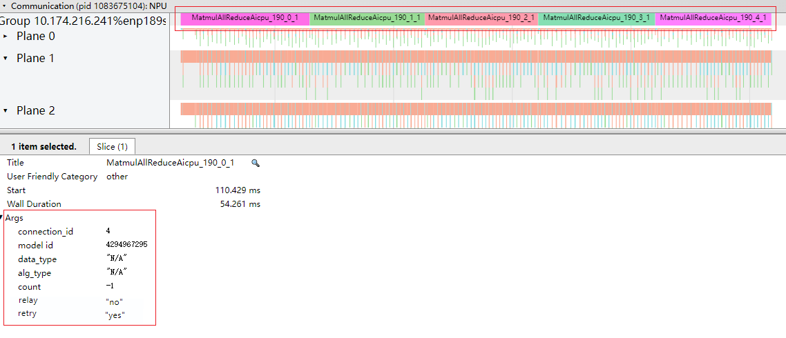

**图 2**  通信小算子信息<a name="zh-cn_topic_0000001658339478_fig471535125016"></a>  
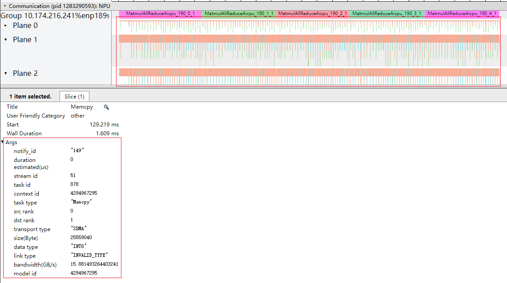

多卡、多机或集群场景时各Device之间存在通信，形成各个通信域，Communication层按照各个通信域进行排列，收集通信算子的耗时，该文件下可以直观找出耗时最长的通信算子。

**表 1**  字段说明

|字段名|字段含义|
|--|--|
|**公共信息**||
|Group * Communication（通信域名称，根据实际上报的名称确定）|通信域下的通信算子。一个卡（Rank）可以存在于不同的通信域中，一个Group标识当前卡在当前通信域的行为。|
|Plane ID|网络平面ID。对多个收发通信链路的并行调度执行，每个Plane就是一个并发通信维度。|
|Title|选择某个组件的接口名称。|
|Start|显示界面中时间轴上的时刻点，chrome trace自动对齐，单位ms。|
|Wall Duration|表示当前接口调用耗时，单位ms。|
|Self Time|表示当前指令本身执行耗时，单位ms。|
|**通信大算子信息**||
|connection_id|CANN层API向NPU算子下发时二者关联的标识。|
|model id|模型ID。|
|data_type|数据类型。|
|alg_type|通信算子各阶段的算法类型，包含：MESH、RING、NB、HD、NHR、PIPELINE、PAIRWISE、STAR等。|
|count|数据传输的数量。|
|relay|通信算子是否发生借轨。显示为yes（表示发生了借轨）或no（表示没有发生借轨）。支持型号：<br/>Atlas A2 训练系列产品/Atlas A2 推理系列产品：仅显示为no，无意义<br/>Atlas A3 训练系列产品/Atlas A3 推理系列产品|
|retry|通信算子是否发生重执行。显示为yes（表示发生了重执行）或no（表示没有发生重执行）。支持型号：<br/>Atlas A2 训练系列产品/Atlas A2 推理系列产品<br/>Atlas A3 训练系列产品/Atlas A3 推理系列产品|
|**通信小算子信息**||
|notify id|notify唯一ID。|
|duration estimated(us)|预估任务持续时间，单位us。|
|stream id|Stream任务的ID。|
|task id|Task任务的ID。|
|task type|Task类型。|
|src rank|源Rank。|
|dst rank|目的Rank。|
|transport type|传输类型，包含：LOCAL、SDMA、RDMA等。|
|size(Byte)|数据量，单位Byte。|
|data type|数据类型。|
|link type|链路类型，包含：HCCS、PCIe、RoCE等。|
|bandwidth(GB/s)|带宽大小，单位GB/s。|


**计算及通信的流水掩盖分析<a name="zh-cn_topic_0000001658339478_section18441122912161"></a>**

msprof\_\*.json下的“Overlap Analysis”为计算及通信的流水掩盖分析数据，由--task-time和--hccl开关控制。如[图3](#zh-cn_topic_0000001658339478_fig1514136114211)所示。

计算和通信存在并行，那么可通过查看流水掩盖的重叠时间（计算和通信并行的时间）从而判断计算通信效率。

**图 3**  计算及通信的流水掩盖呈现效果图<a name="zh-cn_topic_0000001658339478_fig1514136114211"></a>  
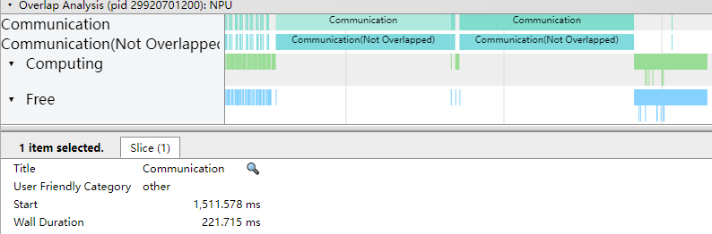

**表 2**  字段说明

|字段名|字段含义|
|--|--|
|Communication|通信时间。单卡场景无通信，不展示该字段。|
|Communication(Not Overlapped)|无掩盖的通信时间。单卡场景无通信，不展示该字段。|
|Computing|计算时间。|
|Free|间隙时间。|
|Start|表示当前接口开始调用的时刻点，单位ms。|
|Wall Duration|表示当前接口调用耗时，单位ms。|


**communication\_statistic\_\*.csv文件说明<a name="zh-cn_topic_0000001658339478_section1214520215155"></a>**

communication\_statistic\_\*.csv文件内容格式示例如下：

**图 4**  communication\_statistic\_\*.csv<a name="zh-cn_topic_0000001658339478_fig172301674189"></a>  
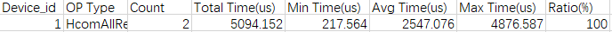

communication\_statistic\_\*.csv为集合通信算子统计信息，通过集合通信算子统计信息了解该类算子的耗时，以及各通信算子在集合通信内部的耗时占比，从而判断某个算子是否存在优化空间。

**表 3**  字段说明

|字段名|字段含义|
|--|--|
|Device_id|设备ID。|
|OP Type|集合通信算子类型。|
|Count|集合通信算子执行次数。|
|Total Time(us)|集合通信算子执行总耗时，单位us。|
|Min Time(us)|集合通信算子执行最小耗时，单位us。|
|Avg Time(us)|集合通信算子执行平均耗时，单位us。|
|Max Time(us)|集合通信算子执行最大耗时，单位us。|
|Ratio(%)|集合通信算子执行耗时与整体集合通信耗时占比。|


## op\_summary（算子详细信息）<a name="ZH-CN_TOPIC_0000002477303242"></a>

AI Core、AI Vector Core和AI CPU算子汇总信息无timeline信息，summary信息在op\_summary\_\*.csv文件汇总，用于统计算子的具体信息和耗时情况。

**产品支持情况<a name="zh-cn_topic_0000001686107246_section5889102116569"></a>**

> **说明：** 
>昇腾产品的具体型号，请参见《[昇腾产品形态说明](https://www.hiascend.com/document/detail/zh/AscendFAQ/ProduTech/productform/hardwaredesc_0001.html)》

|AI处理器类型|是否支持|
|--|:-:|
|Atlas A3 训练系列产品/Atlas A3 推理系列产品|√|
|Atlas A2 训练系列产品/Atlas A2 推理系列产品|√|
|Atlas 200I/500 A2 推理产品|√|
|Atlas 推理系列产品|√|
|Atlas 训练系列产品|√|


**op\_summary\_\*.csv文件说明<a name="zh-cn_topic_0000001686107246_section1214520215155"></a>**

op\_summary\_\*.csv文件内容格式示例如下：

**图 1**  op\_summary（仅为示例）<a name="zh-cn_topic_0000001686107246_fig1265041210717"></a>  
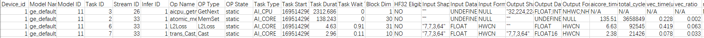

Task Duration字段为算子耗时信息，可以按照Task Duration排序，找出高耗时算子；也可以按照Task Type排序，查看AI Core或AI CPU上运行的高耗时算子。

> **说明：** 
>-   下文字段说明中，不同产品支持的字段略有不同，请以实际结果文件呈现字段为准。
>-   task\_time配置为l0或off时，op\_summary\_\*.csv不呈现AI Core、AI Vector Core的PMU数据。
>-   Atlas A2 训练系列产品/Atlas A2 推理系列产品：MatMul算子的输入a、b矩阵满足：内轴大于1000，MAC理论计算耗时大于50us，内轴大小非516B对齐时，MatMul会转化为MIX算子，此时op\_summary.csv中的MatMul算子数量减少且Task Type由原来的AI\_Core转变为MIX\_AIC。
>-   Atlas A3 训练系列产品/Atlas A3 推理系列产品：MatMul算子的输入a、b矩阵满足：内轴大于1000，MAC理论计算耗时大于50us，内轴大小非516B对齐时，MatMul会转化为MIX算子，此时op\_summary.csv中的MatMul算子数量减少且Task Type由原来的AI\_Core转变为MIX\_AIC。
>-   对于部分算子，执行时间过长，导致metric相关数据失准，不再具有参考意义，此类数据统一置为N/A，不做相关呈现。
>-   由于Task Type为communication类型的算子通常包含一系列通信任务，每个通信任务均有独立的Task ID和Stream ID等标识，此处不作展示，因此该类算子的Task ID和Stream ID为N/A。
>-   算子的输入维度Input Shapes取值为空，即表示为“; ; ; ;”格式时，表示当前输入的为标量，其中“;”为每个维度的分隔符。算子的输出维度同理。
>-   工具会检测算子溢出情况，若发现算子溢出，则提示如下告警，此时该算子的计算结果不可信。
>    **图 2**  算子溢出告警<a name="zh-cn_topic_0000001686107246_fig144168454163"></a>  
>    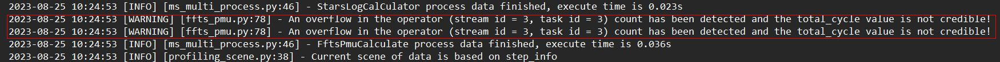

op\_summary\_\*.csv文件根据msprof采集参数取值不同，文件呈现结果不同。完整字段如下。

**表 1**  公共字段说明

|字段名|字段含义|
|--|--|
|Device_id|设备ID。|
|Model Name|模型名称。如果Model Name值为空，则可能由于获取的数据中该值为空。（默认情况下或单算子场景不显示该字段）|
|Model ID|模型ID。|
|Task ID|Task任务的ID。|
|Stream ID|该Task所处的Stream ID。|
|Infer ID|标识第几轮推理数据。（默认情况下或单算子场景不显示该字段）|
|Op Name|算子名称。|
|OP Type|算子类型。task_time为l0时，不采集该字段，显示为N/A。|
|OP State|算子的动静态信息，dynamic表示动态算子，static表示静态算子，通信算子无该状态显示为N/A，该字段仅在--task-time=l1情况下上报，--task-time=l0时显示为N/A。|
|Task Type|执行该Task的加速器类型，包含AI_CORE、AI_VECTOR_CORE、AI_CPU等。task_time为l0时，不采集该字段，显示为N/A。|
|Task Start Time(us)|Task开始时间，单位us。|
|Task Duration(us)|Task耗时，包含调度到加速器的时间、加速器上的执行时间以及结束响应时间，单位us。|
|Task Wait Time(us)|上一个Task的结束时间与当前Task的开始时间间隔，单位us。|
|Block Dim|Task运行切分数量，对应Task运行时核数。task_time为l0时，不采集该字段，显示为0。|
|HF32 Eligible|标识是否使用HF32精度标记，YES表示使用，NO表示未使用，该字段仅在--task-time=l1情况下上报，--task-time=l0时显示为N/A。|
|Mix Block Dim|部分算子同时在AI Core和Vector Core上执行，主加速器的Block Dim在Block Dim字段描述，从加速器的Block Dim在本字段描述。task_time为l0时，不采集该字段，显示为N/A。|
|Input Shapes|算子的输入维度。task_time为l0时，不采集该字段，显示为N/A。|
|Input Data Types|算子输入数据类型。task_time为l0时，不采集该字段，显示为N/A。|
|Input Formats|算子输入数据格式。task_time为l0时，不采集该字段，显示为N/A。|
|Output Shapes|算子的输出维度。task_time为l0时，不采集该字段，显示为N/A。|
|Output Data Types|算子输出数据类型。task_time为l0时，不采集该字段，显示为N/A。|
|Output Formats|算子输出数据格式。task_time为l0时，不采集该字段，显示为N/A。|
|Context ID|Context ID，用于标识Sub Task粒度的小算子，不存在小算子时显示为N/A。|
|aiv_time(us)|当所有的Block被同时调度，且每个Block的执行时长相等时，该Task在AI Vector Core上的理论执行时间，单位us。通常情况下，不同的Block开始调度时间略有差距，故该字段值略小于Task在AI Vector Core上的实际执行时间。--task-time=l1、--aic-mode=task-based时生成。|
|aicore_time(us)|当所有的Block被同时调度，且每个Block的执行时长相等时，该Task在AI Core上的理论执行时间，单位us。通常情况下，不同的Block开始调度时间略有差距，故该字段值略小于Task在AI Core上的实际执行时间。<br>当AI Core频率变化（比如进行手动调频、功耗超出阈值时动态调频以及Atlas 300V/Atlas 300I Pro产品）时该数据不准确，不建议参考。<br/>Atlas 200I/500 A2 推理产品：具体频率变化点请参考查看AI Core频率。<br/>Atlas A2 训练系列产品/Atlas A2 推理系列产品：具体频率变化点请参考查看AI Core频率。<br/>Atlas A3 训练系列产品/Atlas A3 推理系列产品：具体频率变化点请参考查看AI Core频率。<br/>--task-time=l1、--aic-mode=task-based时生成。|
|total_cycles|该Task在AI Core上执行的cycle总数，由所有的Block的执行cycle数累加而成。<br/>--task-time=l1、--aic-mode=task-based时生成。<br/>对于Atlas 200I/500 A2 推理产品拆分为aic_total_cycles（该Task在AI Cube Core上执行的cycle总数）和aiv_total_cycles（该Task在AI Vector Core上执行的cycle总数）。<br/>对于Atlas A2 训练系列产品/Atlas A2 推理系列产品拆分为aic_total_cycles（该Task在AI Cube Core上执行的cycle总数）和aiv_total_cycles（该Task在AI Vector Core上执行的cycle总数）。<br/>对于Atlas A3 训练系列产品/Atlas A3 推理系列产品拆分为aic_total_cycles（该Task在AI Cube Core上执行的cycle总数）和aiv_total_cycles（该Task在AI Vector Core上执行的cycle总数）。|
|寄存器值|自定义采集的寄存器的数值。由--aic-metrics配置自定义寄存器控制。|


下列字段均在--task-time=l1、--aic-mode=task-based时生成，--task-time为l0时，不采集该字段，显示为N/A。生成的数据由aic\_metrics参数取值控制。

**表 2**  字段说明（PipeUtilization）

|字段名|字段含义|
|--|--|
|*_vec_time(us)|vec类型指令（向量类运算指令）耗时，单位us。Atlas 200I/500 A2 推理产品不支持该字段，给予默认值N/A。|
|*_vec_ratio|vec类型指令（向量类运算指令）的cycle数在total cycle数中的占用比。Atlas 200I/500 A2 推理产品不支持该字段，给予默认值N/A。|
|*_mac_time(us)|cube类型指令（矩阵类运算指令）耗时，单位us。|
|*_mac_ratio|cube类型指令（矩阵类运算指令）的cycle数在total cycle数中的占用比。|
|*_scalar_time(us)|scalar类型指令（标量类运算指令）耗时，单位us。|
|*_scalar_ratio|scalar类型指令（标量类运算指令）的cycle数在total cycle数中的占用比。|
|aic_fixpipe_time(us)|fixpipe类型指令（L0C->OUT/L1搬运类指令）耗时，单位us。|
|aic_fixpipe_ratio|fixpipe类型指令（L0C->OUT/L1搬运类指令）的cycle数在total cycle数中的占用比。|
|*_mte1_time(us)|mte1类型指令（L1->L0A/L0B搬运类指令）耗时，单位us。|
|*_mte1_ratio|mte1类型指令（L1->L0A/L0B搬运类指令）的cycle数在total cycle数中的占用比。|
|*_mte2_time(us)|mte2类型指令（DDR->AICORE搬运类指令）耗时，单位us。|
|*_mte2_ratio|mte2类型指令（DDR->AICORE搬运类指令）的cycle数在total cycle数中的占用比。|
|*_mte3_time(us)|mte3类型指令（AICORE->DDR搬运类指令）耗时，单位us。|
|*_mte3_ratio|mte3类型指令（AICORE->DDR搬运类指令）的cycle数在total cycle数中的占用比。|
|*_icache_miss_rate|icache是为instruction预留的L2 Cache，icache_miss_rate数值高代表AI Core读取指令的效率低。|
|memory_bound|用于识别AICore执行算子计算过程是否存在Memory瓶颈，由mte2_ratio/max(mac_ratio, vec_ratio)计算得出。计算结果小于1，表示没有Memory瓶颈；计算结果大于1则表示AI Core在执行Task过程中大部分时间都在做内存搬运而不是计算，且数值越大Memory瓶颈越严重。|
|cube_utilization(%)|cube算子利用率，查看cube算子在单位时间内的运算次数是否达到理论上限，越接近于100%则表示越接近理论上限。计算公式：cube_utilization=total_cycles / (freq * core_num * task_duration)。|

注：对于部分产品，部分字段在该表中使用*前缀指代aic或aiv，表示该数据是在Cube Core或Vector Core上执行的结果。

**表 3**  字段说明（ArithmeticUtilization）

|字段名|字段含义|
|--|--|
|*_mac_fp16_ratio|cube fp16类型指令的cycle数在total cycle数中的占用比。|
|*_mac_int8_ratio|cube int8类型指令的cycle数在total cycle数中的占用比。|
|*_vec_fp32_ratio|vec fp32类型指令的cycle数在total cycle数中的占用比。Atlas 200I/500 A2 推理产品不支持该字段，给予默认值N/A。|
|*_vec_fp16_ratio|vec fp16类型指令的cycle数在total cycle数中的占用比。|
|*_vec_int32_ratio|vec int32类型指令的cycle数在total cycle数中的占用比。Atlas 200I/500 A2 推理产品不支持该字段，给予默认值N/A。|
|*_vec_misc_ratio|vec misc类型指令的cycle数在total cycle数中的占用比。Atlas 200I/500 A2 推理产品不支持该字段，给予默认值N/A。|
|*_cube_fops|cube类型的浮点运算数，即计算量，可用于衡量算法/模型的复杂度，其中fops表示floating point operations，缩写为FLOPs。|
|*_vector_fops|vector类型浮点运算数，即计算量，可用于衡量算法/模型的复杂度，其中fops表示floating point operations，缩写为FLOPs。|

注：对于部分产品，部分字段在该表中使用*前缀指代aic或aiv，表示该数据是在Cube Core或Vector Core上执行的结果。

**表 4**  字段说明（Memory）

|字段名|字段含义|
|--|--|
|*_ub_read_bw(GB/s)|ub读带宽速率，单位GB/s。Atlas 200I/500 A2 推理产品不支持该字段，给予默认值N/A。|
|*_ub_write_bw(GB/s)|ub写带宽速率，单位GB/s。Atlas 200I/500 A2 推理产品不支持该字段，给予默认值N/A。|
|*_l1_read_bw(GB/s)|l1读带宽速率，单位GB/s。|
|*_l1_write_bw(GB/s)|l1写带宽速率，单位GB/s。|
|*_l2_read_bw|l2读带宽速率，单位GB/s。|
|*_l2_write_bw|l2写带宽速率，单位GB/s。Atlas 200I/500 A2 推理产品不支持该字段，给予默认值N/A。|
|*_main_mem_read_bw(GB/s)|主存储器读带宽速率，单位GB/s。|
|*_main_mem_write_bw(GB/s)|主存储器写带宽速率，单位GB/s。Atlas 200I/500 A2 推理产品不支持该字段，给予默认值N/A。|

注：对于部分产品，部分字段在该表中使用*前缀指代aic或aiv，表示该数据是在Cube Core或Vector Core上执行的结果。

**表 5**  字段说明（MemoryL0）

|字段名|字段含义|
|--|--|
|*_l0a_read_bw(GB/s)|l0a读带宽速率，单位GB/s。|
|*_l0a_write_bw(GB/s)|l0a写带宽速率，单位GB/s。|
|*_l0b_read_bw(GB/s)|l0b读带宽速率，单位GB/s。|
|*_l0b_write_bw(GB/s)|l0b写带宽速率，单位GB/s。|
|*_l0c_read_bw(GB/s)|vector从l0c读带宽速率，单位GB/s。|
|*_l0c_write_bw(GB/s)|vector向l0c写带宽速率，单位GB/s。|
|*_l0c_read_bw_cube(GB/s)|cube从l0c读带宽速率，单位GB/s。|
|*_l0c_write_bw_cube(GB/s)|cube向l0c写带宽速率，单位GB/s。|

注：采集AI Vector Core的MemoryL0性能指标时，采集到的数据都为0。注：对于部分产品，部分字段在该表中使用*前缀指代aic或aiv，表示该数据是在Cube Core或Vector Core上执行的结果。

**表 6**  字段说明（MemoryUB）

|字段名|字段含义|
|--|--|
|*_ub_read_bw_vector(GB/s)|vector从ub读带宽速率，单位GB/s。|
|*_ub_write_bw_vector(GB/s)|vector向ub写带宽速率，单位GB/s。|
|*_ub_read_bw_scalar(GB/s)|scalar从ub读带宽速率，单位GB/s。|
|*_ub_write_bw_scalar(GB/s)|scalar向ub写带宽速率，单位GB/s。|

注：对于部分产品，部分字段在该表中使用*前缀指代aic或aiv，表示该数据是在Cube Core或Vector Core上执行的结果。

**表 7**  字段说明（ResourceConflictRatio）

|字段名|字段含义|
|--|--|
|*_vec_bankgroup_cflt_ratio|vec_bankgroup_stall_cycles类型指令执行cycle数在total cycle数中的占用比。由于vector指令的block stride的值设置不合理，造成bankgroup冲突。Atlas 200I/500 A2 推理产品不支持该字段，给予默认值N/A。|
|*_vec_bank_cflt_ratio|vec_bank_stall_cycles类型指令执行cycle数在total cycle数中的占用比。由于vector指令操作数的读写指针地址不合理，造成bank冲突。Atlas 200I/500 A2 推理产品不支持该字段，给予默认值N/A。|
|*_vec_resc_cflt_ratio|vec_resc_cflt_ratio类型指令执行cycle数在total cycle数中的占用比。当算子中涉及多个计算单元，应该尽量保证多个单元并发调度。当某个计算单元正在执行计算，但算子逻辑仍然往该单元下发指令，就会造成整体的算力没有得到充分应用。Atlas 200I/500 A2 推理产品不支持该字段，给予默认值N/A。|

注：对于部分产品，部分字段在该表中使用*前缀指代aic或aiv，表示该数据是在Cube Core或Vector Core上执行的结果。

**表 8**  字段说明（MemoryAccess）

|字段名|字段含义|
|--|--|
|*_read_main_memory_datas(KB)|对片上内存读的数据量，单位KB。|
|*_write_main_memory_datas(KB)|对片上内存写的数据量，单位KB。|
|*_GM_to_L1_datas(KB)|GM到L1的数据搬运量，单位KB。|
|*_L0C_to_L1_datas(KB)|L0C到L1的数据搬运量，单位KB。|
|*_L0C_to_GM_datas(KB)|L0C到GM的数据搬运量，单位KB。|
|*_GM_to_UB_datas(KB)|GM到UB的数据搬运量，单位KB。|
|*_UB_to_GM_datas(KB)|UB到GM的数据搬运量，单位KB。|

注：上表中字段的*前缀，指代aic或aiv，表示该数据是在Cube Core或Vector Core上执行的结果。

仅支持产品：

- Atlas A2 训练系列产品/Atlas A2 推理系列产品
- Atlas A3 训练系列产品/Atlas A3 推理系列产品

**表 9**  字段说明（L2Cache）

|字段名|字段含义|
|--|--|
|`*_write_cache_hit`|写cache命中的次数。|
|`*_write_cache_miss_allocate`|写cache缺失后重新分配缓存的次数。|
|`*_r*_read_cache_hit`|读r*通道cache命中次数。|
|`*_r*_read_cache_miss_allocate`|读r*通道cache缺失后重新分配的次数。|

注：对于部分产品，部分字段在该表中使用*前缀指代aic或aiv，表示该数据是在Cube Core或Vector Core上执行的结果。

仅支持产品：

- Atlas A2 训练系列产品/Atlas A2 推理系列产品
- Atlas A3 训练系列产品/Atlas A3 推理系列产品
- Atlas 200I/500 A2 推理产品

**表 10**  字段说明（PipelineExecuteUtilization）

|字段名|字段含义|
|--|--|
|vec_exe_time(us)|vec类型指令（向量类运算指令）耗时，单位us。|
|vec_exe_ratio|vec类型指令（向量类运算指令）的cycle数在total cycle数中的占用比。Atlas 200I/500 A2 推理产品不支持该字段，给予默认值N/A。|
|mac_exe_time(us)|cube类型指令（fp16及s16矩阵类运算指令）耗时，单位us。|
|mac_exe_ratio|cube类型指令（fp16及s16矩阵类运算指令）的cycle数在total cycle数中的占用比。|
|scalar_exe_time(us)|scalar类型指令（标量类运算指令）耗时，单位us。|
|scalar_exe_ratio|scalar类型指令（标量类运算指令）的cycle数在total cycle数中的占用比。|
|mte1_exe_time(us)|mte1类型指令（L1->L0A/L0B搬运类指令）耗时，单位us。|
|mte1_exe_ratio|mte1类型指令（L1->L0A/L0B搬运类指令）的cycle数在total cycle数中的占用比。|
|mte2_exe_time(us)|mte2类型指令（DDR->AICORE搬运类指令）耗时，单位us。|
|mte2_exe_ratio|mte2类型指令（DDR->AICORE搬运类指令）的cycle数在total cycle数中的占用比。|
|mte3_exe_time(us)|mte3类型指令（AICORE->DDR搬运类指令）耗时，单位us。|
|mte3_exe_ratio|mte3类型指令（AICORE->DDR搬运类指令）的cycle数在total cycle数中的占用比。|
|fixpipe_exe_time(us)|fixpipe类型指令（L0C->OUT/L1搬运类指令）耗时，单位us。|
|fixpipe_exe_ratio|fixpipe类型指令（L0C->OUT/L1搬运类指令）的cycle数在total cycle数中的占用比。|
|memory_bound|用于识别AICore执行算子计算过程是否存在Memory瓶颈，由mte2_ratio/max(mac_ratio, vec_ratio)计算得出。计算结果小于1，表示没有Memory瓶颈；计算结果大于1则表示AI Core在执行Task过程中大部分时间都在做内存搬运而不是计算，且数值越大Memory瓶颈越严重。|
|cube_utilization(%)|cube算子利用率，查看cube算子在单位时间内的运算次数是否达到理论上限，越接近于100%则表示越接近理论上限。计算公式：cube_utilization=total_cycles / (freq * core_num * task_duration)。|

仅支持产品：Atlas 200I/500 A2 推理产品

## op\_statistic（算子调用次数及耗时）<a name="ZH-CN_TOPIC_0000002509383189"></a>

AI Core和AI CPU算子调用的次数及耗时数据无timeline信息，summary信息在op\_statistic\_\*.csv文件汇总。

**产品支持情况<a name="zh-cn_topic_0000001686266978_section5889102116569"></a>**

> **说明：** 
>昇腾产品的具体型号，请参见《[昇腾产品形态说明](https://www.hiascend.com/document/detail/zh/AscendFAQ/ProduTech/productform/hardwaredesc_0001.html)》

|AI处理器类型|是否支持|
|--|:-:|
|Atlas A3 训练系列产品/Atlas A3 推理系列产品|√|
|Atlas A2 训练系列产品/Atlas A2 推理系列产品|√|
|Atlas 200I/500 A2 推理产品|√|
|Atlas 推理系列产品|√|
|Atlas 训练系列产品|√|


**op\_statistic\_\*.csv文件数据说明<a name="zh-cn_topic_0000001686266978_section142961814104116"></a>**

分析各类算子的调用总时间、总次数等，排查是否某类算子总耗时较长，进而分析这类算子是否有优化空间。

**图 1**  op\_statistic\_\*.csv<a name="zh-cn_topic_0000001686266978_fig1654182131816"></a>  
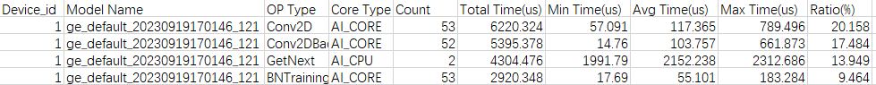

**表 1**  字段说明

|字段名|字段含义|
|--|--|
|Device_id|设备ID。|
|Model Name|模型名称。如果Model Name值为空，则可能由于获取的数据中该值为空。（默认情况下或单算子场景不显示该字段）|
|OP Type|算子类型。|
|Core Type|Core类型，包含AI_CORE、AI_VECTOR_CORE、AI_CPU等。|
|Count|算子调用次数。|
|Total Time(us)|算子调用总耗时，单位us。|
|Avg Time(us)、Min Time(us)、Max Time(us)|分别对应算子调用平均耗时、最小耗时、最大耗时，单位us。|
|Ratio(%)|该类算子在对应模型中的耗时占比。|


## ai\_core\_utilization（AI Core指令占比）<a name="ZH-CN_TOPIC_0000002509503211"></a>

AI Core指令占比数据timeline信息在msprof\_\*.json文件的AI Core Utilization层级展示，summary信息在ai\_core\_utilization\_\*.csv文件汇总。

**产品支持情况<a name="zh-cn_topic_0000001731321225_section5889102116569"></a>**

> **说明：** 
>昇腾产品的具体型号，请参见《[昇腾产品形态说明](https://www.hiascend.com/document/detail/zh/AscendFAQ/ProduTech/productform/hardwaredesc_0001.html)》

|AI处理器类型|是否支持|
|--|:-:|
|Atlas A3 训练系列产品/Atlas A3 推理系列产品|√|
|Atlas A2 训练系列产品/Atlas A2 推理系列产品|√|
|Atlas 200I/500 A2 推理产品|√|
|Atlas 推理系列产品|√|
|Atlas 训练系列产品|√|


**msprof\_\*.json文件的AI Core指令占比数据说明<a name="zh-cn_topic_0000001731321225_section432932191111"></a>**

msprof\_\*.json文件内容格式示例如下：

**图 1**  AI Core Utilization层<a name="zh-cn_topic_0000001731321225_fig8427528151814"></a>  
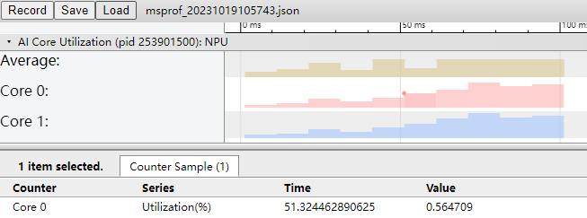

**表 1**  字段说明

|字段名|字段含义|
|--|--|
|Average|均值。|
|Core *<ID>*|Core ID。|
|utilization(%)|当前采样周期内，AI Core在执行Task的total cycle（从AI Core开始执行算子的第一条指令开始计数，到最后一条指令执行完成）占比。|


**ai\_core\_utilization\_\*.csv文件说明<a name="zh-cn_topic_0000001731321225_section1214520215155"></a>**

ai\_core\_utilization\_\*.csv文件内容格式示例如下：

**图 2**  ai\_core\_utilization（仅为示例）<a name="zh-cn_topic_0000001731321225_fig12780124014279"></a>  
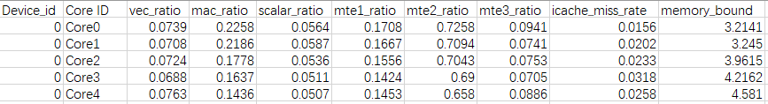

根据--aic-metrics参数取值不同，文件呈现结果不同。完整字段如下。

> **说明：** 
>-   下文字段说明中，不同产品支持的字段略有不同，请以实际结果文件呈现字段为准。
>-   下列字段均在--task-time=l1、--aic-mode=sample-based时生成，--task-time为l0时，不采集该字段，显示为N/A。生成的数据由aic\_metrics参数取值控制。

**表 2**  字段说明（PipeUtilization）

|字段名|字段含义|
|--|--|
|vec_ratio|vec类型指令（向量类运算指令）的cycle数在total cycle数中的占用比。Atlas 200I/500 A2 推理产品不支持该字段，给予默认值N/A。Atlas A2 训练系列产品/Atlas A2 推理系列产品不支持该字段。Atlas A3 训练系列产品/Atlas A3 推理系列产品不支持该字段。|
|mac_ratio|cube类型指令（矩阵类运算指令）的cycle数在total cycle数中的占用比。|
|scalar_ratio|scalar类型指令（标量类运算指令）的cycle数在total cycle数中的占用比。|
|mte1_ratio|mte1类型指令（L1->L0A/L0B搬运类指令）的cycle数在total cycle数中的占用比。|
|mte2_ratio|mte2类型指令（DDR->AICORE搬运类指令）的cycle数在total cycle数中的占用比。|
|mte3_ratio|mte3类型指令（AICORE->DDR搬运类指令）的cycle数在total cycle数中的占用比。Atlas A2 训练系列产品/Atlas A2 推理系列产品不支持该字段。Atlas A3 训练系列产品/Atlas A3 推理系列产品不支持该字段。|
|icache_miss_rate|icache是为instruction预留的L2 Cache，icache_miss_rate数值高代表AI Core读取指令的效率低。|
|fixpipe_ratio|fixpipe类型指令（L0C->OUT/L1搬运类指令）的cycle数在total cycle数中的占用比。|
|memory_bound|用于识别AICore执行算子计算过程是否存在Memory瓶颈，由mte2_ratio/max(mac_ratio, vec_ratio)计算得出。计算结果小于1，表示没有Memory瓶颈；计算结果大于1则表示AI Core在执行Task过程中大部分时间都在做内存搬运而不是计算，且数值越大Memory瓶颈越严重。Atlas A2 训练系列产品/Atlas A2 推理系列产品不支持该字段。Atlas A3 训练系列产品/Atlas A3 推理系列产品不支持该字段。|


**表 3**  字段说明（ArithmeticUtilization）

|字段名|字段含义|
|--|--|
|mac_fp16_ratio|cube fp16类型指令的cycle数在total cycle数中的占用比。|
|mac_int8_ratio|cube int8类型指令的cycle数在total cycle数中的占用比。|
|vec_fp32_ratio|vec fp32类型指令的cycle数在total cycle数中的占用比。Atlas 200I/500 A2 推理产品不支持该字段，给予默认值N/A。|
|vec_fp16_ratio|vec fp16类型指令的cycle数在total cycle数中的占用比。Atlas 200I/500 A2 推理产品不支持该字段，给予默认值N/A。|
|vec_int32_ratio|vec int32类型指令的cycle数在total cycle数中的占用比。Atlas 200I/500 A2 推理产品不支持该字段，给予默认值N/A。|
|vec_misc_ratio|vec misc类型指令的cycle数在total cycle数中的占用比。Atlas 200I/500 A2 推理产品不支持该字段，给予默认值N/A。|
|cube_fops|cube类型的浮点运算数，即计算量，可用于衡量算法/模型的复杂度，其中fops表示floating point operations，缩写为FLOPs。|
|vector_fops|vector类型浮点运算数，即计算量，可用于衡量算法/模型的复杂度，其中fops表示floating point operations，缩写为FLOPs。|


**表 4**  字段说明（Memory）

|字段名|字段含义|
|--|--|
|ub_read_bw(GB/s)|ub读带宽速率，单位GB/s。Atlas 200I/500 A2 推理产品不支持该字段，给予默认值N/A。|
|ub_write_bw(GB/s)|ub写带宽速率，单位GB/s。Atlas 200I/500 A2 推理产品不支持该字段，给予默认值N/A。|
|l1_read_bw(GB/s)|l1读带宽速率，单位GB/s。|
|l1_write_bw(GB/s)|l1写带宽速率，单位GB/s。|
|l2_read_bw|l2读带宽速率，单位GB/s。|
|l2_write_bw|l2写带宽速率，单位GB/s。Atlas 200I/500 A2 推理产品不支持该字段，给予默认值N/A。|
|main_mem_read_bw(GB/s)|主存储器读带宽速率，单位GB/s。|
|main_mem_write_bw(GB/s)|主存储器写带宽速率，单位GB/s。Atlas 200I/500 A2 推理产品不支持该字段，给予默认值N/A。|


**表 5**  字段说明（MemoryL0）

|字段名|字段含义|
|--|--|
|l0a_read_bw(GB/s)|l0a读带宽速率，单位GB/s。|
|l0a_write_bw(GB/s)|l0a写带宽速率，单位GB/s。|
|l0b_read_bw(GB/s)|l0b读带宽速率，单位GB/s。|
|l0b_write_bw(GB/s)|l0b写带宽速率，单位GB/s。|
|l0c_read_bw(GB/s)|vector从l0c读带宽速率，单位GB/s。|
|l0c_write_bw(GB/s)|vector向l0c写带宽速率，单位GB/s。|
|l0c_read_bw_cube(GB/s)|cube从l0c读带宽速率，单位GB/s。|
|l0c_write_bw_cube(GB/s)|cube向l0c写带宽速率，单位GB/s。|

注：采集AI Vector Core的MemoryL0性能指标时，采集到的数据都为0。

**表 6**  字段说明（MemoryUB）

|字段名|字段含义|
|--|--|
|ub_read_bw_vector(GB/s)|vector从ub读带宽速率，单位GB/s。|
|ub_write_bw_vector(GB/s)|vector向ub写带宽速率，单位GB/s。|
|ub_read_bw_scalar(GB/s)|scalar从ub读带宽速率，单位GB/s。|
|ub_write_bw_scalar(GB/s)|scalar向ub写带宽速率，单位GB/s。|


**表 7**  字段说明（ResourceConflictRatio）

|字段名|字段含义|
|--|--|
|vec_bankgroup_cflt_ratio|vec_bankgroup_stall_cycles类型指令执行cycle数在total cycle数中的占用比。由于vector指令的block stride的值设置不合理，造成bankgroup冲突。Atlas 200I/500 A2 推理产品不支持该字段，给予默认值N/A。|
|vec_bank_cflt_ratio|vec_bank_stall_cycles类型指令执行cycle数在total cycle数中的占用比。由于vector指令操作数的读写指针地址不合理，造成bank冲突。Atlas 200I/500 A2 推理产品不支持该字段，给予默认值N/A。|
|vec_resc_cflt_ratio|vec_resc_cflt_ratio类型指令执行cycle数在total cycle数中的占用比。当算子中涉及多个计算单元，应该尽量保证多个单元并发调度。当某个计算单元正在执行计算，但算子逻辑仍然往该单元下发指令，就会造成整体的算力没有得到充分应用。Atlas 200I/500 A2 推理产品不支持该字段，给予默认值N/A。|


**表 8**  字段说明（L2Cache）

|字段名|字段含义|
|--|--|
|write_cache_hit|写cache命中的次数。|
|write_cache_miss_allocate|写cache缺失后重新分配缓存的次数。|
|r*_read_cache_hit|读r*通道cache命中次数。|
|r*_read_cache_miss_allocate|读r*通道cache缺失后重新分配的次数。|
|read_local_l2_hit|读Cache命中的次数。|
|read_local_l2_miss|读Cache缺失次数。|
|read_local_l2_victim|读Cache未命中并触发Cache中数据被换出的次数。|
|write_local_l2_hit|写Cache命中的次数。|
|write_local_l2_miss|写Cache缺失次数。|
|write_local_l2_victim|写Cache未命中并触发Cache中数据被换出的次数。|

仅支持产品：

- Atlas A2 训练系列产品/Atlas A2 推理系列产品
- Atlas A3 训练系列产品/Atlas A3 推理系列产品
- Atlas 200I/500 A2 推理产品

**表 9**  字段说明（MemoryAccess）

|字段名|字段含义|
|--|--|
|read_main_memory_datas(KB)|对片上内存读的数据量，单位KB。|
|write_main_memory_datas(KB)|对片上内存写的数据量，单位KB。|
|gm_to_l1_datas(KB)|GM到L1的数据搬运量，单位KB。|
|l0c_to_l1_datas(KB)|L0C到L1的数据搬运量，单位KB。|
|l0c_to_gm_datas(KB)|L0C到GM的数据搬运量，单位KB。|
|gm_to_ub_datas(KB)|GM到UB的数据搬运量，单位KB。|
|ub_to_gm_datas(KB)|UB到GM的数据搬运量，单位KB。|
|仅支持产品：Atlas A2 训练系列产品/Atlas A2 推理系列产品Atlas A3 训练系列产品/Atlas A3 推理系列产品|

仅支持产品：

- Atlas A2 训练系列产品/Atlas A2 推理系列产品
- Atlas A3 训练系列产品/Atlas A3 推理系列产品

## ai\_vector\_core\_utilization（AI Vector Core指令占比）<a name="ZH-CN_TOPIC_0000002477463228"></a>

AI Vector Core指令占比数据无timeline信息，summary信息在ai\_vector\_core\_utilization\_\*.csv文件汇总。

**产品支持情况<a name="zh-cn_topic_0000001750641108_section91616487538"></a>**

|产品|是否支持|
|--|:-:|
|Atlas A3 训练系列产品/Atlas A3 推理系列产品|√|
|Atlas A2 训练系列产品/Atlas A2 推理系列产品|√|
|Atlas 200I/500 A2 推理产品|√|
|Atlas 推理系列产品|x|
|Atlas 训练系列产品|x|


**ai\_vector\_core\_utilization\_\*.csv文件说明<a name="zh-cn_topic_0000001750641108_section44809124408"></a>**

ai\_vector\_core\_utilization\_\*.csv文件内容格式示例如下：

**图 1**  ai\_vector\_core\_utilization\_\*.csv<a name="zh-cn_topic_0000001750641108_fig167159472016"></a>  
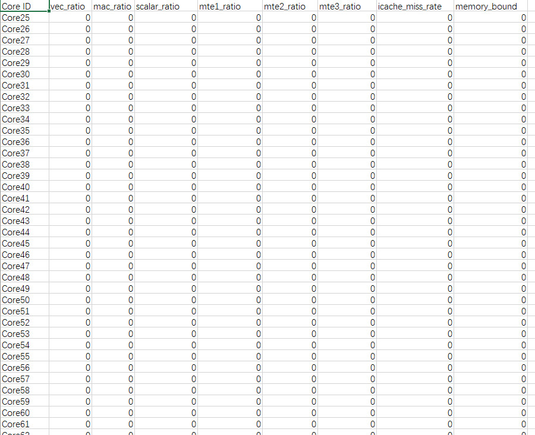

**表 1**  字段说明

|字段名|字段含义|
|--|--|
|vec_ratio|代表vec类型指令（向量类运算指令）的cycle数在total cycle数中的占用比。Atlas 200I/500 A2 推理产品不支持该字段，给予默认值N/A。|
|mac_ratio|代表cube类型指令（fp16及s16矩阵类运算指令）的cycle数在total cycle数中的占用比。|
|scalar_ratio|代表scalar类型指令（标量类运算指令）的cycle数在total cycle数中的占用比。|
|mte1_ratio|代表mte1类型指令（L1->L0A/L0B搬运类指令）的cycle数在total cycle数中的占用比。|
|mte2_ratio|代表mte2类型指令（DDR->AICORE搬运类指令）的cycle数在total cycle数中的占用比。（Atlas 200I/500 A2 推理产品）|
|mte2_ratio|代表mte2类型指令（片上内存->AICORE搬运类指令）的cycle数在total cycle数中的占用比。（Atlas A2 训练系列产品/Atlas A2 推理系列产品）（Atlas A3 训练系列产品/Atlas A3 推理系列产品）|
|mte3_ratio|代表mte3类型指令（AICORE->DDR搬运类指令）的cycle数在total cycle数中的占用比。（Atlas 200I/500 A2 推理产品）|
|mte3_ratio|代表mte3类型指令（AICORE->片上内存搬运类指令）的cycle数在total cycle数中的占用比。（Atlas A2 训练系列产品/Atlas A2 推理系列产品）（Atlas A3 训练系列产品/Atlas A3 推理系列产品）|
|icache_miss_rate|代表icache缺失率，即未命中指令的L1 cache，数值越小越好。|
|memory_bound|用于识别AICore执行算子计算过程是否存在Memory瓶颈，由mte2_ratio/max(mac_ratio, vec_ratio)计算得出。计算结果小于1，表示没有Memory瓶颈；计算结果大于1则表示有Memory瓶颈，且数值越大瓶颈越严重。|

注：此处AI Vector Core性能指标采集项以sample-based场景的PipeUtilization为例，更多参数解析参见[ai_core_utilization（AI Core指令占比）](#ZH-CN_TOPIC_0000002509503211)。

## aicpu（AI CPU算子详细耗时）<a name="ZH-CN_TOPIC_0000002509383191"></a>

aicpu算子详细耗时数据无timeline信息，summary信息在aicpu\_\*.csv文件汇总。

**产品支持情况<a name="zh-cn_topic_0000001752101817_section91616487538"></a>**

|产品|是否支持|
|--|:-:|
|Atlas A3 训练系列产品/Atlas A3 推理系列产品|√|
|Atlas A2 训练系列产品/Atlas A2 推理系列产品|√|
|Atlas 200I/500 A2 推理产品|√|
|Atlas 推理系列产品|√|
|Atlas 训练系列产品|√|


**aicpu\_\*.csv文件说明<a name="zh-cn_topic_0000001752101817_section98641131621"></a>**

AI CPU数据aicpu\_\*.csv文件内容格式示例如下：

**图 1**  aicpu\_\*.csv<a name="zh-cn_topic_0000001752101817_fig101583132201"></a>  
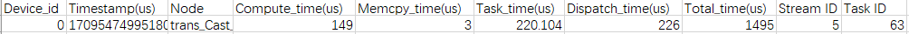

该文件采集的是数据预处理上报的AI CPU数据，其他涉及AI CPU数据的文件采集的是全量AI CPU数据。

**表 1**  字段说明

|字段名|字段含义|
|--|--|
|Device_id|设备ID。|
|Timestamp(us)|事件的时间戳。|
|Node|任务的节点名。|
|Compute_time(us)|计算耗时，单位us。|
|Memcpy_time(us)|内存拷贝耗时，单位us。|
|Task_time(us)|AICPU算子执行时间，包括算子预处理、计算耗时、内存拷贝耗时，单位us。|
|Dispatch_time(us)|分发耗时，单位us。|
|Total_time(us)|从内核态记录的Task开始和结束的时间，包含了Dispatch_time、AICPU框架调度时间和AICPU算子执行时间，单位us。|
|Stream ID|该Task所处的Stream ID。|
|Task ID|Task任务的ID。|


## aicpu\_mi（数据准备的队列）<a name="ZH-CN_TOPIC_0000002509503213"></a>

数据准备的队列大小。数据下沉场景下开启aicpu时生成。

**产品支持情况<a name="zh-cn_topic_0000002013989984_section91616487538"></a>**

|产品|是否支持|
|--|:-:|
|Atlas A3 训练系列产品/Atlas A3 推理系列产品|√|
|Atlas A2 训练系列产品/Atlas A2 推理系列产品|√|
|Atlas 200I/500 A2 推理产品|√|
|Atlas 推理系列产品|√|
|Atlas 训练系列产品|√|


**aicpu\_mi\_\*.csv文件说明<a name="zh-cn_topic_0000002013989984_section98641131621"></a>**

数据准备的队列数据aicpu\_mi\_\*.csv文件内容格式示例如下：

**图 1**  aicpu\_mi\_\*.csv<a name="zh-cn_topic_0000002013989984_fig10248152262010"></a>  
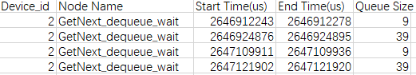

**表 1**  字段说明

|字段名|字段含义|
|--|--|
|Device_id|设备ID。|
|Node Name|数据准备的队列名。|
|Start Time(us)|读取数据的开始时间，单位us。|
|End Time(us)|读取数据的结束时间，单位us。|
|Queue Size|队列大小。|


## l2\_cache（L2 Cache命中率）<a name="ZH-CN_TOPIC_0000002477303246"></a>

L2 Cache数据无timeline信息，summary信息在l2\_cache\_\*.csv文件汇总。

**产品支持情况<a name="zh-cn_topic_0000001704262430_section91616487538"></a>**

|产品|是否支持|
|--|:-:|
|Atlas A3 训练系列产品/Atlas A3 推理系列产品|√|
|Atlas A2 训练系列产品/Atlas A2 推理系列产品|√|
|Atlas 200I/500 A2 推理产品|√|
|Atlas 推理系列产品|√|
|Atlas 训练系列产品|√|


**l2\_cache\_\*.csv文件说明<a name="zh-cn_topic_0000001704262430_section98641131621"></a>**

L2 Cache数据l2\_cache\_\*.csv文件内容格式示例如下：

**图 1**  l2\_cache\_\*.csv<a name="zh-cn_topic_0000001704262430_fig1350115305204"></a>  
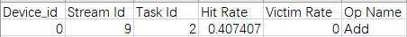

对于下列产品：

-   Atlas 推理系列产品
-   Atlas 训练系列产品

该文件中第一个算子的Hit Rate和Victim Rate数据不作为参考。

对于下列产品

-   Atlas 200I/500 A2 推理产品
-   Atlas A2 训练系列产品/Atlas A2 推理系列产品
-   Atlas A3 训练系列产品/Atlas A3 推理系列产品

该文件中第一个算子数据缺失，不影响整体的性能分析。

**表 1**  字段说明

|字段名|字段含义|
|--|--|
|Device_id|设备ID。|
|Stream Id|该Task所处的Stream ID。|
|Task Id|Task任务的ID。|
|Hit Rate|内存访问请求命中L2次数与内存访问请求总次数的比值。<br>对于Atlas 200I/500 A2 推理产品、Atlas A2 训练系列产品/Atlas A2 推理系列产品、Atlas A3 训练系列产品/Atlas A3 推理系列产品，Hit Rate数据推荐使用aic_metrics的L2 Cache分组实现，此采集方式下Hit Rate数据在op\_summary\_\*.csv文件中呈现。|
|Victim Rate|内存访问请求未命中并触发Cache中数据被换出的次数与内存访问请求总次数的比值。<br>对于Atlas 200I/500 A2 推理产品、Atlas A2 训练系列产品/Atlas A2 推理系列产品、Atlas A3 训练系列产品/Atlas A3 推理系列产品，Victim Rate数据可能出现大于1的情况。|
|Op Name|算子名称。|


## fusion\_op（算子融合信息）<a name="ZH-CN_TOPIC_0000002477463230"></a>

展示模型中算子融合前后的信息数据，该数据无timeline信息，summary信息在fusion\_op\_\*.csv文件汇总。

单算子场景（如PyTorch场景）下无此性能数据文件。

**产品支持情况<a name="zh-cn_topic_0000001704421886_section5889102116569"></a>**

> **说明：** 
>昇腾产品的具体型号，请参见《[昇腾产品形态说明](https://www.hiascend.com/document/detail/zh/AscendFAQ/ProduTech/productform/hardwaredesc_0001.html)》

|AI处理器类型|是否支持|
|--|:-:|
|Atlas A3 训练系列产品/Atlas A3 推理系列产品|√|
|Atlas A2 训练系列产品/Atlas A2 推理系列产品|√|
|Atlas 200I/500 A2 推理产品|√|
|Atlas 推理系列产品|√|
|Atlas 训练系列产品|√|


**fusion\_op\_\*.csv文件说明<a name="zh-cn_topic_0000001704421886_section98641131621"></a>**

模型中算子融合前后信息数据fusion\_op\_\*.csv文件内容格式示例如下：

**图 1**  fusion\_op\_\*.csv<a name="zh-cn_topic_0000001704421886_fig686494418203"></a>  
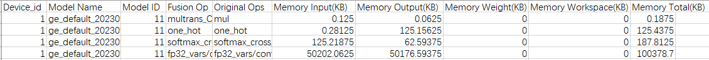

**表 1**  字段说明

|字段名|字段含义|
|--|--|
|Device_id|设备ID。采集到的数据来源于Host侧时，显示值为host。|
|Model Name|模型名称。|
|Model ID|模型ID。|
|Fusion Op|融合算子名称。|
|Original Ops|被融合算子名称。|
|Memory Input(KB)|输入Tensor内存大小，单位KB。|
|Memory Output(KB)|输出Tensor内存大小，单位KB。|
|Memory Weight(KB)|权值内存大小，单位KB。|
|Memory Workspace(KB)|Workspace内存大小，单位KB。|
|Memory Total(KB)|总内存，Memory Input、Memory Output、Memory Weight、Memory Workspace四项之和，单位KB。|


## npu\_mem（NPU内存占用）<a name="ZH-CN_TOPIC_0000002509383193"></a>

NPU内存占用数据timeline信息在msprof\_\*.json文件的NPU MEM层级展示，summary信息在npu\_mem\_\*.csv文件汇总。

**产品支持情况<a name="zh-cn_topic_0000001704360086_section91616487538"></a>**

|产品|是否支持|
|--|:-:|
|Atlas A3 训练系列产品/Atlas A3 推理系列产品|√|
|Atlas A2 训练系列产品/Atlas A2 推理系列产品|√|
|Atlas 200I/500 A2 推理产品|√|
|Atlas 推理系列产品|√|
|Atlas 训练系列产品|√|


**msprof\_\*.json文件的NPU MEM层级数据说明<a name="zh-cn_topic_0000001704360086_section11622953115117"></a>**

msprof\_\*.json文件NPU MEM层级数据如下图所示。（下图仅为示例，实际呈现以产品实现为准）

**图 1**  NPU MEM层<a name="zh-cn_topic_0000001704360086_fig186331551142017"></a>  
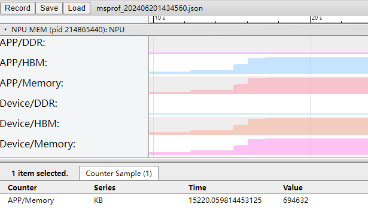

上图展示了进程级和设备级的内存占用情况，单位为KB，其中Memory字段表示内存占用总和。

**npu\_mem\_\*.csv文件说明<a name="zh-cn_topic_0000001704360086_section11791341554"></a>**

npu\_mem\_\*.csv文件内容格式示例如下：

**图 2**  npu\_mem\_\*.csv<a name="zh-cn_topic_0000001704360086_fig137821719212"></a>  
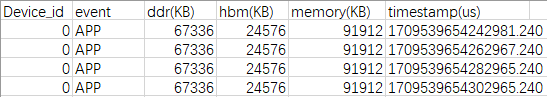

上表为内存占用情况明细，单位为KB，其中Memory字段表示内存占用总和。


## npu\_module\_mem（NPU组件内存占用）<a name="ZH-CN_TOPIC_0000002509503215"></a>

NPU组件内存占用数据无timeline信息，summary信息在npu\_module\_mem\_\*.csv文件汇总。

**产品支持情况<a name="zh-cn_topic_0000001797276317_section165442389381"></a>**

|产品|是否支持|
|--|:-:|
|Atlas A3 训练系列产品/Atlas A3 推理系列产品|√|
|Atlas A2 训练系列产品/Atlas A2 推理系列产品|√|
|Atlas 200I/500 A2 推理产品|√|
|Atlas 推理系列产品|√|
|Atlas 训练系列产品|√|


**npu\_module\_mem\_\*.csv文件数据说明<a name="zh-cn_topic_0000001797276317_section104048511517"></a>**

npu\_module\_mem\_\*.csv文件内容格式示例如下：

**图 1**  npu\_module\_mem\_\*.csv<a name="zh-cn_topic_0000001797276317_fig537247162117"></a>  
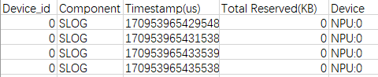

**表 1**  字段说明

|字段名|字段含义|
|--|--|
|Device_id|设备ID。|
|Component|组件名称。|
|Timestamp(us)|时间戳，单位us。可查看组件在当前时刻占用的内存。|
|Total Reserved(KB)|内存占用大小，单位KB。若为-1，则可能是该组件只采集到了已释放的内存。|
|Device|设备类型和设备ID，仅涉及NPU。|


## memory\_record（CANN算子的内存占用记录）<a name="ZH-CN_TOPIC_0000002477303250"></a>

CANN算子的内存占用记录无timeline信息，summary信息在memory\_record\_\*.csv文件汇总，主要记录CANN层级的GE组件申请的内存及占用时间。

**产品支持情况<a name="zh-cn_topic_000000170451978_section5889102116569"></a>**

|产品|是否支持|
|--|:-:|
|Atlas A3 训练系列产品/Atlas A3 推理系列产品|√|
|Atlas A2 训练系列产品/Atlas A2 推理系列产品|√|
|Atlas 200I/500 A2 推理产品|√|
|Atlas 推理系列产品|√|
|Atlas 训练系列产品|√|


**memory\_record\_\*.csv文件数据说明<a name="zh-cn_topic_000000170451978_section104048511517"></a>**

memory\_record\_\*.csv文件内容格式示例如下：

**图 1**  memory\_record\_\*.csv<a name="zh-cn_topic_000000170451978_fig18726153033320"></a>  


**表 1**  字段说明

|字段名|字段含义|
|--|--|
|Device_id|设备ID。|
|Component|组件，使用CANN软件包的性能分析工具仅采集GE组件。|
|Timestamp(us)|时间戳，记录内存占用的起始时间，单位us。|
|Total Allocated(KB)|内存分配总额，单位KB 。|
|Total Reserved(KB)|内存预留总额，单位KB。|
|Device|设备类型和设备ID，仅涉及NPU。|


## operator\_memory（CANN算子的内存占用明细）<a name="ZH-CN_TOPIC_0000002477463232"></a>

CANN算子的内存占用明细无timeline信息，summary信息在operator\_memory\_\*.csv文件汇总，主要记录CANN层级的算子在NPU上执行时所需内存及占用时间。

**产品支持情况<a name="zh-cn_topic_0000001752279281_section5889102116569"></a>**

|产品|是否支持|
|--|:-:|
|Atlas A3 训练系列产品/Atlas A3 推理系列产品|√|
|Atlas A2 训练系列产品/Atlas A2 推理系列产品|√|
|Atlas 200I/500 A2 推理产品|√|
|Atlas 推理系列产品|√|
|Atlas 训练系列产品|√|


**operator\_memory\_\*.csv文件数据说明<a name="zh-cn_topic_0000001752279281_section104048511517"></a>**

operator\_memory\_\*.csv文件内容格式示例如下：

**图 1**  operator\_memory\_\*.csv<a name="zh-cn_topic_0000001752279281_fig280612153313"></a>  
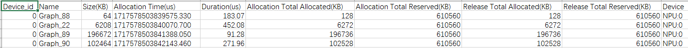

关键字段说明如下。

**表 1**  字段说明

|字段名|字段含义|
|--|--|
|Device_id|设备ID。|
|Name|算子名称。|
|Size(KB)|算子占用内存大小，单位KB。|
|Allocation Time(us)|内存分配时间，单位us。|
|Duration(us)|内存占用时间，单位us。|
|Allocation Total Allocated(KB)|算子内存分配时GE内存池分配总额，单位KB。|
|Allocation Total Reserved(KB)|算子内存分配时GE内存池总额，单位KB。|
|Release Total Allocated(KB)|算子内存释放时GE内存池分配总额，单位KB。|
|Release Total Reserved(KB)|算子内存释放时GE内存池总额，单位KB。|
|Device|设备类型和设备ID，仅涉及NPU。|


**负值空值说明<a name="zh-cn_topic_0000001752279281_section73121012154017"></a>**

operator\_memory\_\*.csv文件中的部分信息存在空值或负值，是因为部分算子申请或释放不在性能数据采集进程的范围内，所以可能未采集到这些算子的内存申请或释放的过程。详细请参考下面示例：

**图 2**  空值负值说明<a name="zh-cn_topic_0000001752279281_fig16334112284217"></a>  
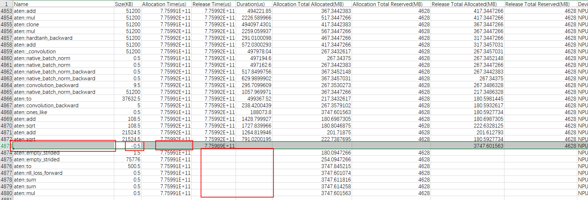

负值说明：上图中4873行的Size列出现了负值（内存申请Size为正值，内存释放Size为负值，如果在采集性能数据的范围内申请且释放了内存，那么Size取申请的数值），而Name列无法识别到算子名称，且其他Allocation列分配内存为空，Release列释放内存数值正常，说明该算子的内存申请在性能数据采集进程前，但内存释放在性能数据采集的范围内，所以仅采集到了内存释放的负值。另外算子名的识别仅在内存申请时进行，所以内存释放时无法识别到算子名，又因为内存申请不在采集性能数据的范围内，所以Allocation列分配内存为空。

空值说明：上图中4874行之后的算子在Release列释放内存数值为空，其他数值正常，说明这些算子的内存申请在性能数据采集的范围内，内存释放却在性能数据采集的范围外，未采集到内存释放所以Release列为空。


## static\_op\_mem（静态图算子内存）<a name="ZH-CN_TOPIC_0000002509383197"></a>

静态图算子内存无timeline信息，summary信息在static\_op\_mem\_\*.csv文件汇总。

**产品支持情况<a name="zh-cn_topic_0000001924444106_section5889102116569"></a>**

|产品|是否支持|
|--|:-:|
|Atlas A3 训练系列产品/Atlas A3 推理系列产品|√|
|Atlas A2 训练系列产品/Atlas A2 推理系列产品|√|
|Atlas 200I/500 A2 推理产品|√|
|Atlas 推理系列产品|√|
|Atlas 训练系列产品|√|


**static\_op\_mem\_\*.csv文件数据说明<a name="zh-cn_topic_0000001924444106_section104048511517"></a>**

static\_op\_mem\_\*.csv文件内容格式示例如下：

**图 1**  static\_op\_mem\_\*.csv<a name="zh-cn_topic_0000001924444106_fig788719246226"></a>  
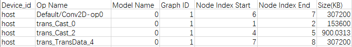

单算子场景通过调用aclprofCreateConfig接口开启ACL\_PROF\_TASK\_MEMORY开关采集生成，该数据仅在模型编译阶段上报。通过该文件可以查看静态图场景下每个Graph子图下算子的内存申请情况。

静态图场景下由Graph ID区分不同的计算图；动态子图场景下由Model Name（根节点名字）区分不同的子图。

**表 1**  字段说明

|字段名|字段含义|
|--|--|
|Device_id|设备ID。|
|Op Name|算子名称。其中最后一行为TOTAL，表示申请的总内存。|
|Model Name|表示的静态子图根节点的名字，如果为0表示为静态图，没有静态子图，如果有静态子图则显示其根节点名字。|
|Graph ID|Graph ID，每个Graph ID对应一张计算图。|
|Node Index Start|算子申请内存的逻辑时间。|
|Node Index End|算子释放内存的逻辑时间。显示为4294967295时，表示算子内存申请的时间最大值，即算子内存释放时间在计算图的生命周期结束时间。|
|Size(KB)|申请的内存大小，单位KB。|


## sys\_mem（系统内存数据）<a name="ZH-CN_TOPIC_0000002509503219"></a>

系统内存数据无timeline信息，summary信息在sys\_mem\_\*.csv文件汇总。

**产品支持情况<a name="zh-cn_topic_0000001751484586_section5889102116569"></a>**

|产品|是否支持|
|--|:-:|
|Atlas A3 训练系列产品/Atlas A3 推理系列产品|√|
|Atlas A2 训练系列产品/Atlas A2 推理系列产品|√|
|Atlas 200I/500 A2 推理产品|√|
|Atlas 推理系列产品|√|
|Atlas 训练系列产品|√|


**sys\_mem\_\*.csv文件数据说明<a name="zh-cn_topic_0000001751484586_section104048511517"></a>**

sys\_mem\_\*.csv文件内容格式示例如下：

**图 1**  sys\_mem\_\*.csv<a name="zh-cn_topic_0000001751484586_fig1844811313228"></a>  


**表 1**  字段说明

|字段名|字段含义|
|--|--|
|Device_id|设备ID。|
|Memory Total(kB)|系统总内存，单位kB。|
|Memory Free(kB)|系统内存剩余，单位kB。|
|Buffers(kB)|内存缓冲区大小，单位kB。|
|Cached(kB)|高速缓冲存储器使用大小，单位kB。|
|Share Memory(kB)|共享内存，单位kB。|
|Commit Limit(kB)|虚拟内存限值，单位kB。|
|Committed AS(kB)|系统已经分配的内存，单位kB。|
|Huge Pages Total(pages)|系统大内存页（huge page）总数。|
|Huge Pages Free(pages)|系统大内存页（huge page）剩余总数。|


## process\_mem（进程内存占用数据）<a name="ZH-CN_TOPIC_0000002477303252"></a>

进程内存占用数据无timeline信息，summary信息在process\_mem\_\*.csv文件汇总。

**产品支持情况<a name="zh-cn_topic_0000001798284369_section5889102116569"></a>**

|产品|是否支持|
|--|:-:|
|Atlas A3 训练系列产品/Atlas A3 推理系列产品|√|
|Atlas A2 训练系列产品/Atlas A2 推理系列产品|√|
|Atlas 200I/500 A2 推理产品|√|
|Atlas 推理系列产品|√|
|Atlas 训练系列产品|√|


**process\_mem\_\*.csv文件数据说明<a name="zh-cn_topic_0000001798284369_section104048511517"></a>**

process\_mem\_\*.csv文件内容格式示例如下：

**图 1**  process\_mem\_\*.csv<a name="zh-cn_topic_0000001798284369_fig13750153752213"></a>  


**表 1**  字段说明

|字段名|字段含义|
|--|--|
|Device_id|设备ID。|
|PID|进程ID。|
|Name|进程名称。|
|Size(pages)|进程占用内存页数。|
|Resident(pages)|进程占用的物理内存页数。|
|Shared(pages)|进程占用的共享内存页数。|


## cpu\_usage（AI CPU、Ctrl CPU利用率）<a name="ZH-CN_TOPIC_0000002477463234"></a>

AI CPU（执行AI CPU算子）、Ctrl CPU（执行Driver任务）利用率数据无timeline信息，summary信息在cpu\_usage\_\*.csv文件汇总。

**产品支持情况<a name="zh-cn_topic_0000001798325329_section5889102116569"></a>**

|产品|是否支持|
|--|:-:|
|Atlas A3 训练系列产品/Atlas A3 推理系列产品|√|
|Atlas A2 训练系列产品/Atlas A2 推理系列产品|√|
|Atlas 200I/500 A2 推理产品|√|
|Atlas 推理系列产品|√|
|Atlas 训练系列产品|√|


**cpu\_usage\_\*.csv文件数据说明<a name="zh-cn_topic_0000001798325329_section104048511517"></a>**

cpu\_usage\_\*.csv文件内容格式示例如下：

**图 1**  cpu\_usage\_\*.csv<a name="zh-cn_topic_0000001798325329_fig1012454414220"></a>  
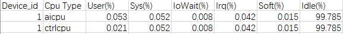

**表 1**  字段说明

|字段名|字段含义|
|--|--|
|Device_id|设备ID。|
|Cpu Type|CPU类型，包含AI CPU和Ctrl CPU。|
|User(%)|用户态进程执行时长（多个AI CPU和Ctrl CPU的平均值）占比。|
|Sys(%)|内核态进程执行时长（多个AI CPU和Ctrl CPU的平均值）占比。|
|IoWait(%)|IO等待状态时长（多个AI CPU和Ctrl CPU的平均值）占比。|
|Irq(%)|硬件中断时长（多个AI CPU和Ctrl CPU的平均值）占比。|
|Soft(%)|软件中断时长（多个AI CPU和Ctrl CPU的平均值）占比。|
|Idle(%)|空闲状态时长（多个AI CPU和Ctrl CPU的平均值）占比。|


## process\_cpu\_usage（进程CPU占用率）<a name="ZH-CN_TOPIC_0000002509383199"></a>

进程CPU占用率数据无timeline信息，summary信息在process\_cpu\_usage文件汇总。

**产品支持情况<a name="zh-cn_topic_0000001751325670_section5889102116569"></a>**

|产品|是否支持|
|--|:-:|
|Atlas A3 训练系列产品/Atlas A3 推理系列产品|√|
|Atlas A2 训练系列产品/Atlas A2 推理系列产品|√|
|Atlas 200I/500 A2 推理产品|√|
|Atlas 推理系列产品|√|
|Atlas 训练系列产品|√|


**process\_cpu\_usage\_\*.csv文件数据说明<a name="zh-cn_topic_0000001751325670_section104048511517"></a>**

process\_cpu\_usage\_\*.csv文件内容格式示例如下：

**图 1**  process\_cpu\_usage\_\*.csv<a name="zh-cn_topic_0000001751325670_fig939675212225"></a>  


**表 1**  字段说明

|字段名|字段含义|
|--|--|
|Device_id|设备ID。|
|PID|进程ID。|
|Name|进程名称。|
|CPU(%)|该进程CPU占用率。|


## 片上内存读写速率<a name="ZH-CN_TOPIC_0000002509503221"></a>

片上内存读写速率数据timeline信息在msprof\_\*.json文件展示，summary信息在ddr\_\*.csv和hbm\_\*.csv文件汇总。

**产品支持情况<a name="zh-cn_topic_000000170451974_section91616487538"></a>**

|产品|是否支持|
|--|:-:|
|Atlas A3 训练系列产品/Atlas A3 推理系列产品|√|
|Atlas A2 训练系列产品/Atlas A2 推理系列产品|√|
|Atlas 200I/500 A2 推理产品|√|
|Atlas 推理系列产品|√|
|Atlas 训练系列产品|√|


**msprof\_\*.json文件的片上内存数据说明<a name="zh-cn_topic_000000170451974_section1861610200457"></a>**

msprof\_\*.json文件片上内存数据如下图所示。

**图 1**  片上内存1<a name="zh-cn_topic_000000170451974_fig766519153238"></a>  
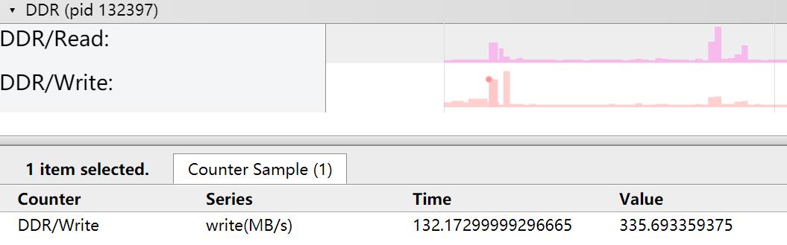

**图 2**  片上内存2<a name="zh-cn_topic_000000170451974_fig128671226172320"></a>  
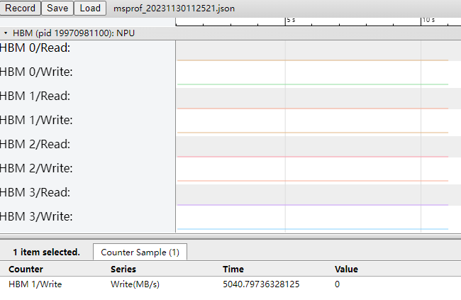

上图展示了片上内存的读写速率，单位为MB/s。

**ddr\_\*.csv文件说明<a name="zh-cn_topic_000000170451974_section11791341554"></a>**

ddr\_\*.csv文件内容格式示例如下：

**图 3**  ddr\_\*.csv<a name="zh-cn_topic_000000170451974_fig4397103862317"></a>  
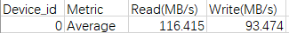

**表 1**  字段说明

|字段名|字段含义|
|--|--|
|Device_id|设备ID。|
|Metric|统计项。|
|Read(MB/s)|读取速率，单位MB/s。|
|Write(MB/s)|写速率，单位MB/s。|


**hbm\_\*.csv文件说明<a name="zh-cn_topic_000000170451974_section0146822185620"></a>**

hbm\_\*.csv文件内容格式示例如下：

**图 4**  hbm\_\*.csv<a name="zh-cn_topic_000000170451974_fig13282164482314"></a>  
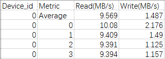

**表 2**  字段说明

|字段名|字段含义|
|--|--|
|Device_id|设备ID。|
|Metric|统计项，数值为内存访问单元的ID。|
|Read(MB/s)|读取速率，单位MB/s。|
|Write(MB/s)|写速率，单位MB/s。|


## hccs（集合通信带宽）<a name="ZH-CN_TOPIC_0000002477463236"></a>

HCCS集合通信带宽数据timeline信息在msprof\_\*.json文件的HCCS层级展示，summary信息在hccs\_\*.csv文件汇总。

**产品支持情况<a name="zh-cn_topic_0000001752359493_section91616487538"></a>**

|产品|是否支持|
|--|:-:|
|Atlas A3 训练系列产品/Atlas A3 推理系列产品|√|
|Atlas A2 训练系列产品/Atlas A2 推理系列产品|√|
|Atlas 200I/500 A2 推理产品|x|
|Atlas 推理系列产品|x|
|Atlas 训练系列产品|√|


**msprof\_\*.json文件的HCCS层级数据说明<a name="zh-cn_topic_0000001752359493_section279614455011"></a>**

msprof\_\*.json文件HCCS层级数据如下图所示。

**图 1**  HCCS层<a name="zh-cn_topic_0000001752359493_fig876626102412"></a>  
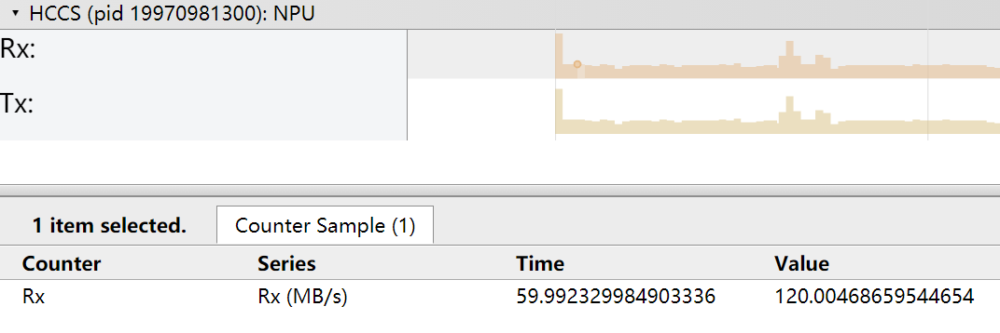

**表 1**  字段说明

|字段名|字段含义|
|--|--|
|Rx、Tx|接收带宽、发送带宽，单位MB/s。|


**hccs\_\*.csv文件说明<a name="zh-cn_topic_0000001752359493_section12139135285518"></a>**

hccs\_\*.csv文件内容格式示例如下：

**图 2**  hccs\_\*.csv<a name="zh-cn_topic_0000001752359493_fig597612312247"></a>  
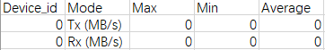

**表 2**  字段说明

|字段名|字段含义|
|--|--|
|Device_id|设备ID。|
|Mode|Tx（发送带宽），Rx（接收带宽），单位MB/s。|
|Max|最大带宽，单位MB/s。|
|Min|最小带宽，单位MB/s。|
|Average|平均带宽，单位MB/s。|


## nic（每个时间节点网络信息）<a name="ZH-CN_TOPIC_0000002509383201"></a>

每个时间节点网络信息数据timeline信息在msprof\_\*.json文件的NIC层级展示，summary信息在nic\_\*.csv文件汇总。

**产品支持情况<a name="zh-cn_topic_0000001750414058_section91616487538"></a>**

|产品|是否支持|
|--|:-:|
|Atlas A3 训练系列产品/Atlas A3 推理系列产品|√|
|Atlas A2 训练系列产品/Atlas A2 推理系列产品|√|
|Atlas 200I/500 A2 推理产品|√|
|Atlas 推理系列产品|√|
|Atlas 训练系列产品|√|


**msprof\_\*.json文件的NIC层级数据说明<a name="zh-cn_topic_0000001750414058_section10870339706"></a>**

msprof\_\*.json文件NIC层数据如下图所示。

**图 1**  NIC层<a name="zh-cn_topic_0000001750414058_fig1930611382249"></a>  
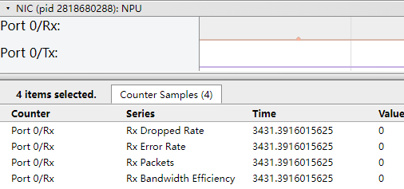

**表 1**  字段说明

|字段名|字段含义|
|--|--|
|Tx/Rx Dropped Rate|发送/接收包丢包率。|
|Tx/Rx Error Rate|发送/接收包错误率。|
|Tx/Rx Packets|发送/接收包速率。|
|Tx/Rx Bandwidth Efficiency|发送/接收包带宽利用率。|


**nic\_\*.csv文件说明<a name="zh-cn_topic_0000001750414058_section10366164515"></a>**

nic\_\*.csv文件内容格式示例如下：

**图 2**  nic\_\*.csv<a name="zh-cn_topic_0000001750414058_fig135704512412"></a>  
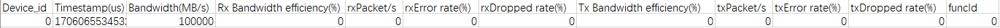

**表 2**  字段说明

|字段名|字段含义|
|--|--|
|Device_id|设备ID。|
|Timestamp(us)|时间节点，单位us。|
|Bandwidth(MB/s)|带宽大小，单位MB/s。|
|Rx Bandwidth efficiency(%)|接收包带宽利用率。|
|rxPacket/s|每秒接收包速率。|
|rxError rate(%)|接收包错误率。|
|rxDropped rate(%)|接收包丢包率。|
|Tx Bandwidth efficiency(%)|发送包带宽利用率。|
|txPacket/s|每秒发送包速率。|
|txError rate(%)|发送包错误率。|
|txDropped rate(%)|发送包丢包率。|
|funcId|网络节点。|


## roce（RoCE通信接口带宽）<a name="ZH-CN_TOPIC_0000002509503223"></a>

RoCE通信接口带宽数据timeline信息在msprof\_\*.json文件的RoCE层级展示，summary信息在roce\_\*.csv文件汇总。

**产品支持情况<a name="zh-cn_topic_0000001750572972_section91616487538"></a>**

|产品|是否支持|
|--|:-:|
|Atlas A3 训练系列产品/Atlas A3 推理系列产品|√|
|Atlas A2 训练系列产品/Atlas A2 推理系列产品|√|
|Atlas 200I/500 A2 推理产品|x|
|Atlas 推理系列产品|x|
|Atlas 训练系列产品|√|


**msprof\_\*.json文件的RoCE层级数据说明<a name="zh-cn_topic_0000001750572972_section11622953115117"></a>**

msprof\_\*.json文件RoCE层级数据如下图所示。

**图 1**  RoCE层<a name="zh-cn_topic_0000001750572972_fig12169145011241"></a>  
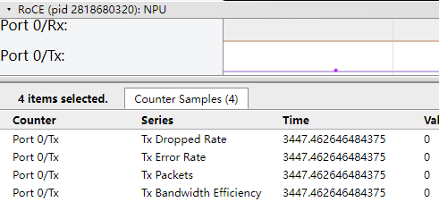

**表 1**  字段说明

|字段名|字段含义|
|--|--|
|Tx/Rx_Dropped_Rate|发送/接收包丢包率。|
|Tx/Rx_Error_Rate|发送/接收包错误率。|
|Tx/Rx_Packets|每秒发送/接收包速率。|
|Tx/Rx_Bandwidth_Efficiency|发送/接收包带宽利用率。|


**roce\_\*.csv文件说明<a name="zh-cn_topic_0000001750572972_section11791341554"></a>**

roce\_\*.csv文件内容格式示例如下：

**图 2**  roce\_\*.csv<a name="zh-cn_topic_0000001750572972_fig8322115682418"></a>  


**表 2**  字段说明

|字段名|字段含义|
|--|--|
|Device_id|设备ID。|
|Timestamp(us)|时间戳，单位us。|
|Bandwidth(MB/s)|带宽大小，单位MB/s。|
|Rx Bandwidth efficiency(%)|接收包带宽利用率。|
|rxPacket/s|每秒接收包速率。|
|rxError rate(%)|接收包错误率。|
|rxDropped rate(%)|接收包丢包率。|
|Tx Bandwidth efficiency(%)|发送包带宽利用率。|
|txPacket/s|每秒发送包速率。|
|txError rate(%)|发送包错误率。|
|txDropped rate(%)|发送包丢包率。|
|funcId|端口ID，用于区分一个Device中的多个端口。|


## pcie（PCIe带宽）<a name="ZH-CN_TOPIC_0000002477303256"></a>

PCIe带宽数据timeline信息在msprof\_\*.json文件的PCIe层级展示，summary信息在pcie\_\*.csv文件汇总。

**产品支持情况<a name="zh-cn_topic_0000001797493789_section91616487538"></a>**

|产品|是否支持|
|--|:-:|
|Atlas A3 训练系列产品/Atlas A3 推理系列产品|√|
|Atlas A2 训练系列产品/Atlas A2 推理系列产品|√|
|Atlas 200I/500 A2 推理产品|x|
|Atlas 推理系列产品|√|
|Atlas 训练系列产品|√|


**msprof\_\*.json文件的PCIe层级数据说明<a name="zh-cn_topic_0000001797493789_section11622953115117"></a>**

msprof\_\*.json文件PCIe层级数据如下图所示。

**图 1**  PCIe层<a name="zh-cn_topic_0000001797493789_fig35584202518"></a>  


**表 1**  字段说明

|字段名|字段含义|
|--|--|
|PCIe_cpl|接收写请求的完成数据包，单位MB/s。Tx表示发送端，Rx表示接收端。|
|PCIe_nonpost|PCIe Non-Post数据传输带宽，单位MB/s。Tx表示发送端，Rx表示接收端。|
|PCIe_nonpost_latency|PCIe Non-Post模式下的传输时延，单位us。Tx表示发送端，Rx表示接收端。PCIe_nonpost_latency无Rx，取固定值0。|
|PCIe_post|PCIe Post数据传输带宽，单位MB/s。Tx表示发送端，Rx表示接收端。|


**pcie\_\*.csv文件说明<a name="zh-cn_topic_0000001797493789_section12139135285518"></a>**

pcie\_\*.csv文件内容格式示例如下：

**图 2**  pcie\_\*.csv<a name="zh-cn_topic_0000001797493789_fig97188812514"></a>  


**表 2**  字段说明

|字段名|字段含义|
|--|--|
|Device_id|设备ID。|
|Mode|模式，包含：<br>&#8226; Tx_p_avg(MB/s)：发送端PCIe Post数据传输带宽，单位MB/s。Tx表示发送端，Rx表示接收端。<br/>&#8226; Tx_np_avg(MB/s)：发送端PCIe Non-Post数据传输带宽，单位MB/s。<br/>&#8226; Tx_cpl_avg(MB/s)：发送端接收写请求的完成数据包，单位MB/s。<br/>&#8226; Tx_latency_avg(us)：发送端PCIe Non-Post模式下的传输时延，单位us。<br/>&#8226; Rx_p_avg(MB/s)：接收端PCIe Post数据传输带宽，单位MB/s。<br/>&#8226; Rx_np_avg(MB/s)：接收端PCIe Non-Post数据传输带宽，单位MB/s。<br/>&#8226; Rx_cpl_avg(MB/s)：接收端接收写请求的完成数据包，单位MB/s。|
|Min、Max、Avg|最小值、最大值、平均值。|


## biu\_group/aic\_core\_group/aiv\_core\_group（AI Core和AI Vector的带宽和延时）<a name="ZH-CN_TOPIC_0000002477463238"></a>

AI Core和AI Vector的带宽和延时数据无summary信息，timeline信息在msprof\_\*.json文件的biu\_group、aic\_core\_group、aiv\_core\_group层级展示。

**产品支持情况<a name="zh-cn_topic_0000001797600917_section91616487538"></a>**

|产品|是否支持|
|--|:-:|
|Atlas A3 训练系列产品/Atlas A3 推理系列产品|√|
|Atlas A2 训练系列产品/Atlas A2 推理系列产品|√|
|Atlas 200I/500 A2 推理产品|x|
|Atlas 推理系列产品|x|
|Atlas 训练系列产品|x|


**msprof\_\*.json文件的biu\_group、aic\_core\_group、aiv\_core\_group层级数据说明<a name="zh-cn_topic_0000001797600917_section432932191111"></a>**

**图 1**  biu\_group<a name="zh-cn_topic_0000001797600917_fig13198121214588"></a>  


**图 2**  aic\_core\_group<a name="zh-cn_topic_0000001797600917_fig14725302476"></a>  


**图 3**  aiv\_core\_group<a name="zh-cn_topic_0000001797600917_fig1994919116471"></a>  


**表 1**  字段说明

|字段名|字段含义|
|--|--|
|**biu_group**|
|Bandwidth Read|BIU总线接口单元读取指令时的带宽。|
|Bandwidth Write|BIU总线接口单元写入指令时的带宽。|
|Latency Read|BIU总线接口单元读取指令时的时延。|
|Latency Write|BIU总线接口单元写入指令时的时延。|
|**aic_core_group**|
|Cube|矩阵类运算指令在本采样周期内的cycle数和占比。|
|Mte1|L1->L0A/L0B搬运类指令在本采样周期内的cycle数和占比。|
|Mte2|片上内存->AICORE搬运类指令在本采样周期内的cycle数和占比。|
|Mte3|AICORE->片上内存搬运类指令在本采样周期内的cycle数和占比。|
|**aiv_core_group**|
|Mte1|L1->L0A/L0B搬运类指令在本采样周期内的cycle数和占比。|
|Mte2|片上内存->AICORE搬运类指令在本采样周期内的cycle数和占比。|
|Mte3|AICORE->片上内存搬运类指令在本采样周期内的cycle数和占比。|
|Scalar|标量类运算指令在本采样周期内的cycle数和占比。|
|Vector|向量类运算指令在本采样周期内的cycle数和占比。|


## Acc PMU（加速器带宽及并发信息）<a name="ZH-CN_TOPIC_0000002509383203"></a>

加速器带宽及并发数据无summary信息，timeline信息在msprof\_\*.json文件的Acc PMU层级展示。

**产品支持情况<a name="zh-cn_topic_0000001750723840_section91616487538"></a>**

|产品|是否支持|
|--|:-:|
|Atlas A3 训练系列产品/Atlas A3 推理系列产品|√|
|Atlas A2 训练系列产品/Atlas A2 推理系列产品|√|
|Atlas 200I/500 A2 推理产品|√|
|Atlas 推理系列产品|x|
|Atlas 训练系列产品|x|


**msprof\_\*.json文件的Acc PMU层级数据说明<a name="zh-cn_topic_0000001750723840_section432932191111"></a>**

msprof\_\*.json文件Acc PMU层级数据如下图所示。

**图 1**  Acc PMU层<a name="zh-cn_topic_0000001750723840_fig19052202251"></a>  


**表 1**  字段说明

|字段名|字段含义|
|--|--|
|read_bandwidth|DVPP和DSA加速器读带宽。|
|read_ost|DVPP和DSA加速器读并发。|
|write_bandwidth|DVPP和DSA加速器写带宽。|
|write_ost|DVPP和DSA加速器写并发。|


## Stars Soc Info（SoC传输带宽信息）<a name="ZH-CN_TOPIC_0000002509503225"></a>

SoC传输带宽信息数据无summary信息，timeline信息在msprof\_\*.json文件的Stars Soc Info层级展示。

**产品支持情况<a name="zh-cn_topic_0000001797682569_section91616487538"></a>**

|产品|是否支持|
|--|:-:|
|Atlas A3 训练系列产品/Atlas A3 推理系列产品|√|
|Atlas A2 训练系列产品/Atlas A2 推理系列产品|√|
|Atlas 200I/500 A2 推理产品|√|
|Atlas 推理系列产品|x|
|Atlas 训练系列产品|x|


**msprof\_\*.json文件的Stars Soc Info层级数据说明<a name="zh-cn_topic_0000001797682569_section432932191111"></a>**

msprof\_\*.json文件Stars Soc Info层级数据如下图所示。

**图 1**  Stars Soc Info层<a name="zh-cn_topic_0000001797682569_fig125031026102512"></a>  


**表 1**  字段说明

|字段名|字段含义|
|--|--|
|L2 Buffer Bw Level|L2 Buffer带宽等级信息。当有缓存带宽信息时，不建议参考该字段值，该字段为粗粒度的统计值。|
|Mata Bw Level|Mata带宽等级信息。|


## Stars Chip Trans（片间传输带宽信息）<a name="ZH-CN_TOPIC_0000002477303258"></a>

片间传输带宽信息数据无summary信息，timeline信息在msprof\_\*.json文件的Stars Chip Trans层级展示。

**产品支持情况<a name="zh-cn_topic_0000001750882752_section91616487538"></a>**

|产品|是否支持|
|--|:-:|
|Atlas A3 训练系列产品/Atlas A3 推理系列产品|√|
|Atlas A2 训练系列产品/Atlas A2 推理系列产品|√|
|Atlas 200I/500 A2 推理产品|x|
|Atlas 推理系列产品|x|
|Atlas 训练系列产品|x|


**msprof\_\*.json文件的Stars Chip Trans层级数据说明<a name="zh-cn_topic_0000001750882752_section11622953115117"></a>**

msprof\_\*.json文件Stars Chip Trans层级数据如下图所示。

**图 1**  Stars Chip Trans层<a name="zh-cn_topic_0000001750882752_fig16602113442510"></a>  


**表 1**  字段说明

|字段名|字段含义|
|--|--|
|PA Link Rx|PA流量接收级别。当有集合通信带宽时，不建议参考该字段值，该字段为粗粒度的统计值。|
|PA Link Tx|PA流量发送级别。当有集合通信带宽时，不建议参考该字段值，该字段为粗粒度的统计值。|
|PCIE Read Bandwidth|PCIe读带宽。当有PCIe带宽时，不建议参考该字段值，该字段为粗粒度的统计值。|
|PCIE Write Bandwidth|PCIe写带宽。当有PCIe带宽时，不建议参考该字段值，该字段为粗粒度的统计值。|


## llc\_read\_write（三级缓存读写速率）<a name="ZH-CN_TOPIC_0000002477463240"></a>

三级缓存读写速率数据timeline信息在msprof\_\*.json文件的LLC层级展示，summary信息在llc\_read\_write\_\*.csv文件汇总。

**产品支持情况<a name="zh-cn_topic_0000001750960004_section1413114612162"></a>**

|产品|是否支持|
|--|:-:|
|Atlas A3 训练系列产品/Atlas A3 推理系列产品|√|
|Atlas A2 训练系列产品/Atlas A2 推理系列产品|√|
|Atlas 200I/500 A2 推理产品|√|
|Atlas 推理系列产品|√|
|Atlas 训练系列产品|√|


**msprof\_\*.json文件的LLC层级数据说明<a name="zh-cn_topic_0000001750960004_section12203141812107"></a>**

msprof\_\*.json文件LLC层级数据如下图所示。

**图 1**  LLC层<a name="zh-cn_topic_0000001750960004_fig197198423259"></a>  


**表 1**  字段说明

|字段名|字段含义|
|--|--|
|LLC <id> Read/Throughput|三级缓存读取时的吞吐量。|
|LLC <id> Write/Throughput|三级缓存写入时的吞吐量。|
|LLC <id> Read/Hit Rate|三级缓存读取时的命中率。|
|LLC <id> Write/Hit Rate|三级缓存读写入时的命中率。|


**llc\_read\_write\_\*.csv文件说明<a name="zh-cn_topic_0000001750960004_section11791341554"></a>**

llc\_read\_write\_\*.csv文件内容格式示例如下：

**图 2**  llc\_read\_write\_\*.csv<a name="zh-cn_topic_0000001750960004_fig1718935117257"></a>  


**表 2**  字段说明

|字段名|字段含义|
|--|--|
|Device_id|设备ID。|
|Mode|模式。|
|Task|任务ID。|
|Hit Rate(%)|三级缓存命中率。|
|Throughput(MB/s)|三级缓存吞吐量，单位MB/s。|


## dvpp（DVPP信息）<a name="ZH-CN_TOPIC_0000002477463244"></a>

DVPP数据无timeline信息，summary信息在dvpp\_\*.csv文件汇总。

**产品支持情况<a name="zh-cn_topic_0000001798325341_section91616487538"></a>**

|产品|是否支持|
|--|:-:|
|Atlas A3 训练系列产品/Atlas A3 推理系列产品|√|
|Atlas A2 训练系列产品/Atlas A2 推理系列产品|√|
|Atlas 200I/500 A2 推理产品|√|
|Atlas 推理系列产品|x|
|Atlas 训练系列产品|√|


**dvpp\_\*.csv文件说明<a name="zh-cn_topic_0000001798325341_section11791341554"></a>**

dvpp\_\*.csv文件内容格式示例如下：

**图 1**  dvpp\_\*.csv<a name="zh-cn_topic_0000001798325341_fig123751313132713"></a>  


**表 1**  字段说明

|字段名|字段含义|
|--|--|
|Device_id|设备ID。|
|Dvpp Id|Engine group的ID。当前每一类Engine都只有一个group，所以该字段均为0。|
|Engine Type|引擎类型，包含VDEC、JPEGD、PNGD等。|
|Engine ID|Engine group中每个Engine实例的编号。|
|All Time(us)|采样周期内本引擎执行的时间，单位us。|
|All Frame|采样周期内处理的帧数。|
|All Utilization(%)|采样周期内本引擎的利用率，本引擎执行的时间/采样周期。|


## ai\_cpu\_top\_function（AI CPU热点函数）<a name="ZH-CN_TOPIC_0000002509383209"></a>

AI CPU热点函数数据无timeline信息，summary信息在ai\_cpu\_top\_function\_\*.csv文件汇总。

**产品支持情况<a name="zh-cn_topic_0000001798284377_section91616487538"></a>**

|产品|是否支持|
|--|:-:|
|Atlas A3 训练系列产品/Atlas A3 推理系列产品|√|
|Atlas A2 训练系列产品/Atlas A2 推理系列产品|√|
|Atlas 200I/500 A2 推理产品|√|
|Atlas 推理系列产品|√|
|Atlas 训练系列产品|√|


**ai\_cpu\_top\_function\_\*.csv文件说明<a name="zh-cn_topic_0000001798284377_section11791341554"></a>**

ai\_cpu\_top\_function\_\*.csv文件内容格式示例如下：

**图 1**  ai\_cpu\_top\_function\_\*.csv<a name="zh-cn_topic_0000001798284377_fig20671163622713"></a>  


**表 1**  字段说明

|字段名|字段含义|
|--|--|
|Device_id|设备ID。|
|Function|AI CPU模块的热点函数。|
|Module|函数所在的模块名。|
|Cycles|统计时间内函数消耗的Cycle数。|
|Cycles(%)|统计时间内函数消耗的Cycle数对于统计时长的占比。|


## ai\_cpu\_pmu\_events（AI CPU PMU事件）<a name="ZH-CN_TOPIC_0000002509503231"></a>

AI CPU PMU事件数据无timeline信息，summary信息在ai\_cpu\_pmu\_events\_\*.csv文件汇总。

**产品支持情况<a name="zh-cn_topic_0000001751325686_section91616487538"></a>**

|产品|是否支持|
|--|:-:|
|Atlas A3 训练系列产品/Atlas A3 推理系列产品|√|
|Atlas A2 训练系列产品/Atlas A2 推理系列产品|√|
|Atlas 200I/500 A2 推理产品|√|
|Atlas 推理系列产品|√|
|Atlas 训练系列产品|√|


**ai\_cpu\_pmu\_events\_\*.csv文件说明<a name="zh-cn_topic_0000001751325686_section11791341554"></a>**

ai\_cpu\_pmu\_events\_\*.csv文件内容格式示例如下：

**图 1**  ai\_cpu\_pmu\_events\_\*.csv<a name="zh-cn_topic_0000001751325686_fig9742143132713"></a>  


**表 1**  字段说明

|字段名|字段含义|
|--|--|
|Device_id|设备ID。|
|Event|寄存器的值。|
|Name|值对应的事件名。|
|Count|寄存器的计数值。|


## ctrl\_cpu\_top\_function（Ctrl CPU热点函数）<a name="ZH-CN_TOPIC_0000002477303264"></a>

Ctrl CPU热点函数数据无timeline信息，summary信息在ctrl\_cpu\_top\_function\_\*.csv文件汇总。

**产品支持情况<a name="zh-cn_topic_0000001798325349_section91616487538"></a>**

|产品|是否支持|
|--|:-:|
|Atlas A3 训练系列产品/Atlas A3 推理系列产品|√|
|Atlas A2 训练系列产品/Atlas A2 推理系列产品|√|
|Atlas 200I/500 A2 推理产品|√|
|Atlas 推理系列产品|√|
|Atlas 训练系列产品|√|


**ctrl\_cpu\_top\_function\_\*.csv文件说明<a name="zh-cn_topic_0000001798325349_section11791341554"></a>**

ctrl\_cpu\_top\_function\_\*.csv文件内容格式示例如下：

**图 1**  ctrl\_cpu\_top\_function\_\*.csv<a name="zh-cn_topic_0000001798325349_fig116201349122718"></a>  


**表 1**  字段说明

|字段名|字段含义|
|--|--|
|Device_id|设备ID。|
|Function|Ctrl CPU模块的热点函数。|
|Module|函数所在的模块名。|
|Cycles|统计时间内函数消耗的Cycle数。|
|Cycles(%)|统计时间内函数消耗的Cycle数对于统计时长的占比。|


## ctrl\_cpu\_pmu\_events（Ctrl CPU PMU事件）<a name="ZH-CN_TOPIC_0000002477463246"></a>

Ctrl CPU PMU事件数据无timeline信息，summary信息在ctrl\_cpu\_pmu\_events\_\*.csv文件汇总。

**产品支持情况<a name="zh-cn_topic_0000001751484602_section91616487538"></a>**

|产品|是否支持|
|--|:-:|
|Atlas A3 训练系列产品/Atlas A3 推理系列产品|√|
|Atlas A2 训练系列产品/Atlas A2 推理系列产品|√|
|Atlas 200I/500 A2 推理产品|√|
|Atlas 推理系列产品|√|
|Atlas 训练系列产品|√|


**ctrl\_cpu\_pmu\_events\_\*.csv文件说明<a name="zh-cn_topic_0000001751484602_section11791341554"></a>**

ctrl\_cpu\_pmu\_events\_\*.csv文件内容格式示例如下：

**图 1**  ctrl\_cpu\_pmu\_events\_\*.csv<a name="zh-cn_topic_0000001751484602_fig01371555142714"></a>  


**表 1**  字段说明

|字段名|字段含义|
|--|--|
|Device_id|设备ID。|
|Event|寄存器的值。|
|Name|值对应的事件名。|
|Count|寄存器的计数值。|


## ts\_cpu\_top\_function（TS CPU热点函数）<a name="ZH-CN_TOPIC_0000002509383211"></a>

TS CPU热点函数数据无timeline信息，summary信息在ts\_cpu\_top\_function\_\*.csv文件汇总。

**产品支持情况<a name="zh-cn_topic_0000001798284385_section91616487538"></a>**

|产品|是否支持|
|--|:-:|
|Atlas A3 训练系列产品/Atlas A3 推理系列产品|√|
|Atlas A2 训练系列产品/Atlas A2 推理系列产品|√|
|Atlas 200I/500 A2 推理产品|√|
|Atlas 推理系列产品|√|
|Atlas 训练系列产品|√|


**ts\_cpu\_top\_function\_\*.csv文件说明<a name="zh-cn_topic_0000001798284385_section11791341554"></a>**

ts\_cpu\_top\_function\_\*.csv文件内容格式示例如下：

**图 1**  ts\_cpu\_top\_function\_\*.csv<a name="zh-cn_topic_0000001798284385_fig633819114286"></a>  


**表 1**  字段说明

|字段名|字段含义|
|--|--|
|Device_id|设备ID。|
|Function|TS CPU模块的热点函数。|
|Cycles|统计时间内函数消耗的Cycle数。|
|Cycles(%)|统计时间内函数消耗的Cycle数对于统计时长的占比。|


## ts\_cpu\_pmu\_events（TS CPU PMU事件）<a name="ZH-CN_TOPIC_0000002509503233"></a>

TS CPU PMU事件数据无timeline信息，summary信息在ts\_cpu\_pmu\_events\_\*.csv文件汇总。

**产品支持情况<a name="zh-cn_topic_0000001751325694_section91616487538"></a>**

|产品|是否支持|
|--|:-:|
|Atlas A3 训练系列产品/Atlas A3 推理系列产品|√|
|Atlas A2 训练系列产品/Atlas A2 推理系列产品|√|
|Atlas 200I/500 A2 推理产品|√|
|Atlas 推理系列产品|√|
|Atlas 训练系列产品|√|


**ts\_cpu\_pmu\_events\_\*.csv文件说明<a name="zh-cn_topic_0000001751325694_section11791341554"></a>**

ts\_cpu\_pmu\_events\_\*.csv文件内容格式示例如下：

**图 1**  ts\_cpu\_pmu\_events\_\*.csv<a name="zh-cn_topic_0000001751325694_fig1666014619286"></a>  


**表 1**  字段说明

|字段名|字段含义|
|--|--|
|Device_id|设备ID。|
|Event|寄存器的值。|
|Name|值对应的事件名。|
|Count|寄存器的计数值。|


## host\_cpu\_usage（Host侧CPU利用率）<a name="ZH-CN_TOPIC_0000002477463248"></a>

Host侧CPU利用率数据在msprof\_\*.json文件的CPU Usage层级展示，summary信息在host\_cpu\_usage\_\*.csv文件汇总。

**产品支持情况<a name="zh-cn_topic_0000001751778214_section91616487538"></a>**

|产品|是否支持|
|--|:-:|
|Atlas A3 训练系列产品/Atlas A3 推理系列产品|√|
|Atlas A2 训练系列产品/Atlas A2 推理系列产品|√|
|Atlas 200I/500 A2 推理产品|√|
|Atlas 推理系列产品|√|
|Atlas 训练系列产品|√|


**msprof\_\*.json文件的CPU Usage层级数据说明<a name="zh-cn_topic_0000001751778214_section11622953115117"></a>**

msprof\_\*.json文件CPU Usage层级数据如下图所示。

**图 1**  CPU Usage层<a name="zh-cn_topic_0000001751778214_fig03894179287"></a>  


**表 1**  字段说明

|字段名|字段含义|
|--|--|
|CPU *<id>*|CPU ID。|
|CPU Avg|CPU平均利用率。|
|usage|利用率。|


**host\_cpu\_usage\_\*.csv文件说明<a name="zh-cn_topic_0000001751778214_section11791341554"></a>**

host\_cpu\_usage\_\*.csv文件内容格式示例如下：

**图 2**  host\_cpu\_usage\_\*.csv<a name="zh-cn_topic_0000001751778214_fig1156013718322"></a>  


**表 2**  字段说明

|字段名|字段含义|
|--|--|
|Device_id|设备ID。Host侧数据时显示为host。|
|Total Cpu Numbers|系统CPU总核数。|
|Occupied Cpu Numbers|进程占用的CPU核数。|
|Recommend Cpu Numbers|使用中的CPU核数，虚拟化场景中为CPU核数资源的推荐分配值。|


## host\_mem\_usage（Host侧内存利用率）<a name="ZH-CN_TOPIC_0000002509383213"></a>

Host侧内存利用率数据timeline信息在msprof\_\*.json文件的Memory Usage层级展示，summary信息在host\_mem\_usage\_\*.csv文件汇总。

**产品支持情况<a name="zh-cn_topic_0000001751619310_section91616487538"></a>**

|产品|是否支持|
|--|:-:|
|Atlas A3 训练系列产品/Atlas A3 推理系列产品|√|
|Atlas A2 训练系列产品/Atlas A2 推理系列产品|√|
|Atlas 200I/500 A2 推理产品|√|
|Atlas 推理系列产品|√|
|Atlas 训练系列产品|√|


**msprof\_\*.json文件的Memory Usage层级数据说明<a name="zh-cn_topic_0000001751619310_section11622953115117"></a>**

msprof\_\*.json文件Memory Usage层级数据如下图所示。

**图 1**  Memory Usage层<a name="zh-cn_topic_0000001751619310_fig142149295285"></a>  


**表 1**  字段说明

|字段名|字段含义|
|--|--|
|Memory Usage|内存使用率。|


**host\_mem\_usage\_\*.csv文件说明<a name="zh-cn_topic_0000001751619310_section11791341554"></a>**

host\_mem\_usage\_\*.csv文件内容格式示例如下：

**图 2**  host\_mem\_usage\_\*.csv<a name="zh-cn_topic_0000001751619310_fig10818133753117"></a>  


**表 2**  字段说明

|字段名|字段含义|
|--|--|
|Device_id|设备ID。Host侧数据时显示为host。|
|Total Memory(KB)|系统总内存，单位KB。|
|Peak Used Memory(KB)|内存使用峰值，单位KB。|
|Recommend Memory(KB)|虚拟化场景中内存的推荐分配值，单位KB。|


## host\_disk\_usage（Host侧磁盘I/O利用率）<a name="ZH-CN_TOPIC_0000002509503235"></a>

Host侧磁盘I/O利用率数据timeline信息在msprof\_\*.json文件的Disk Usage层级展示，summary信息在host\_disk\_usage\_\*.csv文件汇总。

**产品支持情况<a name="zh-cn_topic_0000001798578961_section91616487538"></a>**

|产品|是否支持|
|--|:-:|
|Atlas A3 训练系列产品/Atlas A3 推理系列产品|√|
|Atlas A2 训练系列产品/Atlas A2 推理系列产品|√|
|Atlas 200I/500 A2 推理产品|√|
|Atlas 推理系列产品|√|
|Atlas 训练系列产品|√|


**msprof\_\*.json文件的Disk Usage层级数据说明<a name="zh-cn_topic_0000001798578961_section11622953115117"></a>**

msprof\_\*.json文件Disk Usage层级数据如下图所示。

**图 1**  Disk Usage层<a name="zh-cn_topic_0000001798578961_fig2438443142810"></a>  


**表 1**  字段说明

|字段名|字段含义|
|--|--|
|Disk Usage|磁盘利用率。|


**host\_disk\_usage\_\*.csv文件说明<a name="zh-cn_topic_0000001798578961_section11791341554"></a>**

host\_disk\_usage\_\*.csv文件内容格式示例如下：

**图 2**  host\_disk\_usage\_\*.csv<a name="zh-cn_topic_0000001798578961_fig169961347312"></a>  


**表 2**  字段说明

|字段名|字段含义|
|--|--|
|Device_id|设备ID。Host侧数据时显示为host。|
|Peak Disk Read(KB/s)|磁盘读取速率的峰值，单位KB/s。|
|Recommend Disk Read(KB/s)|虚拟化场景中磁盘读取速率的推荐值，单位KB/s。|
|Peak Disk Write(KB/s)|磁盘写入速率的峰值，单位KB/s。|
|Recommend Disk Write(KB/s)|虚拟化场景中磁盘写入速率的推荐值，单位KB/s。|


## host\_network\_usage（Host侧网络I/O利用率）<a name="ZH-CN_TOPIC_0000002477303268"></a>

Host侧网络I/O利用率数据timeline信息在msprof\_\*.json文件的Network Usage层级展示，summary信息在host\_network\_usage\_\*.csv文件汇总。

**产品支持情况<a name="zh-cn_topic_0000001798698005_section91616487538"></a>**

|产品|是否支持|
|--|:-:|
|Atlas A3 训练系列产品/Atlas A3 推理系列产品|√|
|Atlas A2 训练系列产品/Atlas A2 推理系列产品|√|
|Atlas 200I/500 A2 推理产品|√|
|Atlas 推理系列产品|√|
|Atlas 训练系列产品|√|


**msprof\_\*.json文件的Network Usage层级数据说明<a name="zh-cn_topic_0000001798698005_section11622953115117"></a>**

msprof\_\*.json文件Network Usage层级数据如下图所示。

**图 1**  Network Usage层<a name="zh-cn_topic_0000001798698005_fig9276175712815"></a>  


**表 1**  字段说明

|字段名|字段含义|
|--|--|
|Network Usage|网络I/O利用率。|


**host\_network\_usage\_\*.csv文件说明<a name="zh-cn_topic_0000001798698005_section11791341554"></a>**

host\_network\_usage\_\*.csv文件内容格式示例如下：

**图 2**  host\_network\_usage\_\*.csv<a name="zh-cn_topic_0000001798698005_fig16572542193015"></a>  


**表 2**  字段说明

|字段名|字段含义|
|--|--|
|Device_id|设备ID。Host侧数据时显示为host。|
|Netcard Speed(KB/s)|网卡的额定速率，单位KB/s。|
|Peak Used Speed(KB/s)|网络最高的使用速率，单位KB/s。|
|Recommend Speed(KB/s)|虚拟化场景中网络使用速率的推荐值，单位KB/s。|


## os\_runtime\_statistic（Host侧syscall和pthreadcall）<a name="ZH-CN_TOPIC_0000002477463250"></a>

Host侧syscall和pthreadcall数据timeline信息在msprof\_\*.json文件的OS Runtime API层级展示，summary信息在os\_runtime\_statistic\_\*.csv文件汇总。

**产品支持情况<a name="zh-cn_topic_0000001751778218_section91616487538"></a>**

|产品|是否支持|
|--|:-:|
|Atlas A3 训练系列产品/Atlas A3 推理系列产品|√|
|Atlas A2 训练系列产品/Atlas A2 推理系列产品|√|
|Atlas 200I/500 A2 推理产品|√|
|Atlas 推理系列产品|√|
|Atlas 训练系列产品|√|

**msprof\_\*.json文件的OS Runtime API层级数据说明<a name="zh-cn_topic_0000001751778218_section11622953115117"></a>**

msprof\_\*.json文件OS Runtime API层级数据如下图所示。

**图 1**  OS Runtime API层<a name="zh-cn_topic_0000001751778218_fig144942132296"></a>  


**表 1**  字段说明

|字段名|字段含义|
|--|--|
|Title|选择某个组件的接口名称，例如本例选择的为pthread_mutex_unlock接口。|
|Start|显示界面中时间轴上的时刻点，chrome trace自动对齐，单位ms。|
|Wall Duration|表示当前接口调用耗时，单位ms。|


**os\_runtime\_statistic\_\*.csv文件说明<a name="zh-cn_topic_0000001751778218_section11791341554"></a>**

os\_runtime\_statistic\_\*.csv文件内容格式示例如下：

**图 2**  os\_runtime\_statistic\_\*.csv<a name="zh-cn_topic_0000001751778218_fig1425753011116"></a>  


**表 2**  字段说明

|字段名|字段含义|
|--|--|
|Device_id|设备ID。Host侧数据时显示为host。|
|Process ID|进程ID。|
|Thread ID|线程ID。|
|Name|API接口名称。|
|Time(%)|该接口耗时占比。|
|Time(us)|该接口总耗时，单位us。|
|Count|该接口调用次数。|
|Avg(us)、Max(us)、Min(us)|该接口调用平均耗时、最大耗时、最小耗时，单位us。|


## cpu\_usage（Host侧系统CPU利用率）<a name="ZH-CN_TOPIC_0000002509383215"></a>

Host侧系统CPU利用率数据无timeline信息，summary信息在cpu\_usage\_\*.csv文件汇总。

**产品支持情况<a name="zh-cn_topic_0000001751619314_section91616487538"></a>**

|产品|是否支持|
|--|:-:|
|Atlas A3 训练系列产品/Atlas A3 推理系列产品|√|
|Atlas A2 训练系列产品/Atlas A2 推理系列产品|√|
|Atlas 200I/500 A2 推理产品|√|
|Atlas 推理系列产品|√|
|Atlas 训练系列产品|√|


**cpu\_usage\_\*.csv文件说明<a name="zh-cn_topic_0000001751619314_section11791341554"></a>**

cpu\_usage\_\*.csv文件内容格式示例如下：

**图 1**  cpu\_usage\_\*.csv<a name="zh-cn_topic_0000001751619314_fig514903822911"></a>  


**表 1**  字段说明

|字段名|字段含义|
|--|--|
|Device_id|设备ID。Host侧数据时显示为host。|
|Cpu Type|CPU类型。|
|User(%)|用户态进程执行时长占比。|
|Sys(%)|内核态进程执行时长占比。|
|IoWait(%)|IO等待状态时长占比。|
|Irq(%)|硬件中断时长占比。|
|Soft(%)|软中断时长占比。|
|Idle(%)|空闲状态时长占比。|


## process\_cpu\_usage（Host侧进程CPU利用率）<a name="ZH-CN_TOPIC_0000002509503237"></a>

Host侧进程CPU利用率数据无timeline信息，summary信息在process\_cpu\_usage\_\*.csv文件汇总。

**产品支持情况<a name="zh-cn_topic_0000001798578965_section91616487538"></a>**

|产品|是否支持|
|--|:-:|
|Atlas A3 训练系列产品/Atlas A3 推理系列产品|√|
|Atlas A2 训练系列产品/Atlas A2 推理系列产品|√|
|Atlas 200I/500 A2 推理产品|√|
|Atlas 推理系列产品|√|
|Atlas 训练系列产品|√|


**process\_cpu\_usage\_\*.csv文件说明<a name="zh-cn_topic_0000001798578965_section11791341554"></a>**

process\_cpu\_usage\_\*.csv文件内容格式示例如下：

**图 1**  process\_cpu\_usage\_\*.csv<a name="zh-cn_topic_0000001798578965_fig18181124942913"></a>  


**表 1**  字段说明

|字段名|字段含义|
|--|--|
|Device_id|设备ID。Host侧数据时显示为host。|
|PID|进程ID。|
|Name|进程名称。|
|CPU(%)|该进程CPU占用率。|


## sys\_mem（Host侧系统内存利用率）<a name="ZH-CN_TOPIC_0000002477303270"></a>

Host侧系统内存利用率数据无timeline信息，summary信息在sys\_mem\_\*.csv文件汇总。

**产品支持情况<a name="zh-cn_topic_0000001798698009_section91616487538"></a>**

|产品|是否支持|
|--|:-:|
|Atlas A3 训练系列产品/Atlas A3 推理系列产品|√|
|Atlas A2 训练系列产品/Atlas A2 推理系列产品|√|
|Atlas 200I/500 A2 推理产品|√|
|Atlas 推理系列产品|√|
|Atlas 训练系列产品|√|


**sys\_mem\_\*.csv文件说明<a name="zh-cn_topic_0000001798698009_section11791341554"></a>**

sys\_mem\_\*.csv文件内容格式示例如下：

**图 1**  sys\_mem\_\*.csv<a name="zh-cn_topic_0000001798698009_fig99825716297"></a>  


**表 1**  字段说明

|字段名|字段含义|
|--|--|
|Device_id|设备ID。Host侧数据时显示为host。|
|Memory Total(kB)|系统总内存，单位kB。|
|Memory Free(kB)|系统内存剩余，单位kB。|
|Buffers(kB)|内存缓冲区大小，单位kB。|
|Cached(kB)|高速缓冲存储器使用大小，单位kB。|
|Share Memory(kB)|共享内存，单位kB。|
|Commit Limit(kB)|虚拟内存限值，单位kB。|
|Committed AS(kB)|系统已经分配的内存，单位kB。|
|Huge Pages Total(pages)|系统大内存页（huge page）总数。|
|Huge Pages Free(pages)|系统大内存页（huge page）剩余总数。|


## process\_mem（Host侧进程内存利用率）<a name="ZH-CN_TOPIC_0000002477463252"></a>

Host侧进程内存利用率数据无timeline信息，summary信息在process\_mem\_\*.csv文件汇总。

**产品支持情况<a name="zh-cn_topic_0000001800355893_section91616487538"></a>**

|产品|是否支持|
|--|:-:|
|Atlas A3 训练系列产品/Atlas A3 推理系列产品|√|
|Atlas A2 训练系列产品/Atlas A2 推理系列产品|√|
|Atlas 200I/500 A2 推理产品|√|
|Atlas 推理系列产品|√|
|Atlas 训练系列产品|√|


**process\_mem\_\*.csv文件说明<a name="zh-cn_topic_0000001800355893_section11791341554"></a>**

process\_mem\_\*.csv文件内容格式示例如下：

**图 1**  process\_mem\_\*.csv<a name="zh-cn_topic_0000001800355893_fig31171443301"></a>  


**表 1**  字段说明

|字段名|字段含义|
|--|--|
|Device_id|设备ID。Host侧数据时显示为host。|
|PID|进程ID。|
|Name|进程名称。|
|Size(pages)|进程占用内存页数。|
|Resident(pages)|进程占用的物理内存页数。|
|Shared(pages)|进程占用的共享内存页数。|


