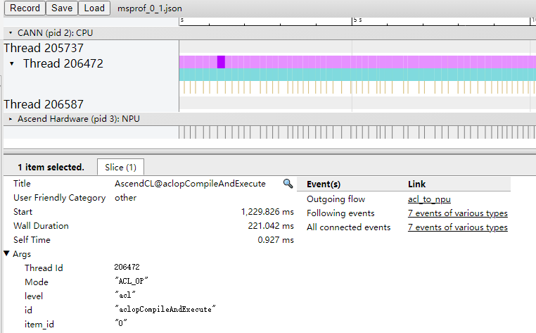
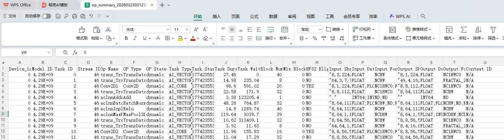
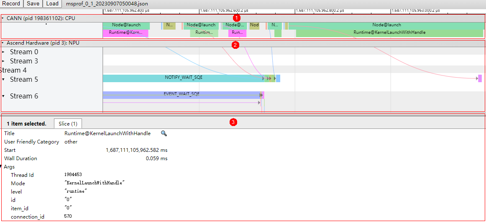
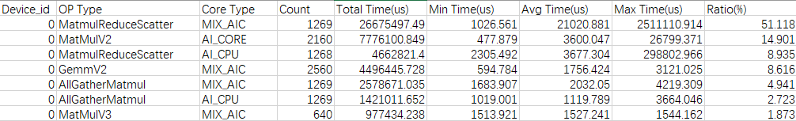

# 快速入门

本快速入门以离线推理场景为例，介绍**msprof**命令行采集和解析性能数据，并通过生成的结果文件分析性能瓶颈。

## 前提条件

- 请确保安装CANN Toolkit开发套件包和ops算子包，具体请参见《[CANN 软件安装指南](https://www.hiascend.com/document/detail/zh/canncommercial/850/softwareinst/instg/instg_0000.html?Mode=PmIns&InstallType=local&OS=openEuler)》。
- 已完成应用程序功能调试，准备对应的可执行二进制文件或可执行脚本。

下文根据昇腾AI处理器的PCIe工作模式区分为Ascend EP和Ascend RC两种操作步骤，Ascend EP和Ascend RC详细介绍请参见《[昇腾产品形态说明](https://www.hiascend.com/document/detail/zh/AscendFAQ/ProduTech/productform/hardwaredesc_0001.html)》。

## 采集、解析并导出性能数据

1. 登录装有CANN Toolkit开发套件包和ops算子包的运行环境，执行如下命令，可一键式采集、解析并导出性能数据：

   ```bash
   msprof --output={path} {用户程序}
   ```

   命令示例：

   ```bash
   msprof --output=/home/HwHiAiUser/profiling_output /home/HwHiAiUser/HIAI_PROJECTS/MyAppname/out/main
   ```

   **表1** 参数说明

   | 参数                              | **可选/必选** | 描述                                                         |
   | --------------------------------- | ------------- | ------------------------------------------------------------ |
   | --output                          | 可选          | 收集到的Profiling数据的存放路径，默认为AI任务文件所在目录。路径中不能包含特殊字符：`"\n", "\\n", "\f", "\\f", "\r", "\\r", "\b", "\\b", "\t", "\\t", "\v", "\\v", "\u007F", "\\u007F", "\"", "\\\"", "'", "\'", "\\", "\\\\", "%", "\\%", ">", "\\>", "<", "\\<", "`。 |
   | 传入用户程序[app arguments] | 必选          | 请根据实际情况在msprof命令末尾添加AI任务执行命令来传入用户程序或执行脚本。<br>格式：msprof [msprof arguments] {用户程序} [app arguments]<br>&#8226; 举例1（msprof传入Python执行脚本和脚本参数）：msprof --output=/home/projects/output python3 /home/projects/MyApp/out/sample_run.py parameter1 parameter2<br>&#8226; 举例2（msprof传入main二进制执行程序）：msprof --output=/home/projects/output main<br>&#8226; 举例3（msprof传入main二进制执行程序）：msprof --output=/home/projects/output /home/projects/MyApp/out/main<br>&#8226; 举例4（在msprof传入main二进制执行程序和程序参数）：msprof --output=/home/projects/output /home/projects/MyApp/out/main parameter1 parameter2<br>&#8226; 举例5（msprof传入sh执行脚本和脚本参数）：msprof --output=/home/projects/output /home/projects/MyApp/out/sample_run.sh parameter1 parameter2 |

   > [!NOTE] 说明
   >
   > 以上为最基本的采集命令，如有其他采集需求，请参见[性能数据采集和自动解析](https://www.hiascend.com/document/detail/zh/mindstudio/830/T&ITools/Profiling/atlasprofiling_16_0007.html#ZH-CN_TOPIC_0000002536038281)。

   命令执行完成后，在--output指定的目录下生成PROF*_*XXX目录，存放自动解析后的性能数据（以下仅展示性能数据）。

   ```ColdFusion
   ├── host   //保存原始数据，用户无需关注
   ...
   │    └── data
   ├── device_{id}   //保存原始数据，用户无需关注
   ...
   │    └── data
   ...
   ├── msprof_*.db
   ├── mindstudio_profiler_output
         ├── msprof_{timestamp}.json
         ├── step_trace_{timestamp}.json
         ├── xx_*.csv
          ...
         └── README.txt
   ```

2. 进入mindstudio_profiler_output目录，查看性能数据文件。

   默认情况下采集到的文件如下表所示。

   **表2** msprof默认配置采集的性能数据文件

   | 文件名              | 说明                                                         |
   | ------------------- | ------------------------------------------------------------ |
   | msprof_*.db         | 汇总所有性能数据的db格式文件。仅Atlas A3 训练系列产品/Atlas A3 推理系列产品、Atlas A2 训练系列产品/Atlas A2 推理系列产品支持默认导出该文件。 |
   | msprof_*.json       | timeline数据总表。                                           |
   | step_trace_*.json   | 迭代轨迹数据，每轮迭代的耗时。单算子场景下无此性能数据文件。 |
   | op_summary_*.csv    | AI Core和AI CPU算子数据。                                    |
   | op_statistic_*.csv  | AI Core和AI CPU算子调用次数及耗时统计。                      |
   | step_trace_*.csv    | 迭代轨迹数据。单算子场景下无此性能数据文件。                 |
   | task_time_*.csv     | Task Scheduler任务调度信息。                                 |
   | fusion_op_*.csv     | 模型中算子融合前后信息。单算子场景下无此性能数据文件。       |
   | api_statistic_*.csv | 用于统计CANN层的API执行耗时信息。                            |

   > [!NOTE] 说明
   >
   > 上表中，“*”表示时间戳。

   - db文件推荐使用MindStudio Insight工具进行分析，详细介绍请参见《[MindStudio Insight工具用户指南](https://gitcode.com/Ascend/msinsight/blob/26.0.0/docs/zh/user_guide/overview.md)》。

   - json文件需要在Chrome浏览器中输入`chrome://tracing`，将文件拖到空白处进行打开，通过键盘上的快捷键（w：放大，s：缩小，a：左移，d：右移）。通过json文件可查看当前AI任务运行的时序信息，比如运行过程中接口调用时间线，如下图所示。

     **图1** 查看json文件

     

   - csv文件可直接打开查看。通过csv文件可以看到AI任务运行时的软硬件数据，比如各算子在AI处理器软硬件上的运行耗时，通过字段排序等可以快速找出需要的信息，如下图所示。

     **图2** 查看csv文件

     

## 性能分析

从上文我们可以看到，性能数据文件较多，分析方法也较灵活，以下介绍几个重要文件及分析方法。

- 通过msprof_*.json文件从整体角度查看AI任务运行的时序信息，进而分析出可能存在的瓶颈点。

  **图5** msprof_*.json文件示例

  

  - 区域1：CANN层数据，主要包含Runtime等组件以及Node（算子）的耗时数据。
  - 区域2：底层NPU数据，主要包含Ascend Hardware下各个Stream任务流的耗时数据和迭代轨迹数据、昇腾AI处理器系统数据等。
  - 区域3：展示timeline中各算子、接口的详细信息（单击各个timeline色块展示）。

  从上图可以大致分析出耗时较长的API、算子、任务流等，并且根据对应的箭头指向找出对应的下发关系，分析执行推理过程中下层具体耗时较长的任务，查看区域3的耗时较长的接口和算子，再结合csv文件进行量化分析，定位出具体的性能瓶颈。

- 通过op_statistic_*.csv文件分析各类算子的调用总时间、总次数等，排查某类算子总耗时是否较长，进而分析这类算子是否有优化空间。

  **图6** op_statistic_*.csv文件示例

  

  可以按照Total Time排序，找出哪类算子耗时较长。

- 通过op_summary_*.csv文件分析具体某个算子的信息和耗时情况，从而找出高耗时算子，进而分析该算子是否有优化空间。

  **图7** op_summary_*.csv文件示例

  

  Task Duration字段为算子耗时信息，可以按照Task Duration排序，找出高耗时算子；也可以按照Task Type排序，查看不同核（AI Core和AI CPU）上运行的高耗时算子。
